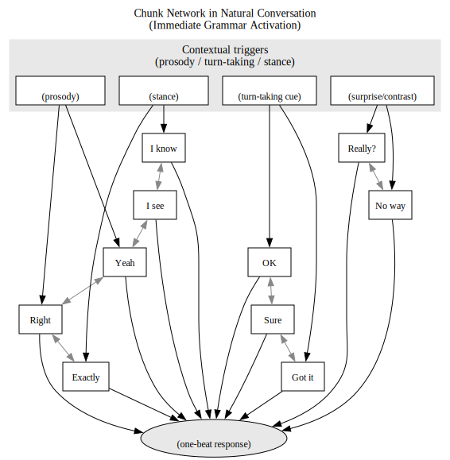
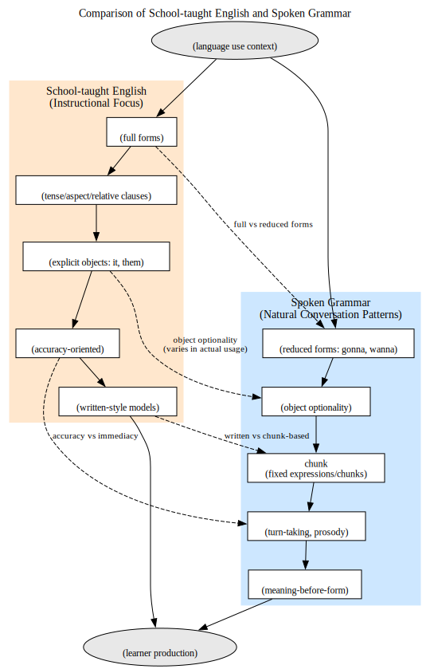

# 即時文法不在が生む不自然さの構造

Last change: 2025/11/17-19:15:58.

## **Abstract**

日本の英語教育は長年にわたり、文法的に整った完全文の運用を重視してきた。本研究は、この「調整文法（adjustive grammar）」偏重が、英語教師自身の発話、学習者の習得過程、さらには会話そのものにどのような影響を及ぼしているかを、プロセス文法モデル（Process Grammar Model: PGM）の観点から検討する。調整文法の過剰使用は、即時性・相互作用性・省略・chunk などの話しことばに本質的な特徴を弱め、認知負荷の増大、対話の破綻、学習者の自然な言語発達の阻害を招く。これらの問題点を、具体的な例と認知科学的知見を参照しながら明確化し、今後の語学教育における即時文法の役割を提示する。

---

## 1 はじめに

英語の口頭表現には、目的語 it を伴う “take it”, “check it out” のような定型的表現が多く見られる。一方で、同じ構文であっても it が省略されることはごく自然であり、実際の英語話者は、場面ごとに即興的に it の有無を調整している。

たとえば、あるYouTube ビデオに見られるごく自然な発話では、

> "Everybody in YES has a job, but it's not a part-time job, but probably should have." in "The other side of Rick Wakeman"

のように"should have"と発話している。
学校文法に従えば、"should have it" が「正しい」とされる。しかし自然な英語では it が省略されても意味は明確であり、むしろ prosody と即時性の観点から自然な発話となる。それにもかかわらず、日本の英語教育では 「it をつけなさい」「目的語を落としてはいけない」というように、調整文法による完全な構文の再現が強制されることもあろう。

この一見些末な "it の有無" という現象は、実は言語運用の本質的な問題を露わにしている。それは、自然な話しことばに必須の 即時文法（Immediate Grammar） が教育現場でほとんど扱われず、調整文法（Adjustive Grammar） のみが過度に強調されているという構造である。

この偏りは、教師自身の英語発話を不自然なものにし、学習者の自然な発話力を阻害し、さらには対話そのものを成立しにくくする。調整文法による長く重い発話は、聞き手の認知負荷を高め、疲労や眠気を誘発し、相互作用を阻害する。本稿では、この 即時文法不在が生む不自然さの構造 を、プロセス文法モデル（PGM）に基づき理論的に明らかにする。

## 2 研究の背景と目的

日本の英語教育は、「正確さ」と「完全性」を基軸とする文法中心主義を基盤としてきた。英語教師自身が、口頭での発話においても、書き言葉に近い構造的に整った文を産出しようとする傾向が強く、「自然な発話」との乖離がしばしば指摘されている。近年、会話分析や認知言語学の分野では、話し言葉の即興性や省略、chunk 化、プロソディが重要視されるが、これらは従来の教育実践では十分に扱われてこなかった。

本研究は、こうした状況をプロセス文法モデル（PGM）における「即時文法（Immediate Grammar）」と「調整文法（Adjustive Grammar）」の二層構造に基づき分析し、調整文法への過度な依存がいかにして発話の不自然性と対話困難を生むかを論じる。
即時文法と調整文法の二層構造は心理学として二重過程理論(Kahneman 2011)にも対応し、即時文法が迅速で自動的な反応を支え、調整文法が熟慮的で意識的な言語構築を担うとされる。

図1: プロセス文法モデルにおける即時文法と調整文法の二層構造

## 3 理論的枠組み: プロセス文法モデル（PGM）

プロセス文法モデルでは、発話生成を次の二契機の相互作用と捉える（山元）。

### (1) 即時文法（Immediate Grammar）

- 一拍で出る短い反応
- 省略（ellipsis）、弱化（reduction）、連結（linking）
- chunk（語のかたまり）の活用(例：I'm good, Check it out; Carter & McCarthy 2006）;
- prosody（強勢・リズム・イントネーション）を重視 (Cutler 2012)
- 感情・認知の直接的反映
- 対話性（turn-taking）を支える(Schegloff 2007)

### (2) 調整文法（Adjustive Grammar）

- 完全文の構築
- 文法的整合性
- 論理的接続・構造化
- 文脈理解に基づく意味調整
- 書き言葉的表現に近似

英語教員の発話は、後者に過剰に依存する傾向があり、即時文法の発動が抑制される。本研究では、この不均衡が引き起こす現象を記述する。
二重過程モデルでは即時処理のほうが自然で効率的(Evans 2008)なのに、教師が過剰に構文処理をしてしまう。
従来、話しことばと書きことばの違いは「流暢さ」や「ネイティブらしさ」として捉えられてきた(Biber et al. 1999)が、本研究はその背後にある文法的構造の不均衡に注目する。

図2: 即時文法と調整文法の処理フロー図

## 4 英語教育における調整文法偏重の構造

英語教育は、形式主義的文法指導を中心に発展してきた。特に以下の点が特徴的である。

1. 完了形・関係代名詞・冠詞などの文法項目の正確運用が過度に重視される
2. spoken grammar (Carter & McCarthy 2006; McCarthy & Carter 1995)をほとんど扱わない
3. 省略や弱化を誤用として扱う
4. 即興的発話よりも、暗記・準備された発話がモデル化される

その結果、英語教師は「I already ate.」のような自然な即時文法的発話よりも、「I have already eaten it.」のような冗長で書き言葉的な構造を優先する。

これは、母語である日本語運用に見られる即時的反応（例：「あ、そうなんだ」「え、まじで？」）とは大きく異なり、英語では調整文法偏重が顕在化する。

---

## 5 調整文法偏重が生み出す不自然な発話の構造

調整文法的英語の特徴は以下のとおりである。

- 完了形の過剰使用
- 文の階層構造を丁寧に組み立てようとする
- 省略の欠如（例：_I have finished eating my lunch already._）
- chunk の不使用（例：_Check it out_ の代わりに説明的表現を用いる）
- prosody の欠如による「話しことばらしさ」の喪失
- 聞き手が割り込む隙間のない一方向性発話

これらの特徴は、話しことばに不可欠な軽さ・間合い・テンポを失わせ、結果的に「話しているのに会話にならない」という現象を生じさせる。

---

## 6 教師・学習者・対話に及ぼす影響

### 6.1 教師への影響：アドリブ不能と発話不安

英語教師は「何も見ないと話せない」と述べることがある。これは即時文法を運用する訓練を受けておらず、書き言葉的構文の再生に依存していることに起因する(Levelt, W. 1989)。

教師が System 2（調整文法）に過度に依存すると、

- 発話準備の負荷が高まり
- アドリブが困難になり
- 話し手としてのストレスが増す

という悪循環が生じる。

### 6.2 学習者への影響: 自然な言語発達の阻害

自然な口語表現である "I already ate." が、教師に否定される例は多い(Lightbown & Spada 2013)。このような訂正が続くと、学習者は以下の誤解を持つ。

- 英語は「長く」「完全で」「間違いのない」文で話さなければならない
- 省略や短い反応は失礼・誤りである
- 自分の自然な英語はすべて誤りである

結果として、即時文法による発話の芽が摘まれ、話すことそのものへの恐怖が増大する。
System 2 が優位になると認知的コストが跳ね上がるため、学習者は話すこと自体を避ける傾向が強まる(Evans 2008; Kahneman 2011)。

### 6.3 対話への影響: 負荷上昇と眠気

調整文法的英語は、聞き手に高度な構文処理を強制する。この負荷はワーキングメモリを圧迫し、認知疲労・注意力低下・眠気を引き起こす(Chafe 1987)。

特に、授業中に「教師の英語を聞くと眠くなる」現象は、構造的には次のように説明できる。

- 処理困難な刺激は脳が抑制反応を起こす
- prosody の欠如は覚醒レベルを下げる
- 即時反応が許されない一方向性発話は対話的動機づけを低下させる

結果として、調整文法のみの発話は、対話そのものを破壊する。

図3: 調整文法偏重による認知負荷モデル（Kahneman との対応）

---

## 7 考察: 即時文法の再評価

自然な言語運用は、即時性・反応性・相互作用性を基盤とする。
英語教育においても、以下の要素を教育体系に組み込む必要がある。

1. chunk の体系的指導（例：I'm good, Check it out, Go ahead）
2. 省略の許容と分析
3. spoken grammar の導入
4. prosody 中心の発話訓練
5. 即時文法の正当化とモデル提示

これらは、学生の自然な英語能力を解放し、教師自身の発話負荷を減らす効果も期待される。

図4：自然会話の chunk ネットワーク図

---

## 8 結論

調整文法に偏重した英語教育は、教師の発話、学習者の言語発達、会話の相互作用に深刻な影響を及ぼしている。本研究は、プロセス文法モデルの観点から、その不均衡が認知負荷の増大、対話不能、眠気の誘発などの具体的問題として現れることを示した。

今後の英語教育においては、調整文法の正確さを維持しつつ、即時文法の機能を積極的に取り込み、自然な会話を成立させる言語観への転換が不可欠である。

図5: 英語教育と spoken grammar のズレを示す比較図

---

## 文献

- Biber, D. et al. (1999). Longman Grammar of Spoken and Written English. Longman.
- Carter, R. & McCarthy, M. (2006). Cambridge Grammar of English. CUP.
- Chafe, W. (1987). "Cognitive constraints on information flow." In Tomlin (Ed.), Coherence and Grounding in Discourse. Benjamins
- Cutler, A. (2012). Native Listening. MIT Press.
- Evans, J. St. B. T. (2008). "Dual-processing accounts of reasoning." Annual Review of Psychology.
- Kahneman, D. (2011). Thinking, Fast and Slow. Farrar, Straus and Giroux.
- Levelt, W. (1989). Speaking: From Intention to Articulation. MIT Press.
- Lightbown, P. & Spada, N. (2013). How Languages are Learned. OUP.
- McCarthy, M. & Carter, R. (1995). "Spoken grammar: What is it and how can we teach it?" ELT Journal, 49(3).
- Schegloff, E. A. (2007). Sequence Organization in Interaction. CUP.

<!--
- サーベイ（英語教師の発話分析）
-->
