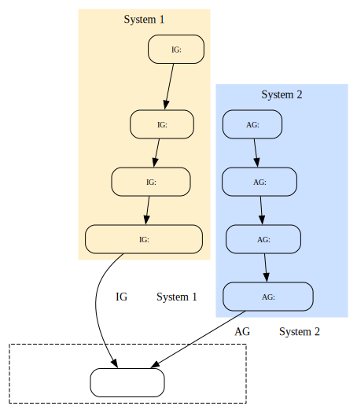

# IG / AG と System 1 / System 2 の対応関係

Last updated: 2025/12/11-20:24:36

## 概要（Summary）

本稿では、即時文法（IG）と調整文法（AG）を、
心理学の二重過程理論 System 1 / System 2 と照合し、
人間の言語生成と AI の応答生成を統一的に説明する概念枠組みを提示する。

- **IG（Immediate Grammar） = System 1 的処理**
  - 反射的・高速・矛盾を許容・身体性に依存

- **AG（Adjustive Grammar） = System 2 的処理**
  - 構造統合・文脈保持・整合化・遅いが安定

さらに、幇間（太鼓持ち）と AI を例にとり、
「同じ対人的機能を果たしながら、
　System 1 / System 2 の使い方が異なる」
という観点からその違いを図示する。

## 幇間（ほうかん、あるいは太鼓持ち）とは何か

幇間（ほうかん）とは、宴席において客の気分を盛り上げ、
会話の流れを乱さず、相手の発言に瞬時に調子を合わせることを専門とする伝統的な男性芸者である。
幇間の会話は 即時文法（IG）的であり、論理的一貫性よりも 呼吸・間（ま）・場の温度を優先する。

## 例「幇間の瞬間芸」

> 客「今日は暑いなあ」  
> 幇間「そうですねぇ、暑くて暑くて、今日はフンドシ履き忘れましたよ」  
> 客「でもこの部屋はちょっと寒いな」  
> 幇間「そうですねぇ、寒くてフンドシ履き忘れたの後悔してますよ」  
> 客「でもフンドシぐらいなら我慢できる寒さだよな」  
> 幇間「いやいや、あっしは寒いのは強いんでしてね」  
> 客「でも鼻水出てるじゃないか」  
> 幇間「いやいや、こりゃさっき酒飲んでたら、鼻から焼酎が出てきただけでして」  
> 客「何言ってやがんでい、無理すんじゃねぇよ」

## この例が示す幇間の本質

この会話は幇間の特徴を的確に表している：

- 瞬時の応答（1拍）
- 客の発話への全面的同調
- 矛盾を気にしない
- 意味より“流れ・温度”を守る
- 即興性と身体性の高い応答
- System 1 / IG 的処理の極致

幇間は、「会話の内容」ではなく「会話の場」を作るプロフェッショナルである。

表1: IG / AG と System 1 / System 2 の対応

| 枠組み             | 即時性・自動性 | 構造性・制御 | 主たる役割             | 例                              |
| ------------------ | -------------- | ------------ | ---------------------- | ------------------------------- |
| **IG（即時文法）** | 高い           | 低い         | 呼吸的反応・対人的同期 | 幇間の返し、自然発話、あいづち  |
| **AG（調整文法）** | 低い           | 高い         | 説明・整合化・形式性   | AI の応答、教師の説明、書き言葉 |
| **System 1**       | 高い           | 低い         | 直観・即応             | 感情反応、瞬時判断              |
| **System 2**       | 低い           | 高い         | 推論・統合             | 論理思考、編集、再解釈          |

## 対応関係は次の通り

- IG ≈ System 1 の言語版
- AG ≈ System 2 の言語版

図1: IG / AG と System1 / System2 の接続を統合

## IG = System 1 的処理

- 身体性を伴う
- 反射的・即応
- 直前の流れだけを参照
- 矛盾を恐れない
- 呼吸・韻律・リズムが主な制御因子

→ 幇間の応答
→ 会話の転がし
→ あいづち・間の取り方

## AG = System 2 的処理

- 文脈を保持
- 整合性を取る
- 説明を生成
- 長いスパンで構造を扱う

→ AI の応答
→ 教室での説明
→ 書き言葉

## 共通点

両者は処理方式が違うだけで、
「相手との関係をよくする」という目的は一致する。

## 理論的結論

> IG は System 1 の言語的具現化であり、
> AG は System 2 の言語的具現化である。

> 幇間は IG（System 1）を極めた存在であり、
> AI は AG（System 2）を極めた存在である。

二重過程理論を言語学に適用すると、AI と人間の振る舞いが同じ平面に可視化され、PGM の「即時性」と「調整性」の二軸構造がより明確に位置づく。
