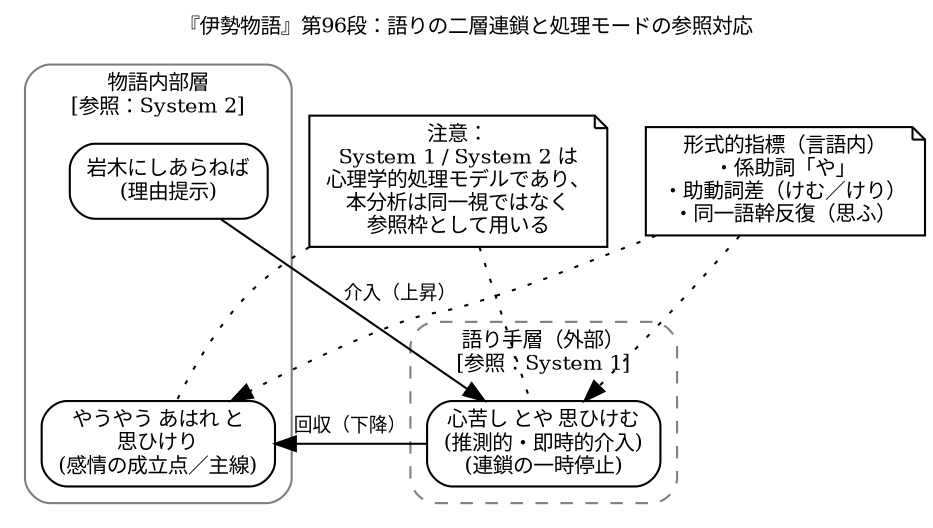

## Working Paper

<!-- Dropbox/pub/nihongo-no-oto/2025/2025-12-21-ise-96-03-kemu-keri-ja.md -->

# 『伊勢物語』第96段における「思ひけむ／思ひけり」と語り手の挿入: 連鎖構造とプロセス文法モデルの観点から

山元啓史 Ph.D. 東京科学大学

Last updated: 2025/12/21-21:47:28

## 1. はじめに

『伊勢物語』第96段には、次の一文が見える。

    岩木にしあらねば、心苦しとや思ひけむ、やうやうあはれと思ひけり。

この文は、表面的には登場人物の感情推移を叙述しているように読まれることが多い。しかしそのような読解においては、文中に挿入されている語り手の推測的介入が、結果として見逃されやすくなる。本稿の目的は、この語り手の存在を読者の主観的印象に委ねるのではなく、語りの連鎖構造に基づいて、形式的に検出可能な構造差として示すことにある。

## 2. 従来の説明の限界

従来の古典語研究や学校文法では、「思ひけむ」は過去に対する推量、「思ひけり」は過去・詠嘆といった意味分類が与えられることが多い。しかし、このような意味ラベルによる説明だけでは、本例において同一動詞「思ふ」が近接して反復されている理由を十分に説明することができない。また、両者が同一主体の内面として連続的に読まれにくい理由や、読解の過程において語りの流れが一度中断されたように感じられる理由も、明確には示されない。

問題は、各助動詞が持つ意味の差異そのものにあるのではない。むしろ、同一語幹が異なる助動詞を伴って連続的に配置されることによって生じる、語りの連鎖構造上の切断にこそ本質がある。本例では、推量を示す「思ひけむ」が語りの進行を一時的に停止させ、後続する「思ひけり」によって物語の主線が回収される。このような構造的操作が、語り手の介入として知覚される効果を生み出しているのであり、単なる意味分類では捉えきれない現象である。

## 3. 分析の前提：プロセス文法モデル

本稿は、文を完成した静的構造として扱うのではなく、発話が生成されつつある過程、すなわち進行中の言語行為として捉える立場に立つ。この立場を、本稿では「プロセス文法モデル（Process Grammar Model）」と呼ぶ。プロセス文法モデルにおいて重要なのは、主語が明示されているか否かや、文が形式的に完結しているかどうかといった点ではない。むしろ、陳述の流れが連続的に進行しているのか、それともその途中に語り手による推測や評価といった操作的要素が挿入され、流れが一時的に切断されているのかという点こそが、分析の中心となる。

このような即時的な処理と、それに続く統合的・反省的な処理の区別は、心理学における Daniel Kahneman の二重過程理論においても指摘されている。同理論では、直感的かつ高速に作動する処理系（System 1）と、意識的で遅延的な推論を担う処理系（System 2）が区別される。本稿で扱う語り手の即時的な推測や評価の挿入は、この System 1 的な処理に近い性質を持つ一方、それが後続の陳述によって回収・統合される過程は、System 2 的な調整に対応する。ただし、本稿の目的は心理学的理論を言語分析に直接適用することではなく、あくまで言語表現の連鎖構造に即して、こうした処理の切替がどのように痕跡として現れるかを記述的に明らかにすることにある。

## 4. 連鎖構造の観察

問題の箇所を簡略化すると、次のような連続が得られる。

    心苦しとや思ひけむ、(注1)
    やうやうあはれと思ひけり

この二句は、形式上は同一の動詞「思ふ」を含みながらも、連鎖上の位置づけにおいて明確に異なる機能を担っている。この差異を捉えるためには、各句の意味内容そのものではなく、両者がどのように配置され、どのような関係で連接されているかに注目する必要がある。本稿では、この連続において観察される構造的特徴を三点に分けて検討する。

### 4.1 同一動詞の近接反復

本例では、同一の動詞「思ふ」が近接して反復されているにもかかわらず、それぞれに伴う助動詞が異なっている点が注目される。この反復は、感情内容そのものが繰り返されていることを意味するものではない。むしろ、同一の語幹が異なる助動詞を伴って配置されることによって、連鎖構造上の操作位置の差異が明示されていると捉えるべきである。このような反復は、意味の強調や累加ではなく、語りの進行過程における異なる処理段階を可視化する役割を果たしている。

### 4.2 「や」による割り込み

「心苦しとや思ひけむ」に見られる係助詞「や」は、文末疑問や感情の強調として理解されがちであるが、本例においてはそのような機能にとどまらない。この「や」は、語りの進行を一時的に停止させ、主線から逸脱した挿入的操作を標識する役割を担っている。すなわち、この箇所で陳述は出来事の連続的な記述から離れ、語り手による推測的判断へと移行する。この切り替えは、意味内容ではなく、連鎖構造上の配置によって検出される。

### 4.3 「思ひけり」による回収

これに対し、後続する「思ひけり」は、推量的な操作を示すものではなく、物語内部における感情の成立点を示している。この句において、語りは再び物語の主線へと回収され、感情の推移が確定的に位置づけられる。先行する「思ひけむ」との対照は、単なる助動詞の意味差ではなく、語りの進行における逸脱と復帰という構造的操作の対を成している点に本質がある。

## 5. 構造の整理

以上の分析を踏まえると、本例の語りは、理由提示、語り手による挿入的介入、物語主線への回収という三つの局面から成る連鎖として整理することができる。すなわち、「岩木にしあらねば」は後続の感情形成を導く理由節として機能し、その直後に置かれた「心苦しとや思ひけむ」は、語りの進行を一時的に停止させる語り手側の推測的介入を示す。これに続く「やうやうあはれと思ひけり」において、語りは再び物語内部の主線へと回収され、感情の成立点が確定的に位置づけられる。

<!--

-->

図1　『伊勢物語』第96段における語りの二層連鎖と処理モードの参照対応

図1は、物語内部の連鎖（理由提示から感情成立に至る主線）に対して、語り手層からの推測的介入（「心苦しとや思ひけむ」）が一時的に挿入され、その後「思ひけり」によって主線へ回収される構造を二層として示したものである。図中に付した System 1 / System 2 の表示は、即時的な推測操作と後続する統合的処理との対応関係を示す参照枠であり、言語構造を心理学的モデルに還元することを意図するものではない。語り手の介入は、係助詞「や」、助動詞差（けむ／けり）、同一語幹の反復といった形式的条件によって、連鎖の切断と再接続として検出される。「心苦しとや思ひけむ」だけでなく、その前の「岩木にしあらねば」も語り手層とも解釈可能であるが、本例では主に「思ひけむ／思ひけり」の対照に注目する。

このような区別は、主語の補完や登場人物の心理を推定することによって導かれるものではない。むしろ、語りの連鎖における配置関係、同一語幹に付随する助動詞の差異、ならびに係助詞の挿入といった形式的条件のみから、構造的に導出されるものである。

## 6. 「めのまへ性」とは何か

本稿で用いる「めのまへ性」とは、読者の想像力や感情移入によって補われる印象的概念ではなく、発話生成のプロセスが完全に書記化されず、その操作の痕跡が文中に残存している状態を指す操作的概念である。本例において注目すべきなのは、「岩木にしあらねば、心苦しとや思ひけむ、やうやうあはれと思ひけり」という同一の文連鎖内部において、疑問の係助詞「や」、過去推量を示す助動詞「けむ」、事態の成立を示す「けり」が同時に配置されている点である。これらは本来、異なる発話段階や操作位置に属する形式であり、単一の話者の内面を一貫して叙述する文において並置されることは想定しにくい。にもかかわらず本例では、それらが近接的に連続して現れることにより、語りの進行が一時的に停止し、語り手による推測的介入が挿入された後、再び物語内部の主線へと回収されるという操作過程が可視化されている。このように、「めのまへ性」は読解上の主観的効果としてではなく、係助詞・助動詞・反復配置という形式的条件の共起によって、連鎖構造上に明示的に検出されるものである。

## 7. 現代語との連続性

以上で示した連鎖構造は、古代語に特有の現象ではなく、現代語においても同様に観察される。たとえば、「これはひどいと思う」という現代語文は、文としては完結しているものの、連鎖上に明確な切断が存在しないため、話し手自身による評価とも、第三者の評価を報告する発話とも読みうる。この曖昧性は、語彙的意味や主語の有無によって解消されるものではなく、連鎖の連続性が保持されたままであることに由来する。

これに対し、「これはひどいと思うところだが、そうは思わなかったらしく」のように連鎖が分割される場合、評価主体は形式的に分離され、話し手の立場と第三者の判断とが明確に区別される。このとき決定的となるのは、評価語の意味内容ではなく、発話の流れに生じた断絶である。すなわち、検出条件は意味解釈ではなく、連鎖の運動が一度停止し、別の操作段階へ移行したかどうかにある。

しかし、このような構造は、文法項目を静的に解析するだけでは捉えにくい。発話を完成した文としてではなく、生成過程にある言語行為として捉え、その記録がどのような単位で文中に残されているかを分析対象とすることで、初めて可視化される。本稿の立場では、分析単位は必ずしも文全体である必要はなく、一息で収まる程度の短い句、すなわち生成中の発話行為の痕跡としての最小単位にまで下ろされる。この視点は、読解上の感覚やセンスに委ねられるものではなく、連鎖構造の配置を形式的に観察するための方法論的前提である。

## 8. 翻訳への含意

以上の分析は、古典文学の翻訳、とりわけ英訳に対しても重要な含意を持つ。従来の英訳においては、語り手による即時的な介入や推測的挿入が、結果として平坦化されることが多かった。この傾向は、翻訳者個々の能力や感受性の問題というよりも、翻訳の分析単位が主として完成した文や意味対応に置かれてきたという、翻訳規範そのものに由来するものである。

語り手の介入を翻訳において保持するためには、語彙的意味の対応関係を優先するのではなく、発話プロセス上の操作をどのように再現するかという観点が不可欠となる。その際、英語においては、モダリティ表現、副詞配置、構文分割、句読法などを用いて、語りの流れが一時的に停止し、再び回収されるという操作を形式的に示す必要がある。これは意訳や文体操作の問題ではなく、原文におけるプロセス構造を保存するための翻訳戦略として位置づけられるべきである。

## 9. おわりに

本稿では、『伊勢物語』第96段における「思ひけむ／思ひけり」の近接配置を中心に、語り手の感想や推測的介入がどのように検出可能であるかを検討してきた。その結果、語り手の介入は主語補完や心理描写によって同定されるのではなく、連鎖構造における破断と回収という形式的操作として把握されるべきであることが明らかとなった。「思ひけむ／思ひけり」の対照は、その典型的な例であり、同一動詞が異なる助動詞を伴って配置されること自体が、語りの操作位置の差異を示している。

さらに、この構造は古代語に固有のものではなく、現代語においても同様に観察されることから、古代語と現代語は発話生成プロセスの連続体として捉えられるべきである。以上を踏まえるならば、古代語文法は完成した体系としてではなく、生成中の言語行為の記録として再記述される必要がある。本稿で用いたプロセス文法モデルは、そのための有効な記述枠組みを提供するものである。

## 参考文献

- Kahneman, D. (2011). Thinking, Fast and Slow. Farrar, Straus and Giroux.
- 片桐 洋一, 福井 貞助, 高橋 正治, 清水 好子 編 (1994). 『新編 日本古典文学全集12・竹取物語／伊勢物語／大和物語／平中物語』. 小学館.
- 坂田 一浩 (2009). 「めのまへ性」という観点の導入による、古代語助動詞の分類に関する一卑見. 『国語国文学研究』44, 53-65.
- 松本 泰丈 (1993). 〈メノマエ性〉をめぐって---しるしづけのうつりかわり. 『国文学 : 解釈と鑑賞』58(7), 118-130.
