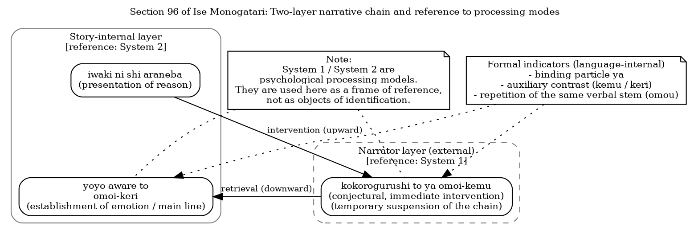

## Working Paper

<!-- 2025-12-21-ise-96-03-kemu-keri-en.md -->

# Narrative Intrusion through "omoi-kemu / omoi-keri" in Section 96 of _Ise Monogatari_:

A Chain-Structural Analysis from the Perspective of the Process Grammar Model

Last updated: 2025/12/21-21:47:28

## 1. Introduction

In Section 96 of _Ise Monogatari_, the following sentence appears:

```text
Iwaki ni shi araneba, kokorogurushi to ya omoi-kemu, yoyo aware to omoi-keri.
```

This sentence is often read, at a surface level, as a description of the emotional transition of the characters involved. In such readings, however, the narrator's inferential intervention embedded within the sentence tends to be overlooked as a result. The aim of this paper is not to leave the recognition of the narrator's presence to the reader's subjective impression, but rather to demonstrate it as a formally detectable structural difference, grounded in the chain structure of the narrative.

## 2. Limitations of Conventional Explanations

In traditional studies of classical Japanese and in school grammar, _omoi-kemu_ is commonly classified as expressing conjecture about the past, while _omoi-keri_ is explained in terms of past tense or exclamatory realization. Such explanations based on semantic labels, however, are insufficient to account for why the same verb _omou_ appears in close succession in this example. Nor do they adequately explain why the two forms are difficult to read as a continuous inner state of a single subject, or why readers often experience a momentary interruption in the flow of the narrative during the process of interpretation.

The issue does not lie simply in the semantic differences associated with each auxiliary. Rather, it lies in the disruption of the narrative chain structure produced by the consecutive placement of the same verbal stem with different auxiliaries. In the present example, _omoi-kemu_, which marks conjecture, temporarily suspends the progression of the narrative, while the subsequent _omoi-keri_ retrieves and reestablishes the main narrative line. It is this structural operation that gives rise to the effect perceived as narrator intervention. Such an effect cannot be fully captured by explanations based solely on semantic classification.

## 3. Analytical Framework: The Process Grammar Model

This paper adopts a perspective that treats sentences not as completed static structures, but as processes in which utterances are being generated, that is, as ongoing linguistic actions. This perspective is referred to here as the Process Grammar Model. Within this model, the central concern is not whether a subject is explicitly expressed, nor whether a sentence is formally complete. Rather, the focus lies on whether the flow of the statement proceeds continuously, or whether it is temporarily disrupted by operational elements such as conjecture or evaluation introduced by the narrator.

The distinction between such immediate processing and subsequent integrative or reflective processing has also been noted in psychology, most notably in Daniel Kahneman’s dual-process theory. In that framework, a fast, intuitive processing system (System 1) is distinguished from a slower, deliberate system responsible for conscious reasoning (System 2). The narrator’s immediate conjectural or evaluative insertions discussed in this paper exhibit characteristics close to System 1 processing, while the manner in which these insertions are later retrieved and integrated by subsequent statements corresponds to System 2-type adjustment.

That said, the aim of this paper is not to apply psychological theory directly to linguistic analysis. Rather, it seeks to describe, in a strictly descriptive manner and with reference to the chain structure of linguistic expression, how such shifts in processing manifest themselves as observable traces within the narrative.

## 4. Observing the Chain Structure

If the relevant passage is simplified, the following sequence can be extracted:

```
kokorogurushi to ya omoi-kemu, (note 1)
yoyo aware to omoi-keri
```

Although both clauses formally contain the same verb _omou_ ("to think"), they perform clearly distinct functions with respect to their positions within the narrative chain. In order to capture this difference, it is necessary to focus not on the semantic content of each clause in isolation, but on how they are arranged and how they are connected within the chain. This section examines three structural characteristics observable in this sequence.

### 4.1 Close Repetition of the Same Verb

In this example, the same verb _omou_ appears in close succession, yet it is accompanied by different auxiliaries in each instance. This repetition does not indicate that the emotional content itself is being reiterated. Rather, the placement of the same verbal stem with different auxiliaries serves to mark a difference in operational position within the chain structure. Such repetition does not function as semantic emphasis or accumulation; instead, it visualizes distinct stages of processing in the progression of the narrative.

### 4.2 Interruption Marked by _ya_

The binding particle _ya_ in _kokorogurushi to ya omoi-kemu_ is often understood as marking a sentence-final question or emphasizing emotional involvement. In the present example, however, its function cannot be reduced to these roles. Here, _ya_ temporarily halts the progression of the narrative and marks an insertive operation that deviates from the main line. At this point, the statement shifts away from the continuous description of events toward a conjectural judgment introduced by the narrator. This shift is detectable not through semantic content, but through the clause’s position and function within the chain structure.

### 4.3 Retrieval through _omoi-keri_

By contrast, the subsequent _omoi-keri_ does not signal a conjectural operation. Instead, it marks the point at which an emotional state is established within the narrative world. In this clause, the narrative is retrieved back into its main line, and the emotional transition is definitively situated. The contrast with the preceding _omoi-kemu_ lies not in a simple difference in auxiliary meaning, but in the paired structural operations of deviation and return within the progression of the narrative.

## 5. Structural Organization

Based on the preceding analysis, the narrative in this example can be organized as a chain consisting of three phases: the presentation of a reason, an insertive intervention by the narrator, and the retrieval of the narrative back into its main line. Specifically, _iwaki ni shi araneba_ functions as a reason clause that motivates the subsequent formation of emotion. Immediately following this, _kokorogurushi to ya omoi-kemu_ signals a conjectural intervention on the part of the narrator that temporarily suspends the progression of the narrative. In the subsequent _yoyo aware to omoi-keri_, the narrative is retrieved back into the internal storyline, and the point at which the emotional state is established is definitively situated.


<!--

-->

**Figure 1.** Two-layer narrative chain and reference to processing modes in Section 96 of _Ise Monogatari_

Figure 1 illustrates a two-layer structure in which a conjectural intervention from the narrator layer (_kokorogurushi to ya omoi-kemu_) is temporarily inserted into the story-internal chain, which otherwise proceeds from the presentation of a reason to the establishment of an emotional state. The main narrative line is subsequently retrieved by _omoi-keri_. The references to System 1 and System 2 in the figure serve as a conceptual frame indicating the correspondence between immediate conjectural operations and subsequent integrative processing; they are not intended to reduce linguistic structure to a psychological model.

The narrator’s intervention is detectable as a disruption and reconnection of the chain through formal linguistic conditions such as the binding particle _ya_, the contrast between the auxiliaries _kemu_ and _keri_, and the repetition of the same verbal stem _omou_. While the preceding clause _iwaki ni shi araneba_ may also be interpreted as belonging to the narrator layer, the present analysis focuses primarily on the contrast between _omoi-kemu_ and _omoi-keri_.

Such distinctions are not derived from the supplementation of subjects or from inferences about the mental states of the characters. Rather, they are structurally derived from formal conditions alone: the configurational relations within the narrative chain, the auxiliary contrast attached to the same verbal stem, and the insertion of a binding particle.

## 6. What Is _Menomae-ness_?

The notion of _menomae-ness_ employed in this paper is not an impressionistic concept supplemented by the reader’s imagination or emotional involvement. Rather, it is an operational concept referring to a state in which the process of utterance generation is not fully textualized, and traces of the operations involved remain embedded in the sentence. What is particularly noteworthy in the present example is that, within a single sentence chain - _iwaki ni shi araneba, kokorogurushi to ya omoi-kemu, yoyo aware to omoi-keri_ - the interrogative binding particle _ya_, the auxiliary _kemu_ indicating conjecture about the past, and _keri_, which marks the establishment of an event or realization, are all simultaneously deployed.

These forms ordinarily belong to different stages of utterance or to different operational positions, and their juxtaposition within a sentence that consistently narrates the inner state of a single speaker would not normally be expected. Nevertheless, in this example, their close sequential appearance renders visible an operational process in which the progression of the narrative is temporarily suspended, a conjectural intervention by the narrator is inserted, and the narrative is subsequently retrieved back into its story-internal main line. In this sense, _menomae-ness_ is not to be understood as a subjective effect arising in interpretation, but as a phenomenon that is explicitly detectable within the chain structure through the co-occurrence of formal conditions such as binding particles, auxiliaries, and patterns of repetitive placement.

## 7. Continuity with Modern Japanese

The chain structure described above is not a phenomenon unique to classical Japanese; it can be observed in a similar manner in modern Japanese as well. For example, the modern sentence _kore wa hidoi to omou_ (“I think this is terrible”) is formally complete as a sentence, yet it contains no explicit disruption within the chain. As a result, it may be read either as the speaker’s own evaluation or as a report of a third party’s evaluation. This ambiguity is not resolved by lexical meaning or by the presence or absence of an explicit subject; rather, it arises from the fact that the continuity of the chain is maintained without interruption.

By contrast, when the chain is divided, as in _kore wa hidoi to omou tokoro da ga, so wa omowanakatta rashiku_ (“I would think this is terrible, but apparently they did not”), the evaluative subject is formally separated, and the speaker’s stance is clearly distinguished from that of a third party. What proves decisive in such cases is not the semantic content of the evaluative expression itself, but the rupture that occurs in the flow of the utterance. In other words, the condition for detection lies not in interpretive meaning, but in whether the movement of the chain is momentarily halted and shifted to a different operational stage.

However, such structures are difficult to capture if grammatical elements are analyzed solely as static units. They become visible only when utterances are treated not as completed sentences, but as linguistic actions in the process of generation, and when attention is directed to how records of that process are preserved within the sentence. From the perspective adopted in this paper, the unit of analysis need not be the sentence as a whole; it may be reduced to short segments that fit within a single breath, that is, to minimal units understood as traces of utterance generation in progress. This perspective does not rely on the reader's intuition or interpretive sensibility, but constitutes a methodological prerequisite for the formal observation of chain-structural configurations.

## 8. Implications for Translation

The analysis presented above also has important implications for the translation of classical literature, particularly into English. In conventional English translations, immediate narrator interventions and conjectural insertions are often flattened as a result. This tendency should not be attributed primarily to the individual translator's skill or sensitivity, but rather to prevailing translation norms in which the unit of analysis has been placed chiefly on completed sentences and semantic equivalence.

In order to preserve narrator intervention in translation, it is essential to shift the focus away from prioritizing lexical correspondence and toward reproducing the operations involved in the utterance-generation process. In English, this may be achieved through the use of modal expressions, adverbial placement, syntactic segmentation, and punctuation, so as to formally indicate the temporary suspension and subsequent retrieval of the narrative flow. This is not a matter of free paraphrase or stylistic embellishment, but should instead be understood as a translation strategy aimed at preserving the processual structure present in the source text.

## 9. Conclusion

This paper has examined how narrator evaluation and conjectural intervention can be formally detected, focusing on the close placement of _omoi-kemu_ and _omoi-keri_ in Section 96 of _Ise Monogatari_. The analysis has shown that narrator intervention should not be identified through subject supplementation or inferred psychological description, but rather understood as a formal operation consisting of disruption and retrieval within the narrative chain. The contrast between _omoi-kemu_ and _omoi-keri_ provides a paradigmatic case in this respect, in that the placement of the same verb with different auxiliaries itself signals a difference in operational position within the narrative.

Furthermore, since comparable structures can be observed not only in classical Japanese but also in modern Japanese, classical and modern language should be regarded as forming a continuum in terms of the utterance-generation process. From this perspective, classical grammar should not be described as a completed system, but rather rearticulated as a record of linguistic actions in the process of generation. The Process Grammar Model adopted in this paper offers an effective descriptive framework for undertaking such a rearticulation.

## References

- Kahneman, D. (2011). Thinking, Fast and Slow. Farrar, Straus and Giroux.
- Katagiri, Y., Fukui, S., Takahashi, M., & Shimizu, Y. (Eds.). (1994). _Shinpen Nihon Koten Bungaku Zenshu 12: Taketori Monogatari, Ise Monogatari, Yamato Monogatari, Hirataka Monogatari_ [New edition of the Japanese classical literature series 12: The Tale of the Bamboo Cutter, The Tales of Ise, The Tales of Yamato, The Tale of Hirataka]. Shogakukan.
- Sakata, K. (2009). "Menomahesei" to iu kanten no dounyuu ni yoru, kodaigo jodoushi no bunrui ni kansuru ichi hiken [A Personal View on the Classification of Ancient Japanese Auxiliary Verbs through the Introduction of the Concept of "Menomae-sei"]. _Kokugo Kokubungaku Kenkyu_, 44, 53-65.
- Matsumoto, Y. (1993). "Menomae-sei" o megutte; shirushiduke no utsurikawari [On "Menomae-sei": The Transition of Markings]. _Kokubungaku: Kaishaku to Kansho (Japanese Literature: Interpretation and Appreciation)_, 58(7), 118-130. (Special Issue: Kodaigo bunpo o saikou suru ["Reconsidering Ancient Japanese Grammar"])

<!-- 片桐 洋一, 福井 貞助, 高橋 正治, 清水 好子 編 (1994). 『新編 日本古典文学全集12・竹取物語／伊勢物語／大和物語／平中物語』. 小学館. -->
<!-- 坂田 一浩 (2009). 「めのまへ性」という観点の導入による、古代語助動詞の分類に関する一卑見. 『国語国文学研究』44, 53-65. -->
<!-- 松本 泰丈 (1993). 〈メノマエ性〉をめぐって--しるしづけのうつりかわり. 『国文学 : 解釈と鑑賞』58(7), 118-130. -->
