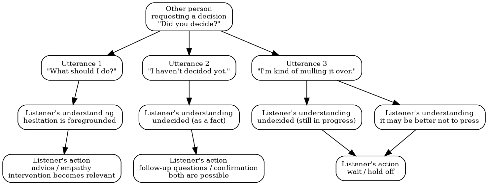

# "Saying 'I'm Worrying' While Not Actually Worrying"

## How "Still Mulling It Over" Maps onto Japanese Expressions of "Undecidedness"

Last updated: 2026/01/05-20:26:33

Hirofumi Yamamoto, Ph.D.
Tokyo Institute of Science

## Abstract

This paper focuses on the Japanese conversational expression "yaya nayande iru" ("I'm kind of mulling it over / I'm somewhat torn"), and describes how it is often used not to report emotional distress, but to communicate a simple interactional status: "I have not decided yet." Beginner learners can express undecidedness with phrases such as "dou shiyou kana" ("What should I do?") or "mada kimete imasen" ("I haven't decided yet"). However, they rarely reach the level of naturally occurring Japanese usage where "yaya nayande iru" is frequently observed. By highlighting this gap and comparing the Japanese expression with English colloquial phrases such as "Still mulling it over," this paper discusses how this usage is difficult to capture in Japanese language education and how it may be positioned within pragmatic development.

## 1. Introduction

In Japanese language education, the verb "nayamu" ("to worry") is often introduced as corresponding to the English verb "to worry." Typical textbook examples include "shinro ni nayande imasu" ("I'm worried about my career path") or "okane no koto de nayande imasu" ("I'm worried about money"), where the word is presented as expressing trouble or psychological burden.

However, observation of everyday conversation suggests that there are many cases where "nayamu" does not convey such emotional suffering. Consider the following exchange:

> A: Mou kimeta?
> B: Un, yaya nayande iru kana.

What this utterance reveals is not deep anxiety or distress. It reveals only one thing: the speaker has not decided yet. Here, "yaya nayande iru" functions less as an explanation of one's feelings and more as a way of telling the interlocutor that the decision is still pending. This paper focuses on such uses and examines utterances in which the speaker says "I'm worrying/mulling it over" while not actually describing any concrete "worry."

## 2. "Yaya nayande iru" Does Not Provide the Content of a Worry

When someone says "yaya nayande iru," the following information is typically not made available:

- what the speaker is worrying about,
- how serious the worry is,
- whether the speaker is suffering or anxious.

What is conveyed is simply the fact that the decision remains pending. This contrast becomes clearer when compared with "dou shiyou kana":

> Dou shiyou kana.

This utterance directly displays the speaker's hesitation and indecision. By contrast:

> Yaya nayande iru.

Here, the speaker's feelings are not foregrounded. The listener primarily receives the information that "the speaker has not decided yet." In other words, "yaya nayande iru" is not a way of describing a worry, but a way of reporting an undecided state.

## 3. When Does "Yaya nayande iru" Occur?

"Yaya nayande iru" is not typically used as a private soliloquy. It often occurs when a decision is requested by another person:

> A: Docchi ni suru?
> B: Un, yaya nayande iru.

In this exchange, the speaker is not trying to explain their inner experience in detail. They are simply signaling, in a compact manner, that they cannot provide an answer yet.

Importantly, the key issue is not to distinguish "yaya nayande iru" from "dou shiyou kana" in terms of psychological content. At the beginner level, learners can already convey undecidedness itself through expressions such as "dou shiyou kana" or "mada kimete imasen." Yet they still rarely reach the form that is frequently observed in naturally occurring Japanese interaction, namely "yaya nayande iru" (Taguchi 2017). The issue is therefore not whether undecidedness can be expressed, but how it is presented through an interactionally appropriate formulation. This gap can also be framed as a problem of pragmatic competence in second language acquisition (Taguchi 2017).

### Table 1. Levels of expressions used to convey "undecidedness"

| Level | Label                        | Example              |
| ----: | ---------------------------- | -------------------- |
|    1. | meaning-based expression     | "mada kimete imasen" |
|    2. | normative natural expression | "kangaete imasu"     |
|    3. | **usage-based expression**   | "yaya nayande iru"   |

Levels 1 and 2 belong to what can be taught directly as stable forms, whereas Level 3 is grounded in naturally occurring usage (Taguchi 2014). In many educational practices, instruction often stops at Level 1, and sometimes extends to Level 2.

If Level 2 is simply called "natural Japanese," then Level 2 and Level 3 become conflated: the distinction between textbook-level naturalness and usage-based naturalness disappears, and Level 3 itself becomes difficult to notice. In fact, it is likely that Level 3 has not even been recognized as a target in many classroom contexts. From this perspective, what matters is to identify Level 3 explicitly and incorporate it into pedagogy.

## 4. The Difference Is Not Vocabulary, but "What the Turn Does"

In similar contexts, beginner learners often use expressions such as:

> Dou shiyou kana.
> Mada kimete imasen.

In these utterances, the speaker's hesitation is fronted, and the listener may interpret the utterance as a display of trouble that invites sympathy or advice. In contrast, native speakers and more advanced speakers often use expressions such as:

> Yaya nayande iru.
> Chotto kangaete te ne.

Here, what is foregrounded is not emotion but the interactional state of being undecided. The difference cannot be explained merely by vocabulary size. Rather, it is tied to how speakers select what needs to be communicated to the interlocutor at that moment.

Such a difference can be positioned not as a matter of grammar or lexical knowledge, but as a difference in pragmatic competence as discussed in second language acquisition research (Taguchi 2017).

## 5. Corresponding Colloquial Expressions in English

English has colloquial expressions that serve a similar interactional function:

> Still thinking.
> Still mulling it over.

From these utterances, the speaker's emotion is not strongly visible. What becomes clear is only that the decision has not been made yet.

> I'll sleep on it.

Similarly, this does not necessarily signal emotional struggle. Rather, it signals the speaker's decision not to decide yet. These English expressions, like Japanese "yaya nayande iru," are not primarily expressions of worry, but expressions that convey undecidedness.

## 6. Why Do Learners Rarely Say "Yaya nayande iru"?

Learner speech often shows early emergence of expressions such as "dou shiyou kana" or "nayande imasu." In contrast, expressions like "yaya nayande iru" or "chotto kangaete te ne" are rarely observed even when learners are in the same communicative situation (Taguchi 2017; Bardovi-Harlig & Hartford 2005).

The crucial point here is not to attribute this gap to differences in internal emotional states. The gap is better understood as a step that learners find difficult to cross: moving from being able to express undecidedness to adopting a usage-based expression that native speakers routinely employ in interaction (Bardovi-Harlig & Hartford 2005).

Figure 1: Patterns of how "What should I do?," "I haven't decided yet," and "I'm kind of mulling it over" may be received. The interpretations are illustrative.

Figure 1 illustrates differences in the possible understandings and actions by the listener in response to three utterances. With "What should I do?," the listener is likely to understand the speaker's hesitation as foregrounded, making advice or empathy relevant. With "I haven't decided yet," the listener understands undecidedness as a factual status, and follow-up questions become possible. With "I'm kind of mulling it over," the listener may understand that the decision is ongoing and that pressing further might be inappropriate, thus leading to a "wait/hold off" response. These different outcomes suggest that the three utterances can have different interactional implications (Sacks, Schegloff, & Jefferson 1974). In this sense, "yaya nayande iru" can be positioned as one usage-based option among the multiple ways native speakers manage undecidedness in interaction.

## 7. Implications for Japanese Language Education

The key implication is that simply teaching "natural expressions" may not be sufficient to reach this usage. What needs to be taught is not practice in stating "what one is worrying about," but practice in how to communicate the state of "not decided yet" in interaction. "Yaya nayande iru" is not an advanced emotional expression. It is a usage-based way of presenting undecidedness as a conversational status.

## 8. Conclusion

"Yaya nayande iru" is an utterance in which the speaker says "I'm worrying/mulling it over" while not actually describing a worry. Through this expression, the speaker does not position themselves as "someone in trouble," but as "someone who has not decided yet." Paying attention to this usage reveals a wider range of functions that the verb "nayamu" can carry in Japanese interaction. This paper has described this particular usage and its pedagogical significance.

## References

- Bardovi-Harlig, K., & Hartford, B. S. (2005). _Interlanguage Pragmatics: Exploring Institutional Talk_. Routledge.
- Sacks, H., Schegloff, E. A., & Jefferson, G. (1974). A simplest systematics for the organization of turn-taking for conversation. _Language_, 50(4), 696-735.
- Taguchi, N. (2014). Developing interactional competence in a study abroad context. _Language Learning_, 64(2), 302-331.
- Taguchi, N. (ed.) (2017). _Pragmatic Competence in Japanese as a Second Language_. De Gruyter Mouton.
