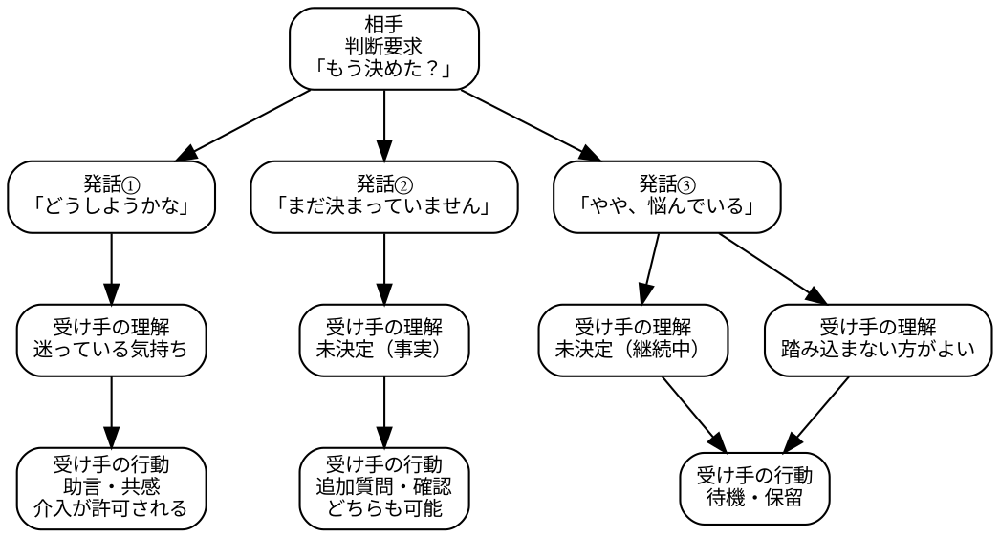

# 「悩んでいる」と言いながら、悩んでいない

## Still mulling it over が示す「未決定」の言い方

Last updated: 2026/01/05-20:26:33

山元啓史, Ph.D.
東京科学大学

## 概要

本稿は、日本語の日常会話で用いられる「やや、悩んでいる」という表現に注目し、この言い方が、感情的な悩みを述べるものではなく、「まだ決めていない」という未決定の状態を相手に伝えるために使われている点を記述する。
初級の学習者は「どうしようかな」「まだ決めていません」といった言い方によって未決定を表すことはできるが、実際の日本語使用で多く見られる「やや、悩んでいる」という言い方には、なかなか至らない。本稿では、この段差に注目し、英語の Still mulling it over などの口語表現と比較しながら、日本語教育において扱いにくいこの用法の位置づけを考える。

## はじめに

日本語の「悩む」は、日本語教育ではしばしば to worry に対応づけられる。たとえば「進路に悩んでいます」「お金のことで悩んでいます」のように、困りごとや心理的な負担を表す語として説明される。
しかし、実際の会話を観察すると、「悩む」がそのような意味で使われていない例が少なくない。
たとえば、次のようなやり取りである。

> A: もう決めた？
> B: うーん、やや悩んでいるかな。

この発話から分かるのは、深刻な不安や苦しさではない。分かるのはただ一つ、「まだ決めていない」ということだけである。
「やや、悩んでいる」は、気持ちを説明しているというより、決定が終わっていないことを相手に伝えるための言い方として使われている。
本稿では、このような用法に注目し、「悩んでいる」と言いながら、実際には悩みを語っていない発話について具体的に見ていく。

## 「やや、悩んでいる」と言っても、悩みは語られていない

「やや、悩んでいる」という言い方では、次の情報は出てこない。

- 何について悩んでいるのか
- どのくらい困っているのか
- つらいのか、不安なのか

出てくるのは、決定が保留されているという事実だけである。
この点は、「どうしようかなぁ」と比べると分かりやすい。

> どうしようかなぁ。

この発話では、迷っている気持ちそのものが聞き手に伝わる。一方で、

> やや、悩んでいる。

では、気持ちはほとんど見えない。聞き手が受け取るのは、「今は決めていないらしい」という情報である。
つまり、「やや、悩んでいる」は、悩みを説明する言い方ではなく、未決定という状態を報告する言い方として使われている。

## 「やや、悩んでいる」はどんな場面で使われるか

「やや、悩んでいる」は、独り言として使われることはあまりない。多くの場合、相手から判断を求められた場面で現れる。

> A: どっちにする？
> B: うーん、やや悩んでいる。

ここで B は、自分の内面を詳しく語ろうとしていない。
「今は答えを出せない」ということだけを、簡潔に相手に伝えている。
この点で重要なのは、「どうしようかなぁ」と対比して機能を分けることではない。
初級段階では、「どうしようかな」「まだ決めていません」といった言い方によって、未決定であること自体は表現できる。しかし、実際の日本語使用で多く見られる「やや、悩んでいる」という言い方には、なかなか至らない。
このような差は、第二言語習得研究で言う pragmatic competence の問題としても位置づけられる（Taguchi 2017）。
問題は、「未決定」を伝えられるかどうかではなく、それをどのような言い方で提示しているかにある。

表1: 未決定を伝える表現のレベル分類

| レベル | 呼び方                 | 例                 |
| ------ | ---------------------- | ------------------ |
| ①      | 意味対応表現           | まだ決めていません |
| ②      | 規範的自然表現         | 考えています       |
| ③      | **実使用レベルの表現** | やや、悩んでいる   |

①と②は「教えられる」レベルである一方で、③は観察される日本語使用に基づく表現である（Taguchi 2014）。
これまで、教育では①で終わる場合が多く、場合によっては、②まで扱われることもある。

この②を「自然な表現」と言ってしまうと、②と③が混ざり、教科書的自然さと、実使用レベルの自然さが
区別されなくなるどころか、③の存在そのものが見えなくなる。
これまでの教育実践では③の存在すら認識されてこなかった、というのが実情である。
この点で重要なのは、③の存在を認識し、教育に取り入れることである。

## 初級と上級の違いは、語彙ではなく「何を伝えているか」

実際、同じ場面で初級の学習者が用いる言い方を見ると、次のようなものが多い。

> どうしようかな。
> まだ決めていません。

これらの発話では、迷っている気持ちがそのまま出ている。
聞き手は、その発話を「困りごとの表明」として受け取る余地が生じる。
一方、母語話者や上級話者は、次のように言う。

> やや、悩んでいる。
> ちょっと、考えててね。

ここで前面に出ているのは感情ではなく、未決定という状態である。
この違いは、語彙をたくさん知っているかどうかでは説明できない。
違いは、「今、何を相手に伝える必要があるか」をどう切り出しているかにある。

このような差は、語彙や文法の問題ではなく、第二言語習得研究で言う pragmatic competence の差として位置づけられる(Taguchi 2017)。

## 英語の口語表現との対応

英語にも、同じ役割を果たす表現がある。

> Still thinking.
> Still mulling it over.

これらの発話からも、話し手の感情はほとんど分からない。分かるのは、「まだ決めていない」という一点である。

> I'll sleep on it.

も同様で、「迷って苦しんでいる」のではなく、「今は決めない」という判断を示している。
これらの英語表現は、日本語の「やや、悩んでいる」と同じく、悩みを語る表現ではなく、未決定を伝える表現である。

## なぜ学習者は「やや、悩んでいる」と言わないのか

学習者の発話を見ていると、「どうしようかな」「悩んでいます」といった言い方は比較的早い段階から現れる。一方で、「やや、悩んでいる」「ちょっと考えていてね」のような言い方は、同じ場面でもほとんど見られない（Taguchi 2017; Bardovi-Harlig & Hartford 2005）。
ここで重要なのは、その理由を話者の内面状態に求めることではない。事実として、未決定であることを伝えられる段階から、実際の日本語使用で見られる言い方へと移るところに、越えにくい段差がある（Bardovi-Harlig & Hartford 2005）、という点である。

図1: 「どうしようかな」「まだ決めていません」「やや、悩んでいる」の受け取られ方パターン比較。受け取られ方は例。

図1は、「どうしようかな」「まだ決めていません」「やや、悩んでいる」の3つの発話に対する聞き手の理解と行動の違いを示したものである。
「どうしようかな」では、聞き手は話し手の迷っている気持ちを理解し、助言や共感、介入が許可される。
「まだ決まっていません」では、聞き手は未決定という事実を理解し、追加質問や確認が可能になる。
一方で、「やや、悩んでいる」では、聞き手は未決定が継続中であることを理解し、踏み込まない方がよいと判断し、待機・保留の行動を取る。
このように、3つの発話は、聞き手の理解と行動において異なる影響を与える可能性がある（Sacks, Schegloff, & Jefferson 1974）。
その点において「やや、悩んでいる」は、他の2つの発話とは含意が異なり、母語話者が使う多元的な用法の一つとして位置づけられる。

## 日本語教育への含意

ここから分かるのは、「自然な表現」をそのまま教えても、この用法には届きにくいということである。
必要なのは、「何を悩んでいるか」を言う練習ではなく、「今は決めていない」という状態をどう伝えるか、を扱うことである。「やや、悩んでいる」は、感情表現の上級形ではない。
未決定をそのまま状態として提示する言い方である。

## 用語の整理: 「やや、悩んでいる」実使用レベルの表現

それでは、「やや、悩んでいる」のような発話を、どのように呼ぶのが最も適切であるか。
よく使われるが「ズレている」呼び方として、以下の3つが見られる。

表2: よく使われるが不適切な呼び方の例

| 呼び方               | 問題点                       | コメント                   |
| -------------------- | ---------------------------- | -------------------------- |
| ① 母語話者らしい表現 | 評価語であり、説明力が弱い   | 不十分                     |
| ② 慣用表現           | 定型性・言い換え不可性が前提 | 不適切                     |
| ③ 実用表現           | 説明力が弱い                 | 「実使用レベル」は的確か？ |

よく使われるが不適切な呼び方の例としては、ネイティブらしい表現 (native-like expression)、慣用表現 (idiomatic expression)、実用表現 (practical expression) がある。
母語話者らしい表現は、母語話者が発話するものすべてが含まれ、何がどう違うのかを説明しないため、議論には不十分である。
慣用表現 / idiomatic expression は定型性・言い換え不可性が前提、「やや、悩んでいる」は慣用句ではないため、対象と合わない。
実用表現は、実際に使われる表現で、corpus-based 研究で使われることがあるが、「出てきた事実を指すだけ」で説明力が弱い。
本論では、「実使用レベル」と呼んでいて、説明力があるが、他により適切な呼び方がないかを検討する。

会話分析（CA）では、用語は使われておらず、おそらく「participants' orientation」「what the turn does」のような説明的表現で済ませている。
第二言語習得（SLA）分野では、表3のような用語が使われることがあるが、いずれも広すぎて、一点に焦点化できない。

表3: SLA分野で使われる関連用語の例

| 用語                     | コメント                                       |
| ------------------------ | ---------------------------------------------- |
| formulaic language       | 定型表現全般を指し、範囲が広すぎる             |
| pragmatic competence     | 実用的な言語運用能力全般を指し、範囲が広すぎる |
| interactional competence | 相互行為能力全般を指し、範囲が広すぎる         |

本論の概念整理としては、問題にしているのは「母語話者であること」そのものではなく、
母語話者が、相互行為の中で無意識に使い分けている発話レベルのことである。
つまり、正しい／誤り、自然／不自然、丁寧／ぞんざいのような表出レベルの観察ではなく、
「次のやりとりをどう配置するか」まで含み込んだ発話レベルのことである。

では、何と呼ぶのが一番よいかを考えると、次の条件を満たす必要がある。
実使用レベルの発話とは、教科書レベルと明確に区別できるものであり、評価語にもならず、corpus・観察ベースである以上に、見た目の意味ではなく、相互行為の中での位置づけに注目していることを示す必要がある。

## おわりに

「やや、悩んでいる」は、「悩んでいる」と言いながら、悩みを語らない発話である。この言い方によって、話し手は「困っている人」になるのではなく、「まだ決めていない人」として、その場に立つ。
このような使い方に注目すると、「悩む」という語が、日本語の中で担っている役割の幅が見えてくる。
本稿は、その具体的な用法を記述したものである。

## 参考文献

- Bardovi-Harlig, K., & Hartford, B. S. (2005). _Interlanguage Pragmatics: Exploring Institutional Talk_. Routledge.
- Sacks, H., Schegloff, E. A., & Jefferson, G. (1974). A simplest systematics for the organization of turn-taking for conversation. _Language_, 50(4), 696-735.
- Taguchi, N. (2014). Developing interactional competence in a study abroad context. _Language Learning_, 64(2), 302-331.
- Taguchi, N. (2017). _Pragmatic Competence in Japanese as a Second Language_. De Gruyter Mouton.
