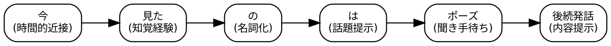

# 「今、見たのは、」の即時文法としての理解

Last updated: 2026/01/07-10:11:57

山元啓史, Ph.D. 東京科学大学

## 概要

このドキュメントは、AEAD プロジェクトの「今、見たのは、」の表現に関して、いくつかの重要なポイントを整理したものである。

## 1. はじめに

「今、見たのは、」が難しい理由は、意味ではなく「使いどころ」と「途中で止まること」にある。
これは多くの学習者が考える「文 = 完結した情報」という前提に反する。

## 2. 特徴

### 表1：外国人にとって習得しにくい点

| 項目 | 表現の特徴           | なぜ難しいか                                    |
| ---- | -------------------- | ----------------------------------------------- |
| ①    | 「のは、」で止まる   | 文が未完で許容される                            |
| ②    | 「今」の意味が幅広い | just now / recently / a moment ago を文脈で切替 |
| ③    | 名詞句の提示が目的   | 情報ではなく注意喚起が主目的                    |
| ④    | 後続を前提にする     | 聞き手の反応を含めて成立                        |
| ⑤    | 主語が曖昧           | I が明示されない                                |

特に **④** が課題である。
学習者にとって「まだ文が終わっていない」ことや主語が明示されないことに戸惑いの可能性があるが、
最も理解が難しいのは、この表現が 聞き手の反応を前提にしているという点である。
つぎに、②の「今」のような時に関する副詞が前提であることも、学習者には難しい。

## 3. 即時文法としての位置づけ

この表現は、情報提示文ではなく話題提示と注意集中の装置である。
即時文法的特徴は以下の通りである。発話は相手の注意を取った時点で一旦成功とみなされる。
内容は次のターンに委ねられる。文法的完成より相互行為のタイミングが優先される。

## 4. 構造の可視化

図1：「今、見たのは、」のプロセス構造

ポイントとしては、「は」は文を閉じないこと、「ポーズ」が文法構造の一部であること、
後続が来なくても失敗ではないことが挙げられる。

## 5. 教材化のヒント（即時文法向け）

教えるときの注意としては、「これは incomplete sentence です」と言わないことである。
「これは _turn-taking_ のための形」と説明するのが良い。

有効な練習方法の一例として、以下のようなロールプレイがある。

- 学習者A：「今、見たのは、」
- 学習者B：自由に推測・反応
  - 「え？なに？」
  - 「だれ？」
  - 「本当？」

反応が出た時点で成功とみなす。

## おわりに

この表現は特に、「話題の導入」「名詞句の強調」が入っており、意味説明に寄りすぎないことが重要である。
文として完結しなくても自然であること、相手の反応を前提とすることなどに注意して指導する必要がある。

## 参考文献

- Yamamoto, H. (2025). AEAD: A Expression A Day. Institute of Science Tokyo.
- Yamamoto, H. (2025). Process Grammar Model (v1.0.11) [Working Paper]. Zenodo. https://doi.org/10.5281/zenodo.15613134
