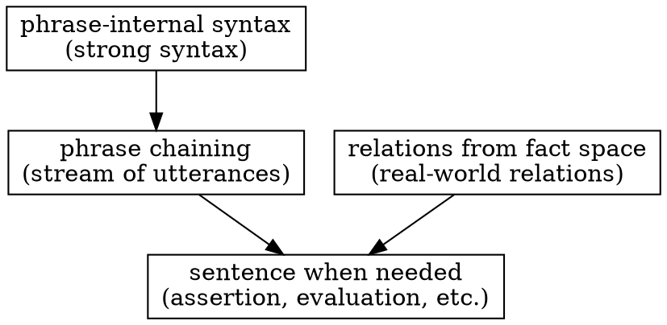
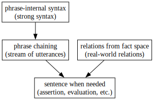

# Local Syntax and Loose Language Structure: Utterance as Phrase Chaining

Last change: 2026/03/16-19:05:30.

Hirofumi Yamamoto  
Institute of Science Tokyo

## Abstract

The basic unit of language is often described as the sentence. However, when actual conversation is observed, utterances do not always proceed sentence by sentence. Instead, they frequently unfold as a chain of short phrases.

Within phrases, clear word order constraints exist, indicating the presence of strong local syntax. In contrast, the overall structure of an utterance is relatively loose, emerging as phrases connect over time.

This paper proposes a perspective in which the basic unit of language is the phrase. It distinguishes between local syntax inside phrases and the structure of utterances as chains of phrases.

---

## 1 Introduction

In many grammatical theories, the basic unit of language is assumed to be the sentence (Chomsky 1965). Noun phrases (NP) and verb phrases (VP) are typically treated as elements that compose a sentence.

However, when actual conversation is observed, utterances do not always proceed in full sentences (Sacks, Schegloff and Jefferson 1974). Consider the following short dialogue.

> A: What do you think?
> B: Of what?
> A: Of your boyfriend?
> B: Ah, him? He is just a guy.

In this exchange, only the final utterance appears as a complete sentence. The preceding utterances function as short units that manage reference and topic.

Such phenomena raise questions about the assumption that the sentence is the fundamental unit of language.

---

## 2 Objective

The objective of this paper is to propose a perspective that treats the phrase as the basic unit of language.

Specifically, this study aims to clarify the following points.

- Utterances unfold as chains of phrases
- Strong syntax exists inside phrases
- Many relations between phrases are interpreted through structures in real-world situations

Through this perspective, the structure of language can be understood as locally strong but globally loose.

---

## 3 Methods

In this study, the phrase is treated using the following operational criterion.

A phrase is defined as a linguistic unit that is recognized as a single chunk within a short time span during speech, and that contains relatively strong word order constraints. Such stability of word order is closely related to frequency of usage and cognitive processing (Bybee 2010).

Units with this type of locally strong syntax are treated as phrases in this analysis. Observations focus on word order constraints within phrases, the chaining of phrases in speech, and the relationship between grammatical structure and real-world relations.

---

## 4 Results

Observation reveals three major characteristics of language.

First, utterances proceed as chains of phrases.
Second, strong syntax exists within phrases.
Third, many dependency relations originate from structures in the real world.

First, utterances unfold as chains of phrases. In conversation, speech progresses through sequences of short units. This view, in which grammatical structure emerges through usage, has also been discussed as emergent grammar (Hopper 1998). Sentences do not necessarily exist from the outset; they appear when required within the flow of speech.

Second, strong syntax exists inside phrases. Within phrases, clear word order constraints can be observed.

For example, in a Japanese verb phrase:

```
tabe -> rare -> masu
eat     POT     POL
```

This order is fixed, whereas:

```
rare -> masu -> tabe
POT     POL     eat
```

is not possible.

Similarly, in noun phrases:

```
Shin Kan Sen
new  main line (Shinkansen, Japanese bullet train)
```

is natural, while:

```
Sen Kan Shin
line main new
```

is unnatural.

These constraints maintain forms that speakers and listeners can recognize instantly and are related to cognitive economy.

Third, many dependency relations originate from structures in the real world. The relations of who does what to whom certainly exist, but they are not necessarily created by grammar itself. Instead, they arise from the structure of real-world situations.

Language can express these relations, but it is not necessary to encode all of them within grammatical structure.

---

## 5 Discussion

From these observations, language structure can be understood as consisting of three layers.

```
phrase-internal syntax
        ->
phrase chaining in time
        ->
interpretation through real-world relations
```

Strong syntax exists within phrases. However, the overall structure of speech unfolds as chains of phrases. Relations between phrases are interpreted not only through grammar but also through relations in real-world situations.

In this sense, language is strongly structured locally, but globally it forms a relatively loose system.

---

## 6 Conclusion

This paper has proposed a perspective that treats the phrase as the basic unit of language.

Strong syntax exists inside phrases, while the overall structure of speech unfolds as chains of phrases. Sentences appear as forms that perform particular functions such as assertion or evaluation, but they are not the only fundamental unit of language.

From this perspective, language can be understood as a system that is locally structured yet globally loose.

---

<!--

-->



Figure 1: Language Structure Overview: Language is strongly structured locally inside phrases, but globally loose in the chaining of phrases.

---

## References

1. Bybee, J. (2010). _Language, Usage and Cognition_. Cambridge University Press.
2. Chomsky, N. (1965). _Aspects of the Theory of Syntax_. MIT Press.
3. Hopper, P. J. (1998). Emergent grammar. In M. Tomasello (Ed.), _The New Psychology of Language: Cognitive and Functional Approaches to Language Structure_ (pp. 155-175). Lawrence Erlbaum Associates.
4. Langacker, R. W. (2008). _Cognitive Grammar: A Basic Introduction_. Oxford University Press.
5. Sacks, H., Schegloff, E. A., & Jefferson, G. (1974). A simplest systematics for the organization of turn-taking for conversation. _Language_, 50(4), 696-735.
