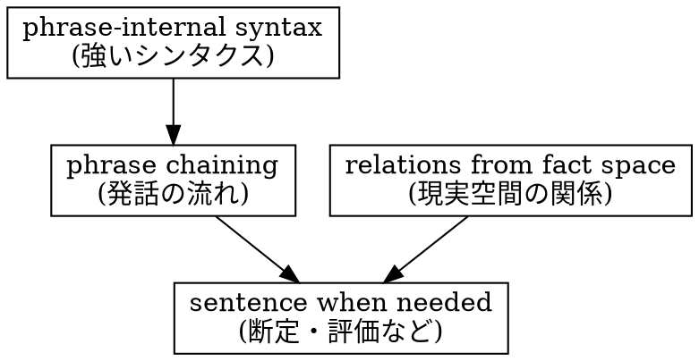
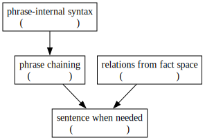

# 局所的シンタクスと緩い言語構造: 句連鎖としての発話

Last change: 2026/03/16-19:07:46.

山元啓史 (東京科学大学)

## 概要

言語の基本単位はしばしば「文」であると説明される。
しかし、実際の会話を観察すると、発話は必ずしも文単位で進むわけではなく、むしろ短い句の連鎖として展開することが多い。
句の内部には明確な語順制約があり、そこには強いシンタクスが存在する。一方、発話全体の構造は比較的緩く、時間の中で句が連鎖していく形で形成される。
本稿では、言語の基本単位を句として捉える視点を提示し、句内部の局所的シンタクスと、句連鎖としての発話構造を区別して説明する。

---

## 1. はじめに

多くの文法理論では、言語の基本単位は「文」であるとされる（Chomsky 1965）。
名詞句（NP）や動詞句（VP）は、文を構成する要素として扱われる。
しかし、実際の会話を観察すると、発話は必ずしも文単位で進むわけではない（Sacks, Schegloff & Jefferson 1974）。
例えば次のような短い対話を考える。

> A: What do you think?  
> B: Of what?  
> A: Of your boyfriend?  
> B: Ah, him? He is just a guy.

このやり取りでは、最後の発話のみが完全な文として現れている。それ以前の発話は、参照の確認や話題の調整といった機能を持つ短い単位である。

このような現象は、言語の基本単位を文とする見方に疑問を投げかける。

---

## 2. 目的

本稿の目的は、言語の基本単位を「句」として捉える視点を示すことである。

具体的には次の点を明らかにする。

- 発話は句の連鎖として展開する
- 句の内部には強いシンタクスが存在する
- 句と句の関係の多くは現実空間の構造によって解釈される

この整理により、言語の構造が局所的には強く、全体としては緩やかな体系であることを示す。

---

## 3. 方法

本稿では、句（phrase）を次のような操作的基準によって扱う。

句とは、発話の中で短時間に一まとまりとして認識される言語単位であり、その内部には比較的強い語順制約が存在する単位である。このような語順の安定は、言語使用の頻度や認知処理と深く関係していると考えられている（Bybee 2010）。
本稿では、このような局所的に強いシンタクスを持つ単位を句として観察する。
特に句内部の語順制約、発話における句の連鎖、現実空間の関係と文法構造の関係、などの観察から、言語構造の層を整理する。

---

## 4. 結果

観察の結果、言語には次の三つの特徴が確認できる。
第一に、発話は句の連鎖として進む。
第二に、句内部には強いシンタクスが存在する。
第三に、支配関係の多くは現実空間に由来する。

まず、発話は句の連鎖として進む。
会話では、発話は短い単位の連鎖として展開する。
このように、文法が使用の中で形成されるという見方は emergent grammar としても議論されている（Hopper 1998）。
文が最初から存在するわけではなく、発話の流れの中で必要に応じて現れる。
つぎに、句内部には強いシンタクスが存在する。
句の内部では語順制約が明確に存在する。
例えば日本語の動詞句では

```
たべ → られ → ます
```

という順序が固定されており、

```
られ → ます → たべ
```

のような順序は成立しない。
同様に名詞句でも

```
東京科学大学
```

は自然であるが

```
大学東京科学
```

は不自然である。
このような語順制約は、発話者と受け手が瞬時に認識できる形式を維持するためのものであり、認識の経済性と関係している。

さらに、支配関係の多くは現実空間に由来する。
このように文法構造と意味解釈が認知的・概念的構造と密接に関係するという見方は、認知文法でも指摘されている（Langacker 2008）。
誰が何をするのか、何が何を修飾するのかといった関係は確かに存在する。しかしそれらは必ずしも文法が作る関係ではなく、現実空間の構造に由来する。
言語はそれらの関係を表現することができるが、すべてを文法構造として組み込む必要はない。

---

## 5. 考察

以上の観察から、言語構造は次の三層として理解できる。

```
phrase-internal syntax
        ↓
phrase chaining in time
        ↓
interpretation through real-world relations
```

句の内部には強いシンタクスが存在する。しかし発話全体は句の連鎖として展開する。句と句の関係は、文法だけでなく現実空間の関係によって解釈される。
この意味で、言語は局所的には強く構造化されているが、全体としては緩やかな体系である。

---

## 6. おわりに

本稿では、言語の基本単位を句として捉える視点を提示した。
句内部には強いシンタクスが存在する。一方、発話全体は句の連鎖として展開する。文は必要な機能（断定や評価など）を担う形式として現れるが、言語の唯一の基本単位ではない。
この視点から見ると、言語は局所的には強く構造化され、全体としては緩やかな体系として理解することができる。

---

<!--

-->



図1: 言語構造の概要: 言語は句の内部では強く構造化されるが、句の連鎖として見ると全体は緩やかな体系である。

## 参考文献

1. Bybee, J. (2010). _Language, Usage and Cognition_. Cambridge University Press.
2. Chomsky, N. (1965). _Aspects of the Theory of Syntax_. MIT Press.
3. Hopper, P. J. (1998). Emergent grammar. In M. Tomasello (Ed.), _The New Psychology of Language: Cognitive and Functional Approaches to Language Structure_ (pp. 155-175). Lawrence Erlbaum Associates.
4. Langacker, R. W. (2008). _Cognitive Grammar: A Basic Introduction_. Oxford University Press.
5. Sacks, H., Schegloff, E. A., & Jefferson, G. (1974). A simplest systematics for the organization of turn-taking for conversation. _Language_, 50(4), 696-735.
