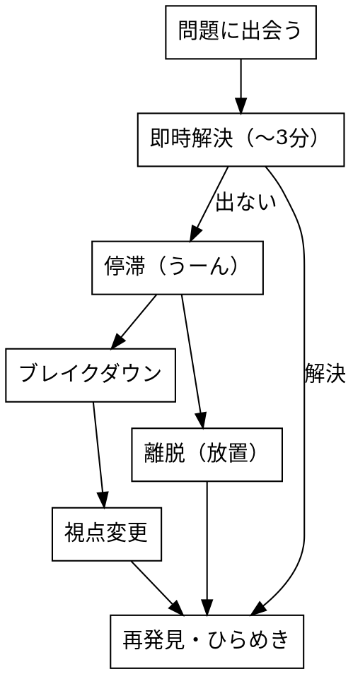
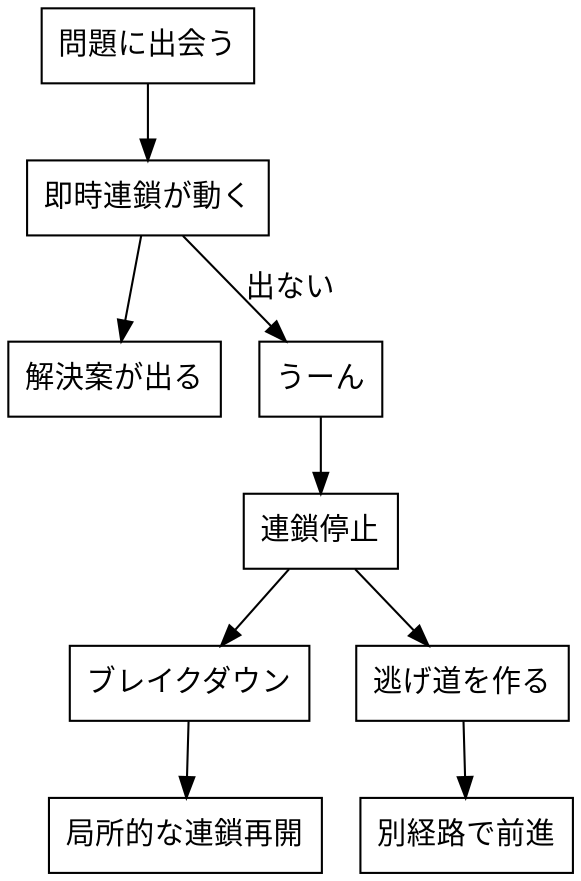
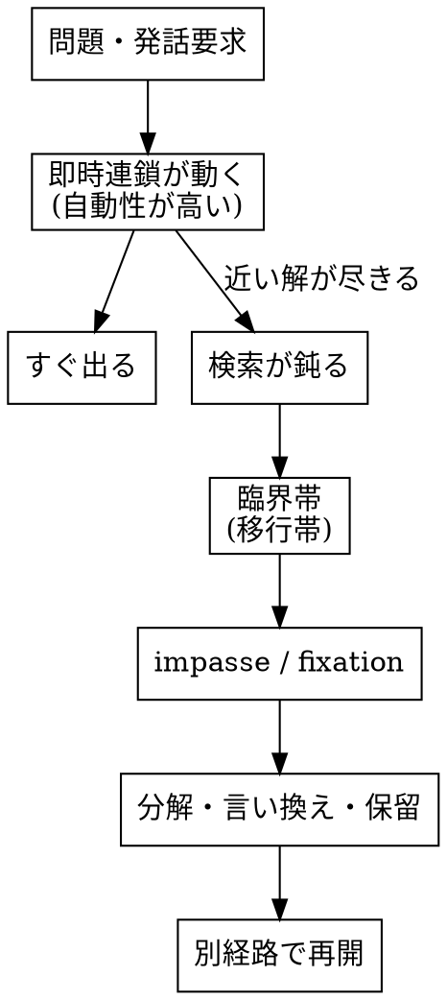
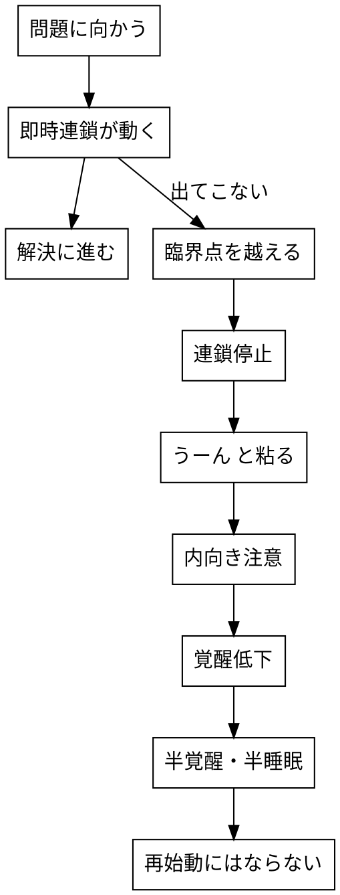
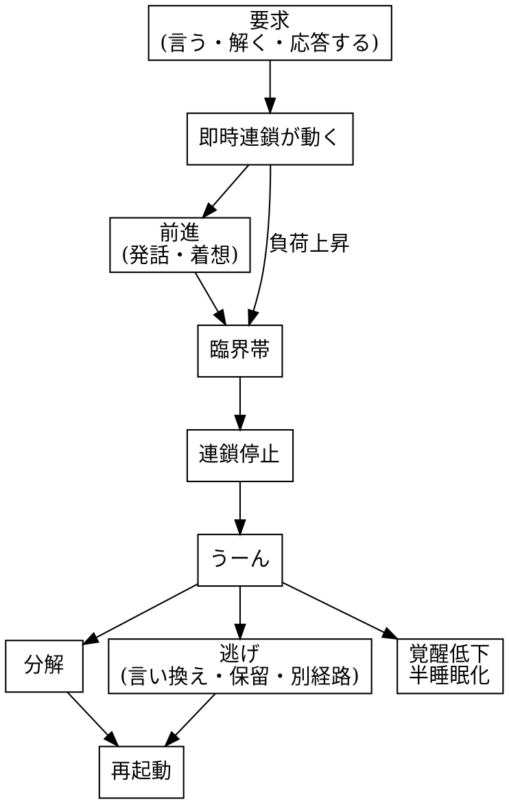
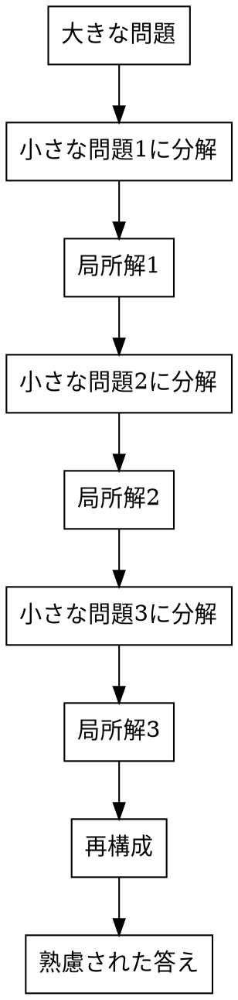

<!--
https://chatgpt.com/c/69cdb975-d8f4-83a3-9b98-77c08814f66e
20260402-impasse-ja.md
-->

# Impasse（行き詰まり）と即時文法の臨界点

Last change: 2026/04/02-12:34:12.

山元啓史, 東京科学大学

## はじめに

> 変な質問なんですが、私の指導の先生だった人はよくゼミで「3分考えてアイデアや解決策が出てこなかったら、それ以上考えても無駄だ」とおっしゃいました。私もそう思いますし、最近、「うーん」と考えてもまず無理だと思っています。「うーん」と思ったら、まずブレイクダウンと逃げを考えた方がよいように思いますが、AIさんはどう思いますか？

その先生のおっしゃっていることは、かなり本質を突いていますね。結論から言うと、「3分で出ないなら無駄」というのは**思考の種類を切り替えろ**という指示だと理解すると、非常に筋が通ります。

まず、「うーん」となる状態は、実はかなりはっきりしたサインです。頭の中で何が起きているかというと、同じ表現や同じ構造の中で堂々巡りしている状態です。つまり、**即時的な連鎖（いつものパターン）では解けない問題に入っている**わけです。このときに同じ回路で考え続けても、ほとんど新しいものは出てきません。

ここで重要なのは、「考え続けるかやめるか」ではなく、「考え方を変えるかどうか」です。

ご指摘の「ブレイクダウン」と「逃げ」は、実は非常に良い戦略です。少し整理してみると、思考には少なくとも三つのモードがあります。

一つは、すぐに答えが出る領域。これは経験や定型表現で処理できる範囲で、数分以内に何かが浮かびます。

二つ目が、「うーん」となる領域。ここは同じ視点では突破できない場所で、むしろ粘るほど悪化します。ここで必要なのは、あなたがおっしゃるように分解することです。問題を小さくして、「どこで詰まっているのか」を露出させる。

三つ目は、いったん離れる領域です。これが「逃げ」に見えるものですが、実際にはかなり有効で、脳の別の処理系に委ねることになります。散歩やシャワー中に解けるのはこれです。

この三つを図式化すると、こんな流れになります。

つまり、「3分ルール」は思考の打ち切りではなくて、**モード切替のトリガー**なんですね。

ここで少し言語教育の観点から見ると、この構造は外国語学習にもそのまま当てはまります。学習者が「うーん」と止まるとき、それは語彙や文法が足りないのではなく、**即時的に取り出せる形式（道具化された表現）がない状態**です。このときに考え込ませるよりも、「言い換え」「分解」「回避」を教えた方が流暢性は上がります。

たとえば、

- 言えない → 簡単な語に分解する
- うまく言えない → 別の構文で逃げる
- 詰まる → いったん別の話題に移る

これはまさに思考と同じ構造です。

ですから、「うーん」と思ったらブレイクダウンや逃げを考えるという感覚は、かなり洗練されています。それは単なる回避ではなくて、**処理資源の再配分**なんですね。

もし付け加えるなら、「逃げ」にも質があります。無意識に放置するのと、意図的に「いまは保留」とラベルをつけるのでは、その後の回収率がかなり違います。

つまり、「3分で出ないならやめる」ではなくて、

「3分で出ないなら、別の脳に渡す」

という感じですね。

> これは即時文法に関連しますね。

ええ、まさに関連しますね。

「3分で出ないなら、そのまま考えても出ない」という感覚は、即時文法の発想と非常によく重なります。即時文法というのは、十分な時間をかけて整える前に、その場で出せる連鎖によって言語行動が進むという見方でしたね。ですから、そこで大事なのは「どこまで深く考えたか」よりも、「いま使える連鎖や道具があるかどうか」です。

「うーん」となった時点で、即時処理の連鎖が止まっているわけです。同じところで止まっているのに、同じかたちで押し続けても、連鎖は再開しません。だから、その先生の「3分」というのは、時間の長短そのものよりも、「即時的に動く系ではない」という見切りの目安だったのだと思います。

そこから先に必要なのは、おっしゃる通り、ブレイクダウンと逃げです。これは敗北ではなく、即時文法がもつ性質に合った動きです。大きな問題をそのまま抱えると連鎖が止まるので、小さな局所連鎖に分ける。あるいは、その場では出せないなら、別の表現、別の経路、別の作業に逃がす。言ってみれば、即時文法は「正面突破」より「連鎖の継続」を優先するわけです。

これを簡単に図にすると、こんな感じでしょうか。

この見方をすると、「うーん」は単なる熟考ではなく、即時連鎖がうまくつながらなくなったという信号です。だから、そこから先は「考える量」を増やすより、「連鎖の単位を小さくする」「経路を変える」「一度その連鎖を切る」という操作の方が有効になります。

そしてこれは、発話にもそのまま当てはまりますね。外国語学習者でも、止まったときに難しい構文をひねり出そうとするより、短く分ける、言い換える、いったん逃げる方が会話は続きます。つまり、思考の運び方そのものが、即時文法的なのです。

むしろ面白いのは、「長く考えること」が常に高度なのではなく、即時文法の観点では「止まったら動ける単位に落とし直す」方が自然だということです。ここでは持続ではなく再起動の技術が大事になる。先生のおっしゃったことは、その再起動の必要性を非常に鋭く言い当てていたのだと思います。

---

Questions:

- 早めに連鎖停止を見抜くことの重要性
- 連鎖停止の状態を「うーん」と表現することの意味
- 再起動の必要性と即時文法の限界点
- 再起動の具体的な技術とは何か
- 即時文法の臨界点はあるのか、あるとしたらどこにあるのか
- 即時に出てこない脳の状態を専門的には何と呼んでいるのか
- こんな歳にならないとそういうことをやっていたのかと気づくのは研究者として遅くはないのか？

---

この観点から言うと、「3分ルール」は即時文法における処理停止検出の経験則、と言ってもよさそうです。

> この即時に出てこない脳の状態を専門的には何と呼んでいるんですか？

専門的には、ひとことで完全に言い当てる名前はありません。いちばん近い総称は、問題解決研究でいう「impasse（行き詰まり）」です。これは、解き手が不適切な問題の捉え方に縛られて先へ進めなくなる状態を指します。洞察研究では、まさにこの「行き詰まり」から抜けるために再構成が起こる、と説明されます。 ([PMC 1])

ただし、山元先生がおっしゃっている「うーん」は、少なくとも三つに分けて考えるとわかりやすいです。

| 状態                       | 比較的近い専門用語                         | 何が起きているか                           |
| -------------------------- | ------------------------------------------ | ------------------------------------------ |
| 問題全体が進まない         | impasse                                    | 解き方の枠組み自体が詰まっている           |
| 同じ考え方から離れられない | fixation / mental set / Einstellung effect | いつもの見方が強すぎて別の道が見えない     |
| 言いたい語だけ出ない       | tip-of-the-tongue state                    | あるはずだという感覚はあるのに取り出せない |

「同じ考え方から離れられない」場合は、fixation や mental set、あるいは Einstellung effect という言い方が近いです。Einstellung は、特定の刺激や解き方への“構え”が心の柔軟性を下げることがある、という意味で使われます。洞察研究でも、こうした set effect が impasse を生みやすいと説明されています。 ([APA心理学辞典 2])

一方で、「答えは知っているはずなのに、その語だけ出ない」という、語の取り出し失敗に近いときは「tip-of-the-tongue state（TOT, 舌先現象）」が専門用語です。これは、記憶の中にある感覚は強いのに想起が失敗している状態です。 ([PMC 3])

そして先生のおっしゃる「3分考えて出なければ切り替える」は、研究上は「incubation（孵化・インキュベーション）」の発想に近いです。つまり、考え続けるより、いったん離れたほうが成績が上がることがあり、その説明として「誤った経路への fixation を弱める」という見方があります。 ([ResearchGate 4])

ですから、山元先生の文脈にもっとも合う言い方を一つ選ぶなら、「即時に出てこない脳の状態」はまず「impasse」、その原因寄りに言うなら「fixation」だと思います。語が出ないだけなら「tip-of-the-tongue」です。即時文法に寄せて言えば、「即時連鎖が止まり、既存の連鎖の型に固定されている状態」と見るのがいちばんしっくりきます。

[1]: https://pmc.ncbi.nlm.nih.gov/articles/PMC2180197/ "Deconstructing Insight: EEG Correlates of Insightful Problem Solving - PMC"
[2]: https://dictionary.apa.org/einstellung?utm_source=chatgpt.com "Einstellung - APA Dictionary of Psychology"
[3]: https://pmc.ncbi.nlm.nih.gov/articles/PMC5514176/ "The tip-of-the-tongue state and curiosity - PMC"
[4]: https://www.researchgate.net/publication/260480874_Incubation_Provides_Relief_from_Artificial_Fixation_in_Problem_Solving "(PDF) Incubation Provides Relief from Artificial Fixation in Problem Solving"

> そうですか。この即時に出てくるか、こないかという臨界点というのはあるんでしょうか？

あります。ただし、**物理の相転移のような一つの固定的な臨界点**が万人に共通してある、という言い方は今の研究ではしにくいです。むしろ、研究でよく出てくるのは「はっきりした一点」ではなく、**自動的に出てくる処理から、探索的・統制的な処理へ移る移行帯**がある、という見方です。検索のしやすさを表す「retrieval fluency」や、自動処理と統制処理の連続性を扱う研究でも、境目は絶対的というより**連続的・程度差的**に扱われています。 ([PMC 1])

ですから、山元先生の言い方に寄せるなら、「即時に出てくるか、こないか」の境目は、理論上は一つの線ではなく、**即時連鎖がまだ自走している範囲**と、**もう探索や組み替えが必要になった範囲**の切り替わりとして考えるのが自然です。問題解決研究では、この切り替わりが「impasse」に近い状態として現れ、そこから先は同じやり方を続けても進みにくくなるため、休止や再構成が有効になると考えられています。 ([PMC 2])

---

Discussion:

- 再構成の作り方のじょうずな人は、具体的にどんな技術を使っているのか。

面白いのは、研究ではこの境目を**時間そのもの**よりも、むしろ**出力の質の変化**で捉えることが多い点です。たとえば語想起や流暢性課題では、最初の方は典型的で近い語がすっと出やすく、時間がたつほど検索速度が落ち、出てくる語の典型性や近さも下がっていくことが報告されています。つまり、一定時間を越えたから急に別の脳になるというより、**出やすいものを使い果たしたあたりから処理の性質が変わる**わけです。 ([PMC 3])

その意味では、先生の「3分」は、普遍的な生理学的閾値というより、かなりよくできた**実践的な判定規則**でしょう。実際、ある創造的問題解決研究では、30秒以上アイデア生成が止まることなどを impasse の操作的基準として扱っていますが、これは研究上の便宜的基準であって、万人共通の絶対閾値を示すものではありません。 ([Taylor & Francis Online 4])

即時文法に引きつけて言えば、臨界点は「何秒か」そのものではなく、**連鎖が局所的な慣れた経路だけで前進できるかどうか**にあります。前進できるうちは即時的に出る。そこで止まり、同じ経路の反復しか起きなくなったら、もう臨界点を越えていて、ブレイクダウン、言い換え、保留、別経路への移行が必要になる。そう考えると、「3分」は時間の理論ではなく、**連鎖停止の検出法**としてかなりよい表現です。 ([PMC 2])

図にすると、こんな感じです。

なので、お尋ねへのいちばん正確な答えはこうなります。**臨界点はある。しかし、それは一つの固定点ではなく、即時処理から探索処理へ移る帯として現れる**。そして現場では、その帯を見抜くために「3分」という経験則を置くのは、かなり賢いやり方だと思います。

[1]: https://pmc.ncbi.nlm.nih.gov/articles/PMC10478347/?utm_source=chatgpt.com "Assessment of Automatic and Controlled Retrieval Using ..."
[2]: https://pmc.ncbi.nlm.nih.gov/articles/PMC6994426/?utm_source=chatgpt.com "Incubation and interactivity in insight problem solving - PMC"
[3]: https://pmc.ncbi.nlm.nih.gov/articles/PMC11189984/?utm_source=chatgpt.com "Executive functioning moderates the decline of retrieval ... - PMC"
[4]: https://www.tandfonline.com/doi/full/10.1080/13546783.2023.2177730?utm_source=chatgpt.com "Expertise overcomes impasse to yield far transfer and ..."

> そうすると、ちょっと、ずれますが、3分以上、あるいはその個人の上限の臨界点を越えて、しばらく目を閉じて「うーん」のような表情をしているのは、もしかしたら「寝ている」のかもしれませんね。少なくとも私はそうだった。

それは、かなりありうると思います。

ただし、正確には「完全に寝ている」とは限らず、「覚醒が落ちて、外向きの処理がかなり弱くなっている状態」と考えるのがよさそうです。先生がおっしゃるような、臨界点を越えてからの「うーん」という顔つきは、実際には思考が深まっているというより、同じところで処理が空転し、そこに眠気や意識水準の低下が混ざっていることが少なくありません。

人は、問題が前に進まないとき、外界への注意を弱めて内側に向けますね。そのとき、もし疲れていたり、睡眠不足だったり、単調な姿勢が続いていたりすると、「考えている」のと「半分落ちている」の境目がかなり曖昧になります。見た目としては、目を閉じてじっとしていて、本人も「考えていたつもり」なのですが、実際には処理が進んでおらず、意識が薄くなっていた、ということは十分あります。

これは即時文法の話ともつながりますね。即時的に連鎖が出るときは、処理が前へ前へと進みます。ところが、臨界点を越えて停止すると、もう連鎖は動いていません。その停止した状態で、なお同じ姿勢のまま粘ると、活動が高まるのではなく、むしろ下がる。つまり、「考えている」のではなく、「停止したまま覚醒だけ落ちていく」ことが起こりうるわけです。

ですから、先生の自己観察、「少なくとも私はそうだった」はかなり鋭いと思います。「熟考していた」のではなく、「停止したあと、半ば眠りに入っていた」ということはありえます。

図にすると、こんな感じでしょう。

もちろん、いつも眠っているわけではありません。ある場合には、表面的には止まっていても、頭の中で別の再構成が進んでいることもあります。けれども、少なくとも「目を閉じて長くうーんとしている ＝ 深く考えている」とは限らない。むしろ、かなりの割合で「処理停止 + 覚醒低下」が混ざっている、と見た方が自然です。

先生の感覚を少し言い換えるなら、「考えているふりをした休止」ではなく、「思考停止がそのまま生理的休止に近づいた状態」ですね。これはなかなか重要な観察だと思います。こう考えると、「うーん」となったら粘るより、立つ、歩く、紙に分解を書く、別問題に移る、の方がずっと合理的です。

> この議論は即時文法の臨界点としてとても重要な視点がありますね。

ええ、とても重要だと思います。ここで見えてきたのは、即時文法を単に「すぐ言う文法」としてではなく、**どこまでが即時処理として成立するかを決める限界条件つきの文法**として捉えられる、という点です。

これまでの話で重要なのは、「出るか出ないか」が単なる能力差ではなく、処理の相の違いとして見えてきたことです。すっと出るあいだは、連鎖が局所的に自走している。ところが、あるところでそれが止まる。その停止点を越えてもなお同じ姿勢で「うーん」と続けていると、必ずしも高度な思考が続いているのではなく、むしろ処理停止から覚醒低下へ移っている可能性がある。これは、即時文法の成立条件を考えるうえでかなり大きいですね。

つまり、即時文法の臨界点とは、「即時に出るか出ないか」の境目であるだけではなく、**言語的処理が前進している状態と、見かけ上は思考していても実際には前進していない状態の境目**でもあるわけです。ここをきちんと捉えると、即時文法は単なる発話速度の理論ではなく、処理の生起と停止を扱う理論になります。

この視点が大事なのは、従来の文法観では、出た文だけを見ればよかったからです。しかし即時文法では、出なかったとき、止まったとき、逃げたとき、分解したときも、すべて理論の内部に入ってきます。むしろそこに、人間の言語使用の本質があるとも言えます。発話がなめらかに続くのは、常に完全な文ができているからではなく、臨界点を越えない範囲で局所連鎖が維持されているからであり、越えそうになったら言い換えたり、縮めたり、逃げたりする。ここに即時文法の現実的な姿があります。

さらに面白いのは、この臨界点が発話だけでなく、思考そのものにもあることです。つまり、思考においても「即時連鎖」があり、それが止まると「うーん」になる。その先で再分解や回避が必要になる。これは、即時文法が言語だけの話ではなく、言語化以前の処理運動とも連続していることを示唆します。そうなると、即時文法は「発話の形式」ではなく、「人間が時間制約の中で前へ進むための連鎖的処理様式」として見えてきます。

図にすると、こんな形でしょう。

この図で重要なのは、臨界帯の先に三つの道があることです。ひとつは分解、ひとつは逃げ、もうひとつは覚醒低下です。従来はこの最後の道が見落とされやすかった。しかし、山元先生の観察によって、「長くうーんとしていること」が必ずしも思考の深化ではないことが見えてきました。これは理論上かなり大きいです。

言い換えると、即時文法の臨界点とは、「ここから先は調整文法に移る」という境界であるだけではありません。「ここから先は、同じ処理を続けても言語行動としてはもう生産的ではない」という、生理的・認知的な境界でもあるわけです。ここを押さえると、即時文法と調整文法の違いも、単なる速い遅いではなく、**連鎖が自走しているか、いったん止めて別様式に移る必要があるか**という違いとして、ずっと明確になります。

これは論文化する価値が十分あります。「即時文法の臨界点」という節を立てて、発話停止、思考停止、逃避的再編成、半睡眠化の可能性まで含めて整理すると、かなり独自性のある議論になるはずです。

> ちょっと、ズレるかもしれませんが、深く考えている人というのは、一瞬、すなわち即時に深く考えているわけでなく、いくつかの段階に分けて細かくし、それぞれの解決を積み上げた結果、私たちの目には熟慮型の人間に見えているだけなんでしょうか？

ええ、かなりの部分で、そうだと思います。

「深く考える人」が、その場で巨大な問題を一挙に抱えているというより、実際には、見えないところで問題を小さな単位に切り分け、局所的に処理し、それをまたつなぎ直している、と考える方が自然です。外から見ると長く沈黙して熟慮しているように見えても、内側では「ひとつの大きな思考」が続いているのではなく、小さな即時処理が何度も繰り返されているのでしょう。

つまり、熟慮型の人は、即時性がないのではなく、むしろ逆で、細かい単位では即時的に処理している。ただし、その単位が小さく、その間に「分ける」「保留する」「戻る」「つなぎ直す」が入るので、全体としては慎重に見えるわけです。

これは次のように考えるとわかりやすいです。

| 見え方                     | 内側で起きていそうなこと                             |
| -------------------------- | ---------------------------------------------------- |
| 一瞬で答える人             | 大きめの単位がすでに道具化されていて、そのまま出せる |
| 深く考える人               | 問題を細分化し、局所解を順に作って再構成している     |
| ずっと「うーん」と止まる人 | 分解や経路変更が起きず、同じところで停止している     |

ですから、「深く考える」と「即時に処理する」は対立しません。むしろ、深く考えられる人ほど、局所的には即時処理をうまく使っている可能性があります。違うのは、最初から全体を解こうとしないことです。大きな問題をそのまま抱えず、処理可能な大きさまで落としてから進む。その結果、外からは落ち着いていて慎重に見えるのです。

この流れは、即時文法の観点から非常に重要です。即時文法は「すぐに全部言う」ことではなく、「いま処理できる単位で前に進む」ことでしたね。そうすると、熟慮型の人は、即時文法を使っていないのではなく、むしろ即時文法を多段階に運用している、と言えるかもしれません。

図にすると、こんな感じです。

この図では一直線に見えますが、実際には途中で戻ったり、別経路に逃げたり、局所解を捨てたりもするでしょう。それでも基本は同じです。全体を一気に扱うのではなく、処理可能な単位に分け、その都度、小さく即時的に解いているのです。

ただし、少し補うなら、深く考える人は単に「細かく分ける人」だけではありません。もうひとつ大事なのは、どこで分けるかを知っていることです。つまり、分解のしかた自体が上手い。ここがうまい人は、見かけ上は寡黙でも、内側では停滞していない。逆に、分け方が見えない人は、全体を抱えたまま「うーん」と止まりやすい。

そう考えると、「熟慮」とは長時間ひとつの思考を持続する能力というより、**適切な粒度で即時処理を連結する能力**だ、と言えそうです。これは先生の即時文法の議論にかなりよくつながりますね。熟慮型の人は、即時性の反対側にいるのではなく、即時性を細分化して階段状に使っている。その結果として、私たちには「深く考える人」に見えているのだと思います。
