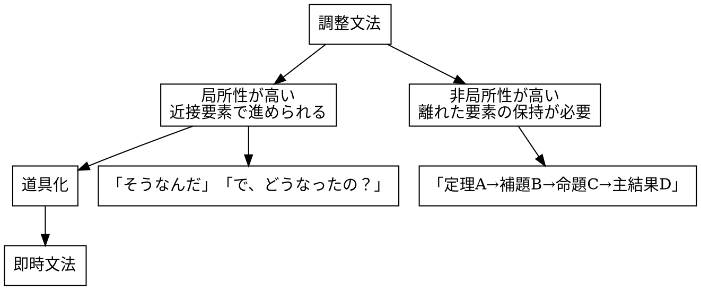
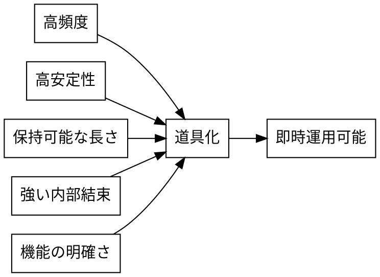
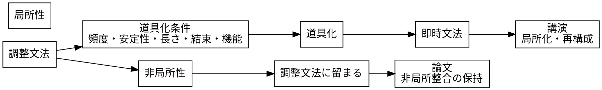

<!--
https://chatgpt.com/c/69cf9503-18f4-83a7-8092-57882afe5dc6
20260403-adjustive-grammar-ja.md
-->

# 調整文法の極限と即時文法への可遷移性

Last change: 2026/04/03-20:27:42.

山元啓史, 東京科学大学

## はじめに

本稿では、調整文法の生成物が一様に即時文法へ移行するわけではないという観察から出発する。この点は直観的には明らかであるが、従来は十分に区別されてこなかったように思われる。本稿では、この差を局所性および道具化という観点から捉えることを試みる。

本稿では、調整文法における生成結果がすべて即時文法へ移行可能であるわけではないという点を出発点とし、調整文法の極限における二つの分岐を記述する。従来、調整文法によって形成された表現は、反復使用を通じて道具化され、その結果として即時的に運用可能な単位へと圧縮されると考えられてきた。実際、多くの定型表現や複合的な述部構造は、調整の産物でありながら、使用の段階では即時的に処理される。この意味において、調整文法は即時文法への供給源として機能している。

しかしながら、この過程は普遍的ではない。調整文法によって構成される文字列の中には、構造上、即時文法へ移行することが不可能なものが存在する。本稿はこの点を、調整文法の極限における分岐として捉える。

まず、調整文法における生成物の一部は、反復と使用履歴を通じて内部構造が固定化され、局所的連鎖として再利用可能な単位へと収束する。この過程を道具化と呼ぶ。道具化された表現は、構成要素の逐次的な再計算を必要とせず、まとまりとして即時的に呼び出されるため、即時文法の処理領域に移行する。この領域では、処理は局所的連鎖に基づいて進行し、全体構造の逐次的検証は不要となる。

これに対して、調整文法の生成物の中には、全体的整合性の維持が成立条件そのものであるものが存在する。この種の表現では、ある部分の選択や変形が、非局所的に他の部分の正当性に影響を及ぼす。そのため、処理は常に全体構造を参照しながら行われる必要があり、局所的連鎖への分解が本質的に不可能である。このような構造は、反復による圧縮を受けても、単一の即時的単位として安定化することができない。

数学的論証は、この非可遷移領域の典型例である。論証においては、各推論ステップが後続の正当性に対して連鎖的かつ非局所的な制約を持つため、部分的な理解や局所的なもっともらしさでは成立しない。したがって、論証全体は、調整文法の枠内に留まり続ける必要がある。これに対し、講演において提示される内容は、論証そのものではなく、着想や見通しといった局所連鎖に還元可能な要素へと再構成されたものであり、ここにおいて即時文法的運用が可能となる。

以上より、調整文法の極限においては、次の二種類の収束形が区別される。すなわち、反復によって道具化され即時文法へ移行する可遷移構造と、全体整合性の拘束により調整文法に留まり続ける非可遷移構造である。この区別は、言語運用における即時性の限界を規定するものであり、あらゆる表現が訓練によって即時化されうるという見方に対して、構造的な制約の存在を示すものである。

---

もしここからさらに発展させるなら、次の方向が考えられます。

- 「非局所性」をもう少し形式化する

はい。ここでいう「局所性」は、ある部分の処理が、その近くの要素だけを見れば進められるか、それとも離れた部分まで保持しないと成立しないか、という違いとして出せると思います。

論文風に少し整えて言うと、局所性とは、ある文字列の次の選択や解釈が、主として隣接または近接する要素との連鎖によって決まる性質である。これに対して非局所性とは、ある箇所の選択や正当性が、離れた位置の要素や文字列全体の整合性に依存する性質である。即時文法は局所性の高い処理に適し、調整文法は非局所性の高い処理を支える。

たとえば、即時的に使いやすい表現には、かなり局所的なものがあります。

「そうなんだ」
「なるほどね」
「まあ、それはそう」
「行けたら行く」

これらは、もちろん社会的含意や語用論的な含みはありますが、発話の生成そのものは比較的局所的です。前の一言を受けて、その近くの反応として出せる。全体の論証構造や長距離の整合を保持しなくても、とりあえず成立します。こういうものは、調整によって磨かれたとしても、道具化されれば即時に取り出せます。

これに対して、局所性が低く、非局所性が高いものとしては、たとえば次のようなものがあります。

「定理Aを仮定すると補題Bが従い、補題Bの結果を用いることで命題Cの条件(iii)が満たされる。したがって主結果Dが成立する」

この文字列では、「したがって」がその直前だけを見て成立しているのではありません。「定理A」「補題B」「条件(iii)」「主結果D」という離れた複数の部分が、全体としてちゃんと噛み合っていなければならない。ここでは局所的な流れだけでは足りず、非局所的な保持が必要になります。これが調整文法に留まりやすい構造です。

日本語のもっと身近な例に落とすと、こういう対比もできます。

まず局所性が高い例です。

「え、ほんと？」
「それで？」
「で、どうなったの？」
「まあ、いいか」

これらは、直前の発話との局所連鎖でかなり動きます。遠くの文脈を厳密に保存しなくても使える。だから即時化しやすい。

一方で、非局所性が高い例はこうです。

「先ほど述べた二つの前提が同時に成り立つならば、ここでの例外規定は適用されないことになる」

この文では、「先ほど述べた二つの前提」が何かを保持していないと、後半は成立しません。「ここでの例外規定」も、離れた位置の定義や文脈を参照しています。こういう文は、その場の勢いだけでは作りにくく、書きながら全体を調整する必要があります。

図式化すると、こうなると思います。

これをもう少し論文風に書くと、次のようになります。

局所性の高い表現では、発話の進行は主として隣接的連鎖によって支えられる。そのため、反復使用によって処理単位の固定化が進みやすく、道具化を経て即時文法へ移行しやすい。これに対して、非局所性の高い表現では、ある部分の成立が離れた要素や全体構造との整合に依存するため、局所的連鎖への還元が困難である。この種の表現は、反復によって部分的な定型化が進んだとしても、全体としては調整文法に留まりやすい。

簡単な表にすると、こうです。

| 型       | 支配的な性質               | 例                                   | 即時化   |
| -------- | -------------------------- | ------------------------------------ | -------- |
| 局所型   | 近くの要素だけで進めやすい | 「そうなんだ」「で、どうなったの？」 | しやすい |
| 非局所型 | 離れた要素との整合が必要   | 論証、法文、厳密な説明文             | しにくい |

さらに言えば、すべてが白黒で分かれるわけではなく、中間もあります。たとえば学会発表でよくある、

「細かい証明は省略しますが、ポイントはここです」

のような言い方は、非局所的な論証を、その場では局所的に受け取れる形へ圧縮しているわけです。これはまさに、調整文法の内容を、講演のために局所化している例ですね。

この考え方を使うと、先ほどの議論はかなり整理できます。つまり、調整から道具化を経て即時に使えるものとは、局所性を十分に獲得できたものです。逆に、どうしても即時に使えないものとは、非局所性が本質として残るものです。

必要でしたら次に、この「局所性」をもう少し形式化して、「隣接依存」「近距離依存」「長距離依存」の三段階ぐらいに分けた文章案も出せます。

- 「道具化」の条件（頻度・安定性・長さなど）を明示する

はい。ここを明示すると、「何が調整文法から即時文法へ移りやすいのか」がかなり見えやすくなります。考え方としては、道具化とは単に「よく使うから覚える」ということではなく、**反復使用によって、ひとかたまりとして安定し、再計算なしで呼び出せるようになること**だと置くとよいと思います。

その条件は、少なくとも「頻度」「安定性」「長さ」「内部結束性」「機能の明確さ」の五つくらいで記述できそうです。

まず頻度です。これはもっともわかりやすい条件です。同じ形、あるいはごく近い形が繰り返し使われるほど、毎回その場で組み立てるより、まとまりとして保持したほうが処理負担が小さくなります。「そうなんだ」「まあいいか」「しょうがない」「お先に失礼します」のような表現は、まさにその例です。ただし、頻度だけでは足りません。頻度が高くても、毎回構造が大きく変わるものは、道具として固定しにくいからです。

そこで次に安定性が必要になります。安定性とは、表現の内部構造や語順、使われる場面、意味機能が大きくぶれないことです。たとえば「よろしくお願いします」は、語順も機能もかなり安定しています。だからまとまりとして保持しやすい。これに対して、論証文のように毎回中身が変わり、どこが主張でどこが前提かが文ごとに組み替わるものは、頻度があっても表現全体としては固定しにくいわけです。

長さも重要です。ただし、ここでいう長さは単純な文字数や語数ではありません。**一息で保持できる処理単位の長さ**と考えたほうがよいです。短すぎればもちろん道具化しやすいのですが、少し長くても、内部が強くまとまっていれば道具化できます。たとえば「そういうこともある」「行けたら行く」「何とかしてよ」くらいなら、かなりまとまりとして扱えます。しかし、条件節が重なり、途中に修飾が入り、最後に結論が出るような長い論証文は、一塊としては持ちにくい。つまり、長さそのものよりも、長さに対して内部がどれだけ圧縮されているかが鍵になります。

そこで内部結束性という条件が出てきます。これは、構成要素どうしが強く結びついていて、途中の入れ替えや削除が起こりにくいことです。「どうしても」「しょうがない」「ていうか」「と言いますか」のようなものは、部分に分けられはしても、運用上は強いまとまりを持っています。逆に、数学の論証や法的説明のように、各部分が他の内容に置き換わりやすく、そのつど新しい整合が必要なものは、内部結束が弱い。だから全体としての道具化が難しいのです。

最後に機能の明確さがあります。これは、その表現が何をするための道具なのかがはっきりしていることです。あいづちを打つ、保留する、断る、同意を示す、話題を切り替える、といった機能が明確な表現は、場面ごとにすぐ取り出せます。つまり、形式だけでなく用途が固定していることが、道具化を後押しします。これに対して、論証文は毎回「何を示すか」が異なるので、用途が広すぎて、全体をひとつの道具にしにくいのです。

これを表にすると、こうなります。

| 条件         | 内容                         | 道具化しやすい例         | 道具化しにくい例         |
| ------------ | ---------------------------- | ------------------------ | ------------------------ |
| 頻度         | 繰り返し使われる             | 「そうなんだ」           | 一回限りの複雑な説明     |
| 安定性       | 語順・機能・場面がぶれにくい | 「よろしくお願いします」 | 毎回構造が変わる論証文   |
| 長さ         | 一息の処理単位に収まりやすい | 「行けたら行く」         | 条件が入れ子になった長文 |
| 内部結束性   | 要素同士が強くまとまる       | 「しょうがない」         | 可変部分の多い説明文     |
| 機能の明確さ | 用途がはっきりしている       | あいづち・依頼・断り表現 | 用途が毎回変わる議論文   |

論文風に言い換えるなら、次のように書けます。

道具化は、反復使用された表現が単なる記憶対象ではなく、即時運用可能な処理単位として固定化される過程である。この固定化は、少なくとも五つの条件に支えられる。第一に、当該表現が高頻度で反復されること。第二に、その内部構造と機能が安定していること。第三に、表現全体が処理単位として保持可能な長さに収まっていること。第四に、構成要素間の結合が強く、部分的な差し替えに対して不変性を持つこと。第五に、語用論的機能が明確であり、特定の場面において再利用しやすいことである。これらの条件が高く満たされるほど、表現は調整文法の産物でありながら、再計算を要しない即時的道具として機能するようになる。

逆に言えば、頻度があっても、構造が不安定で、長く、内部可変性が高く、用途も広すぎるものは、道具化しにくいわけです。数学の論証はまさにそうで、たとえば「背理法により」や「したがって」は道具化できますが、証明全体は道具化できません。つまり、**部分は道具化できても、全体は道具化できない**ということです。

この関係を図にすると、こう書けます。

さらに一歩進めるなら、これらを二値ではなく連続量として扱えそうです。たとえば、ある表現について、

道具化指数 = 頻度 x 安定性 x 結束性 x 機能明確性 ÷ 処理負荷

のような発想で考えることもできます。もちろんこれはまだ概念図ですが、少なくとも「何が道具化しやすいか」を記述する枠組みにはなります。

必要でしたら次に、この五条件を使って、「そうなんだ」「お先に失礼します」「行けたら行く」「数学の証明文」を実際に比較した小さな評価表を作れます。

- 講演と論文の差を、この枠組みで節として独立させる

はい、ここまでの議論を踏まえて、「講演と論文の差」を独立した節として組み込み、全体を一つのまとまった論文風の記述として提示します。あくまで定義→区別→適用という流れを崩さずに書いています。

---

### 調整文法の極限と道具化：局所性と可遷移性に基づく記述

本稿は、調整文法によって生成される表現が、すべて即時文法へ移行可能であるわけではないという点を出発点とし、調整文法の極限における構造的分岐を記述することを目的とする。特に、局所性および道具化の条件を導入することで、即時文法への可遷移性を規定する原理を明らかにする。

調整文法は、全体構造の整合性を保持しながら文字列を生成する過程である。この過程において生成された表現の一部は、反復使用を通じて内部構造が固定化され、再計算を要しない処理単位として再利用可能になる。この過程を道具化と呼ぶ。道具化された表現は、局所的連鎖に基づいて即時的に呼び出されるため、即時文法の領域へと移行する。

道具化の成立には、少なくとも次の条件が関与する。すなわち、当該表現が高頻度で反復されること、内部構造および語用論的機能が安定していること、処理単位として保持可能な長さに収まること、構成要素間の結束が強く部分的な差し替えに対して不変性を持つこと、そして機能が明確で特定の場面において再利用可能であることである。これらの条件が満たされるほど、表現はまとまりとして固定され、即時文法的運用が可能となる。

このとき重要となるのが局所性である。局所性とは、ある部分の処理が近接する要素との連鎖によって進行可能である性質を指す。局所性の高い表現では、処理は逐次的かつ近接的に進行し、全体構造の保持を必要としないため、道具化を経て即時文法へ移行しやすい。これに対して、非局所性の高い表現では、ある部分の成立が離れた要素や全体構造との整合に依存するため、局所的連鎖への還元が困難であり、調整文法に留まり続ける。

以上より、調整文法の極限においては、次の二種類の収束形が区別される。第一に、局所性を獲得し、道具化を経て即時文法へ移行する可遷移構造である。第二に、非局所的整合性の拘束により、調整文法に留まり続ける非可遷移構造である。

---

### 講演と論文における運用差

上記の枠組みは、講演と論文の差異を説明する上でも有効である。講演においては、聴衆との相互作用および時間的制約の下で、局所的連鎖に基づく理解が優先される。そのため、非局所性の高い構造は、そのまま提示されるのではなく、局所性の高い断片へと再構成される。ここでは、論証そのものではなく、着想、見通し、簡易化の鍵といった、局所連鎖に還元可能な要素が前景化される。

これに対して論文では、読者がその場に存在しないため、表現は時間的に分断された状態でも自己完結的に成立しなければならない。そのため、非局所的整合性の保持が不可欠となり、すべての要素は全体構造との関係において厳密に位置づけられる必要がある。この結果、講演において許容される飛躍や圧縮は排除され、調整文法の極限的な運用が要求される。

したがって、講演は調整文法によって得られた内容を局所化し、即時文法的運用へ適合させる過程であり、論文は同内容を非局所的整合性のもとで固定する過程であると位置づけられる。

---

### 図式化

---

この形にしておくと、

- 「何が即時化できるのか」
- 「なぜ論文は重くなるのか」
- 「なぜ講演は自由に見えるのか」

がすべて同じ枠組みで説明できます。

さらに発展させるなら、このあとに「非局所性の形式化（依存距離など）」や「道具化の連続量モデル」を付けると、かなり理論として締まってくると思います。

もし次に進めるとしたら、

    「局所性」をもう一段だけ形式に寄せる

    「非局所性」を1つだけ厳密に定義する

このどちらかを一点突破でやると、一気に論文らしさが出ます。

全部を一度に固める必要はないと思いますよ。
