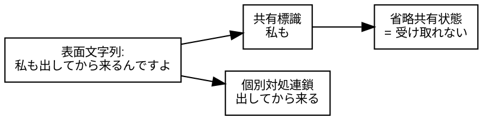
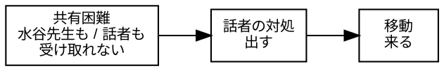
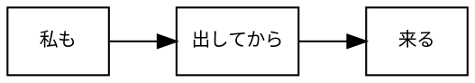
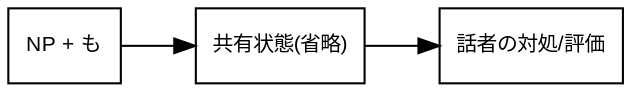

<!--
https://chatgpt.com/c/69d43afd-6fb4-83a2-bb90-5e110f04755e
Dropbox/pub/nihongo-no-oto/2026/20260407-sokuji-rensa-ja.md
-->

# 即時的連鎖としての「私も出してから、来るんですよ」

Last change: 2026/04/07-10:09:49.

山元啓史, 東京科学大学

---

## 1. はじめに

自然言語の発話は、必ずしも統語的に整った文として産出されるわけではない。とりわけ日常会話においては、表面上の線形構造と意味的作用域が一致しない連鎖が頻繁に観察される。このような事例は、従来、談話的省略、文間関係、あるいは不完全な発話として扱われ、統語論的記述の中心的対象からは外される傾向にあった。

しかし、このような扱いには問題がある。第一に、それらの発話は単なる逸脱ではなく、実際の言語運用において安定して出現する構造をもっている。第二に、それらは発話の即時的な生成過程に密接に関わっており、整形された文へと還元することによって、その接続のしかた自体が観察不能となる。第三に、こうした連鎖においては、場面内で共有された情報の鮮度が、発話の許容条件として機能している可能性があり、この点は従来の文内中心の文法記述では十分に捉えられてこなかった。

本稿は、このような問題意識に基づき、線形隣接と意味的作用域の不一致を示す発話を、「談話的省略」や「復元可能な構造」としてではなく、即時的な連鎖を許容する文法規則として捉えることを提案する。すなわち、発話を完成形としてではなく、時間的に進行する処理として捉え、その過程において許容される接続様式を文法の一部として記述する立場を採用する。

具体的には、本稿では「私も出してから、来るんですよ」という発話を中心的事例として取り上げ、「も」の作用域が表面上の後続述部に及ばず、場面内で共有された困難にかかっているにもかかわらず、そのまま話者固有の対処連鎖へと移行する構造を分析する。この事例を通じて、共有状態への接続と個別対処への移行が一続きに許容される即時的連鎖の存在を示し、その記述の必要性を論じる。

本稿の構成は次の通りである。第2節では、即時文法と調整文法という理論枠組みを提示する。第3節では、具体的事例を詳細に分析し、当該連鎖の構造とその許容条件を明らかにする。第4節では、類似事例との比較を通じて、この連鎖様式の一般性を検討する。

---

## 2. 理論枠組み: 即時文法と調整文法

本稿では、言語使用を二つの運用様式として捉える。一つは、時間的制約のもとで即座に発話が形成される即時文法であり、もう一つは、発話内容の選択や構文の整形が可能な調整文法である。

調整文法においては、述語と項の関係、修飾関係、作用域などが文内で明示的に整えられることが求められる。そのため、「私も出してから、来るんですよ」のような発話は、「私もそうなんです。だから、出してから来るんですよ」のような二文構造に復元され、統語的整合性が確保される形で記述される傾向にある。

これに対し、即時文法においては、発話は時間的に連続する処理の中で形成されるため、線形隣接と意味的作用域が一致しない連鎖が許容される。本稿では、この即時側の連鎖規則を文法の一部として記述対象とする。

## 3. 即時的連鎖としての「私も出してから、来るんですよ」

### 3.1 事例の提示

セブンイレブンのレジ前において、スマートフォンのアプリに表示されるバーコードを提示しようとしても、通信環境の影響により画面が即時に表示されない場面が観察された。筆者は当初それを個別的な問題と考えていたが、先に店に来ていた水谷先生もまた、レジ前で端末を上下にかざしながらバーコードの表示に手間取っていた。

この状況において、筆者は「私も出してから、来るんですよ」と発話した。

本発話は、表面的には単一の文として与えられているが、その意味は「私も電波をうまく受け取れないため、電波環境のよい場所であらかじめバーコードを表示させてからレジに来るのである」と解釈される。しかし重要なのは、水谷氏が同様の対処を行っているわけではない点である。したがって、「私も」の「も」は後続の「出してから来る」には作用していない。

### 3.2 「も」の作用域と共有困難

本事例において、「私も」は直後の述部に係るのではなく、場面内で高い鮮度をもって共有されている困難、すなわち「電波がうまく受け取れない」という状態を受けている。この共有困難は明示されないまま、話者の対処連鎖へと接続される。

一方、表面文字列は次のような単純な線形連鎖として現れる。

ここでは、線形隣接と意味作用域の不一致が観察される。

### 3.3 即時的連鎖としての記述

本稿では、この不一致を「省略」や「談話補完」として処理するのではなく、即時側に属する連鎖規則として扱う。その理由は以下の三点にある。

第一に、即時的感覚が消えてしまうことである。「私も」と発した時点で共有困難への参与が成立し、そのまま話者自身の対処へ移行する。この即時的なつながりは、調整後の因果の見え方のよろしい復元文にすると失われる。この即時的感覚というものの定義自体も難しく課題ではあるが、温存する考え方が必要である。

第二に、どういう共有まで許されるか、すなわち、時間的にも印象的にも、文脈が脳裏に活きているという共有鮮度そのものがルールに関わっていることである。共有があるというだけでは足りず、どの程度の鮮度で共有されているかが、このような連鎖を許す条件になっている。極端な話ではあるが、明日の同時刻ではこの連鎖は許されないかもしれない。したがって、共有の鮮度を含めたルールが必要である。

第三に、この共有機構が言語非依存の一般的原理である可能性もある一方で、現状では言語依存の実装、すなわちローカルなルールであることも否定できないことである。したがって、現段階では表面連鎖をそのまま記述単位として保持しなければならない。

以上より、本事例は「共有状態への接続と個別対処への移行が一続きに許容される即時的連鎖」として記述される。

この種の発話を記述しなければならない理由は、実際の言語運用をそのまま捉えるためである。実際の文字列をスキャンしたときに、なんらかのルールに収めたい。これを省略や談話補完として整った文に還元してしまうと、話し手がその場でどのように連鎖を作ったかという事実が見えなくなる。すると、即時的なつながり方そのものが記述対象から外れてしまう。また、この種の連鎖は、どの程度まで共有されていれば許されるのかという条件を含んでいる可能性がある。したがって、表面に現れた連鎖をそのまま記述単位として保持する態度と枠組みが必要である。

---

## 4. 他例との比較と一般化

同様の構造は、他の発話にも観察される。たとえば、

「これ、私もダメで、いつも先にやっておくんですよ」
「それ、私もよくあって、結局あとでやるんですよ」

といった例においても、「私も」は共有された困難や経験を受け、その直後に話者固有の対処や評価が続く。

これらの例に共通するのは、次の連鎖である。

このような構造において、「も」は文内の統語的関係に閉じるのではなく、場面共有に接続したまま、後続の個別連鎖へ移行する。これは、即時文法における基本的な連鎖様式の一つと考えられる。
