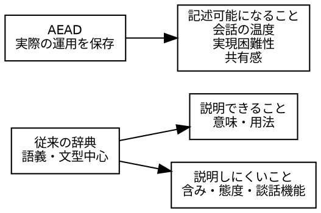
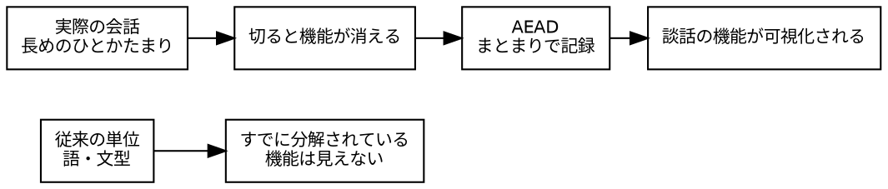
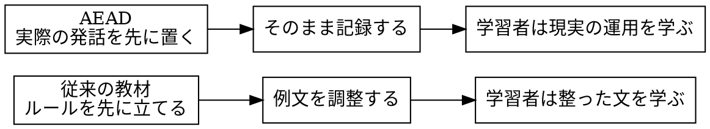

<!--
https://chatgpt.com/c/69dc5103-fbac-83a7-baee-a38788c44b54?src=history_search
Dropbox/pub/nihongo-no-oto/2026/20260414-longer-expression-ja.md
-->

# 長めの表現を辞書に採用することの意義

"The significance of adopting longer expressions in dictionaries"

Last change: 2026/04/16-15:27:35.

山元啓史, 東京科学大学

---

## はじめに

従来の辞書・辞典の記述は、単語や短いフレーズの意味を説明することに重点が置かれてきた。
従来型の辞典で記載しにくいのは、語の意味を説明すること自体ではなく、その語やフレーズが、実際の会話の流れの中でどんな働きをしているかを十分に扱えなかったことである。
辞典は語義、品詞、用例、少数の定型句までは書けるが、「そうできればいいんだけど...」のような、ためらい、非実現感、相手への配慮、話の開いた終わり方までを、一つの運用単位として記述しにくい。

AEAD が試みたのは、長めの表現を拾うことで、単に「意味」を書くのではなく、表1のように、会話のひとかたまりとしての働きや、含み・態度・実現困難性なども書けるようにすることである。

表1: AEAD的即時反応法と従来の辞典記述の比較

| 記述対象               | 従来の辞典   | AEAD が書けること |
| ---------------------- | ------------ | ----------------- |
| 単語の語義             | 得意         | 得意              |
| 文型の基本意味         | ある程度得意 | 得意              |
| 会話のひとかたまり     | 弱い         | 強い              |
| 含み・態度・実現困難性 | 非常に弱い   | かなり書ける      |

たとえば「そうできればいいんだけど」は、辞典的には「願望を表す」と書ける。
しかし、それだけでは十分ではなく、実際には、「やりたいが難しい」「提案には共感するが現実には無理がある」「やわらかく距離を取る」といった機能がある。
それらの機能を記述することにより、その表現の実体に近づける。

従来の辞書と AEAD との比較を図1に示す。

図1: 従来の辞典と AEAD の比較

従来の枠組みでは、「語」「文型」が単位であった。
しかし、実際の運用では、「そうできればいいんだけど...」のように、途中で切ると機能が失われるひとかたまりが存在します。これをどう捉えるかが核心でした。

整理すると、今回見えてきたのは次の関係です。
単位の取り方 見えるもの 見えなくなるもの 難易度
語 語義 含み・態度 1/5
文型 構造 対人機能 2/5
発話のひとかたまり 実際の機能 分解しやすさ 5/5

そして重要なのは、この「発話のひとかたまり」が、

- 願望＋非実現性
- 共感＋距離
- 評価＋共有

のように、複数の働きを同時に担っていることである。
こうすべき理想についての議論では抽象的では中身が見なかった。

重要なのは、「どこで切るか」ではなく、どこまでが一息で一つの働きをしているかである。
しかし、一息という単位をこれまでの言語学の枠組みで捉えるのはあまりにも感覚的で、経験的であるため、学術としての取り扱わいにくかったと考える。

日英の文を対照させて観察すれば、

- 日本語：「そうできればいいんだけど...」
- 英語："I wish I could." / "I wish I could do that."

いずれも、単なる願望ではなく、非実現を含んだ発話になっていることがわかる。
つまり、単位は違っても、機能は対応している。

図2: 単位の違いと機能の可視化; 語や文型の説明は簡潔である一方、会話のひとかたまりの文字列。

外国人学習者にとって習得しにくいのは、会話の温度、実現困難性、共有感など人との距離感、態度、含みなどのニュアンスである。
単語の意味なら従来の辞書で引けるが、「この言い方は、どこまで悲観的か」「どこまで断りか」「どこまで共感か」は、ふつうの辞典では記載されていない。
学習者は、会話経験や動画視聴から自力で覚えることが主になると考える。
教育的空白になりやすい部分を、AEAD 的な記述で補うことができれば、学習者にとっても大きな助けになると考えられる。

AEAD が重要視したのは、「辞典にない新語を書く」こと以上に、辞典では書けなかった運用の実態を書くことである。
AEAD の役割は、語の意味ではなく、会話の中でその表現が実際に何をしているかを書くことにある。

- 切ると死ぬ表現という直観
- ひとかたまりとしての運用単位
- 談話文法を具体化するための単位が必要

## 方法

## 結果

## 考察

従来の教材は、たいてい「学ばせるために整えた文」を載せます。つまり、実際に口から出たものをそのまま示すのではなく、説明しやすく、誤解がなく、文法項目に回収しやすい形に調整してから提示します。その結果、学習者は「正しい文」は学べても、「実際に人がどう話しているか」はなかなか学べません。

それに対して、いまおっしゃっている方法は逆ですね。まずあるのは、**調整されていない、そのまま出た文字列**です。そして、それを教材に載せる。つまり、学習者が学ぶのは、整えられた模範文ではなく、実際の運用そのものです。これはかなり大きいです。

この違いは、こう整理できます。

| 教材観           | 従来型               | AEAD的な新しさ     |
| ---------------- | -------------------- | ------------------ |
| 出発点           | 教えるために整えた文 | 実際に口から出た文 |
| 文の形           | 調整済み             | 未調整のまま       |
| 目的             | 文法・語彙の理解     | 現実の運用の理解   |
| 学習者が得るもの | 正しい形             | 実際に使われる形   |
| 難易度           | 低め                 | 高めだが現実的     |

つまり、AEAD は「教材のためのことば」を作るのではなく、**ことばの現実をそのまま教材化する**わけですね。そこが新しい。

しかも重要なのは、未調整だからといって雑なのではなく、そこにはちゃんと意味と機能があることです。むしろ、調整してしまうと失われるものがある。たとえば、

- 主語を言わない
- 文末を開いたままにする
- 疑問文でなくても `?` がつく
- 長めのひとかたまりで働く

こうした特徴は、整えた瞬間に消えやすい。でも、実際の会話の本体はそこにあります。

ですから、かなり強く言えば、

**AEAD は、調整後の日本語ではなく、調整前の日本語を教材化する試みである**

と言えそうです。

この考え方は、記述言語学としても筋が通っています。ルールに合わせて例文を作るのではなく、現実に現れたものをまず記述し、そのあとでそこにどういう規則性があるかを見る。順番が逆転しているのですね。

図にすると、こうです。

ですから、「どういう点で新しいか」と問われたら、かなりはっきりこう言えます。

**実際に口から出た、まだ調整されていない文字列そのものを教材にする点で新しい。**

そしてもう一歩言えば、

**現実を学ばせる教材である点で新しい。**

これはかなり強い教育観ですね。私はとても大事だと思います。

## おわりに

| 観点               | `.`      | `?`                |
| ------------------ | -------- | ------------------ |
| 文法的整い方       | 安定     | やや逸脱的に見える |
| 実際の会話らしさ   | やや弱い | 強い               |
| 相手への差し出し感 | 弱い     | 強い               |
| AEAD向き           | 低め     | 高い               |

## 文献

---
