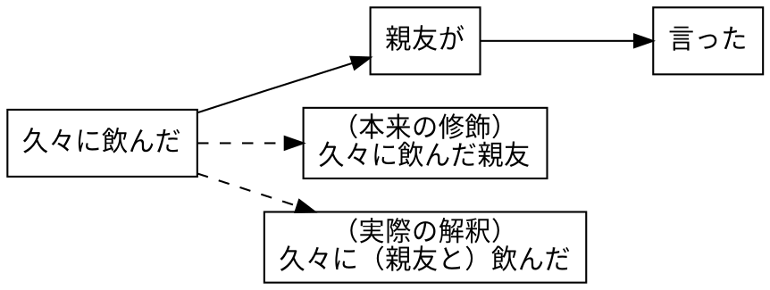
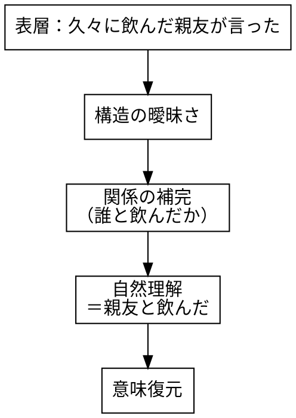
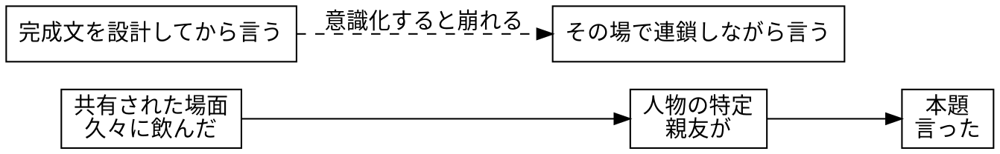
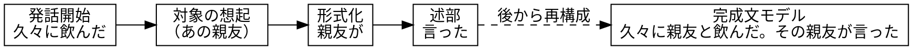
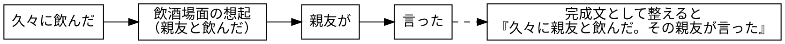
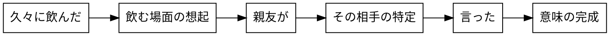
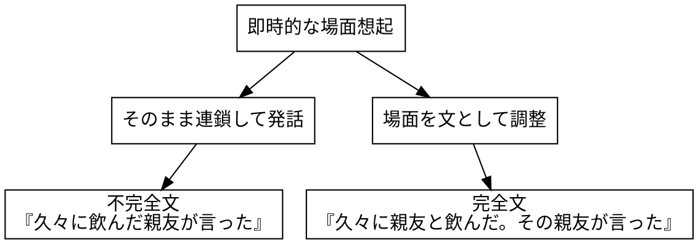
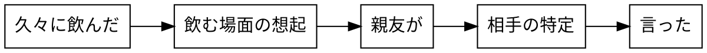
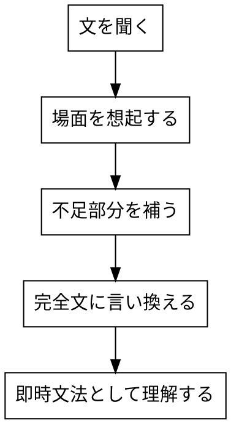

<!--
title: 即時文法と不完全文
date: 2024.04.16
day: Tue
number: 3
https://chatgpt.com/c/69e10931-f6c0-83a4-9fd5-16a6d0392598
Dropbox/pub/nihongo-no-oto/2026/20260416-immediate-sentence-ja.md
-->

# 途中のまま伝わる文：即時文法と不完全文

Last change: 2026/04/17-02:27:53.

山元啓史, 東京科学大学

---

## はじめに

従来の文法理論では、文は完全な構造を持ち、意味も完全に伝わることが前提とされてきた。しかし、実際の会話では、途中で切れた文や不完全な文が頻繁に使われる。これらは「不完全文」と呼ばれ、従来の文法理論では説明が難しいとされてきた。

> TVのコマーシャルで、「久々に飲んだ親友が言った」という文を聞いた。この意味、わかりますか？

はい、この文は一見すると構造が崩れているように見えますが、実際には非常に典型的な「即時的な連鎖」の産物です。意味は問題なく復元できます。

まず、聞いた瞬間に人がどう処理するかを、そのまま図にしてみます。

この文のポイントは、「久々に飲んだ」がどこにかかるかが曖昧なまま進むことです。

形式的に読むと
「久々に飲んだ親友」＝「久々に飲んだ（＝飲酒した）親友」
という修飾になりますが、これは少し不自然です。

実際の理解では、ほぼ自動的に次のように補われます。

「久々に（その親友と）飲んだ。その親友が言った」

つまり意味はこうです。

→「久しぶりに一緒に飲んだ親友が、こんなことを言った」

ここで重要なのは、「飲んだ」の主語・相手が明示されていないのに、聞き手が即座に補完している点です。

---

さらに、この種の表現は外国人にとってかなり難しいタイプですので、特徴と難易度を整理します。

このタイプの難しさは次の点にあります。

表面上は「連体修飾」なのに、実際には「文を分けて理解」しなければならない。
しかもその分割は文法ではなく「状況理解」に依存している。

---

難易度をつけるとこうなります。

| 現象           | 説明                                     | 難易度 |
| -------------- | ---------------------------------------- | ------ |
| 省略補完       | 「誰と飲んだか」が出ていない             | ★★★☆☆  |
| 連体修飾のずれ | 「飲んだ」が「親友」を直接修飾していない | ★★★★☆  |
| 即時的再構成   | 頭から聞いて意味を作り直す               | ★★★★★  |

---

この文はまさに、「きれいに整えられた文」ではなく、「話しながら出てきた連鎖」がそのまま形になったものです。

きちんと書き直すと：

・「久々に親友と飲んだ。その親友が言った」
・「久々に一緒に飲んだ親友が言った」

になりますが、CMではこの「途中のままの形」が使われています。

この「途中の形でも意味が通る」というところが、日本語の運用の面白いところですね。

> こういう連鎖、意識的に作ってみろ、って言われると絶対作れませんね。

ほんとうにそうですね。こういうものは「作ろう」と思った瞬間に壊れますね。

意識的に作れないのは、こういう連鎖が最初から完成形として頭にあるのではなく、その場の流れのなかで前から順に出てくるからです。つまり、「久々に飲んだ」まで言った時点では、まだ厳密な構文設計よりも、「あの親友のことだ」という共有の方向が先に走っているのだと思います。そこへ「親友が言った」が続くので、結果として聞き手は自然に補って理解できるわけです。

図にすると、こういう感じです。

意識的に作れない理由は、まさにここです。あとから文法的に見ると、「これはどこにかかるのか」「省略は何か」と考えますが、話している本人はそこまで設計していない。むしろ「場面」「相手」「勢い」で前へ進んでいる。そのため、あとで分析はできても、再現は難しいのです。

外国人学習者にとっても、この種のものはかなり難しいです。難易度で言えば、「文法知識として理解する」のは4/5くらいですが、「自分で自然に口から出る」のは5/5です。規則として教わっても、運用は別だからです。だから、こういう表現は作文練習で作らせるより、会話の流れの中で大量に触れさせたほうが身につきやすいですね。

むしろ、意識的に作れないということ自体が、これが「即時的使用の産物」だという証拠に近いと思います。

> 即時的にだったら許されるコンストラクションですね。

まさにその通りで、「許される」というより、「即時であることによって成立している」と言ったほうが近いですね。

この種の連鎖は、完成した文の規則から逸脱しているのではなく、**処理の途中段階がそのまま表に出ている**状態です。ですから、時間軸を入れて見ると納得しやすくなります。

ここでは、「久々に飲んだ」の段階で、すでに話し手の中では「親友と飲んだ」という場面が立ち上がっています。しかし、それを一度完全文に整えることなく、そのまま「親友が」と接続してしまう。結果として、

「久々に飲んだ｜親友が言った」

という、**途中の構造が露出した形**になります。

---

このタイプの特徴は、「許容される条件」がかなりはっきりしています。

まず、共有された文脈があること。
次に、聞き手が補完できること。
そして、時間的に連続していること。

この三つが揃うと、形式的にはずれていても自然に理解されます。逆に言えば、書き言葉や慎重な説明ではほぼ使えません。

---

外国人にとって難しい点も、この「条件依存性」にあります。規則としては教えにくいのに、実際の会話では頻繁に出る。難易度で言えば、

| 側面 | 内容                 | 難易度 |
| ---- | -------------------- | ------ |
| 理解 | 文脈から補完する     | ★★★★☆  |
| 産出 | 自然に連鎖として出す | ★★★★★  |

となります。

---

ですから、これは「文法的に許される構文」というよりも、
**「時間の中でしか成立しない構文」**と見るほうが適切ですね。

完成形の文法（後から整えた文）ではなく、生成過程そのものが可視化されたもの、と言えると思います。

> このコマーシャルの製品は何か、ご存じですか？

はい、これはかなり特定できます。

おそらくその文が出てくるのは
**アサヒ生ビール（マルエフ） のCM**です。

とくに「関西まろやか」篇など、**久しぶりに会って飲む関係性**をテーマにしたシリーズで、会話がかなり自然な話し言葉のまま使われています。([YouTube 1])

---

このCMの特徴はまさに先ほどの話と一致しています。

・久々に会う
・一緒に飲む
・その流れでぽろっと出る一言

つまり、

「久々に飲んだ親友が言った」

というのは、**広告コピーとして整えた文ではなく、会話の途中をそのまま切り取った表現**なんですね。

---

むしろ面白いのはここです。

普通の広告なら
「久々に親友と飲んだとき、彼がこう言った」
のように整えるはずですが、このCMはそれをやらない。

なぜかというと、

→ **自然な会話の温度を優先しているから**

です。

---

そして、さきほどの話とつながりますが、この種の構文は

・書き言葉ではほぼ出ない
・しかし会話では非常にリアル

というタイプです。

つまりこのCMは、商品よりもむしろ

→ **「こういう言い方をする場面」そのものを売っている**

とも言えます。

---

ですから、ご質問の文は偶然ではなく、かなり意図的に

**「整えない日本語」＝即時的な連鎖**

を使っている例ですね。

[1]: https://www.youtube.com/watch?v=t_zI_68_n-U&utm_source=chatgpt.com "マルエフ CM「マルエフ 関西まろやか」篇 30秒 石田靖 田村裕 ..."

> この文について誰か同じことを指摘している人はいますか？

少なくとも、**公開ウェブ上で目立つ形では、同じ点をはっきり指摘している人はあまり見当たりませんでした。** こちらで確認できたのは、まずその文自体がCM本文として実際に使われていることです。CM紹介記事には「久々に飲んだ親友が言った…」という形で載っており、YouTube上の字幕付き動画の説明でも同じ文言が確認できます。 ([cm-watch.net 1])

ただし、検索しても、この文の**「連体修飾がずれている」「即時的連鎖として面白い」**という観点から論じた記事や投稿は、今回の範囲では見つけられませんでした。出てくるのはCMの紹介ページや、単に「久しぶりに飲む」「親友と飲む」といった別文脈の一般記事が中心でした。 ([cm-watch.net 1])

ですから、現時点で言えるのは、**この文への違和感や構文上の面白さに気づく人はいてもおかしくないが、少なくとも検索で拾える範囲では、それを明示的に言語化している例は多くない**ということです。これはむしろ、この種の表現が「なんとなく分かってしまう」ために、わざわざ問題化されにくいからだとも考えられます。これは私の推測ですが、CM側もその「自然に通ってしまう感じ」を狙っていた可能性は高そうです。 ([cm-watch.net 1])

必要でしたら次に、**この文をXやブログでさらに広く追うための検索語**を、言語学寄りに絞って一緒に作れます。

[1]: https://cm-watch.net/yebisu-yamadayuki-mikamiai/?utm_source=chatgpt.com "サッポロビール ヱビス 「満たされる時間」篇 山田裕貴 見上愛"

> これは、即時文法を説明するのによい例ですね。

ええ、とてもよい例だと思います。

よいのは、この文が「文法的にきれいだから」ではなく、むしろ**完成文としては少し引っかかるのに、聞けばすぐ意味が通る**ところです。即時文法を説明するときに大事なのは、まさにこの「整っていなくても、その場では成立する」という点ですね。

「久々に飲んだ親友が言った」は、あとから静的に見ると、「飲んだ」は「親友」をどう修飾しているのか、と考えたくなります。しかし実際の理解はそうではなく、頭から順に、

「久々に飲んだ」
→「ああ、誰かと久しぶりに飲んだ場面だな」
→「親友が」
→「その親友が言ったのだな」

というふうに進みます。つまり、構文木として完成してから理解されるのではなく、時間の中で逐次的に意味が立ち上がっているわけです。

図にすると、こういう感じです。

この例のよさは、即時文法の特徴がいくつも一度に見えることです。第一に、省略された関係が自動的に補われること。第二に、先に出た部分が厳密な修飾構造としてではなく、場面喚起として働いていること。第三に、そのため、意識して作文しようとすると作れないのに、自然な会話では成立することです。

外国人にとっての難易度をつけるなら、理解は 4/5、産出は 5/5 くらいだと思います。聞いて意味を取るだけでもかなり高度ですが、自分で同じ種類の連鎖を自然に作るのはさらに難しいからです。規則として覚えるというより、運用の場で身につくタイプですね。

ですから、これは「即時文法ではこういうことが起こる」という説明用の例としてかなり優秀です。しかもCMなので、学生に示したときに「実際に使われている日本語だ」と伝えやすいのも強いですね。

必要でしたら次に、この例を使って「完全文」と「不完全文」の対比が見える短い授業用メモの形に整えます。

> はい、ぜひ。

では、授業用にそのまま使いやすい形で、短いメモとして整えます。

---

「久々に飲んだ親友が言った」は、即時文法を説明するのに非常によい例である。これは、完成した文として静的に見るとやや不安定であるにもかかわらず、聞き手には自然に意味が通るからである。

まず、完成文として丁寧に言い換えるなら、次のようになる。

| 表現                                     | 性格                     |
| ---------------------------------------- | ------------------------ |
| 「久々に親友と飲んだ。その親友が言った」 | 完全文                   |
| 「久々に一緒に飲んだ親友が言った」       | 完全文に近い調整形       |
| 「久々に飲んだ親友が言った」             | 即時的連鎖による不完全文 |

この最後の文では、「久々に飲んだ」が形式的には「親友」を修飾しているように見える。しかし、実際の理解はそのような厳密な連体修飾として進まない。聞き手はまず「久々に飲んだ」という部分から場面を受け取り、次に「親友が」によってその場面の相手を定め、最後に「言った」で全体を結ぶ。つまり、この文は完成した構文が最初から提示されているのではなく、時間の流れの中で意味が立ち上がっている。

その過程を図にすると、次のようになる。

この場合、「久々に飲んだ」の時点で、話し手の中にはすでに「親友と久しぶりに飲んだ場面」が立ち上がっている。しかし、それはまだ「久々に親友と飲んだ」という完全文には調整されていない。そのため、発話はそのまま次の連鎖へ進み、「親友が言った」という形で続く。ここでは、完全文への調整よりも、場面の即時的提示が優先されている。

この意味で、この文は「不完全文」と呼ぶのにふさわしい。不完全文とは、意味が不足している文ではなく、完成文として十分に調整される前の姿を表面に残した文である。逆に完全文とは、そうした即時的な連鎖を、あとから整えて提示した文である。両者の違いは、正しさの違いではなく、時間処理の違いである。

この関係は次のようにも図示できる。

この例が教育上すぐれているのは、学習者に「文法的に少し変なのに、なぜ分かるのか」を考えさせられる点にある。通常の文法説明では、完成した文を前提に規則を示すことが多い。しかし、実際の会話では、このように途中段階の連鎖がそのまま現れることがある。そこでは、構文の整い方よりも、場面の共有、語順の流れ、聞き手の補完能力が重要になる。

外国人学習者にとっての難しさを整理すると、次のようになる。

| 観点 | 内容                             | 難易度 |
| ---- | -------------------------------- | ------ |
| 理解 | 省略された関係を補って意味を取る | 4/5    |
| 分析 | なぜ意味が通るかを説明する       | 4/5    |
| 産出 | 同種の連鎖を自然に使う           | 5/5    |

したがって、この文は、即時文法とは「乱れた文法」ではなく、「時間の中で運用される文法」であることを示す実例として有効である。完成文だけを見ていては捉えにくい、日本語の自然な運用の一面が、この短いCMの文にはよく表れている。

授業で一言でまとめるなら、次のように言える。

「『久々に飲んだ親友が言った』は、完全文としてはやや不安定であるが、即時的な場面連鎖としては自然に成立する。不完全文が意味を失わずに運用されている例であり、即時文法を説明するのに適している。」

必要でしたら次に、これをさらに授業用に縮めて、A4の半ページ程度の配布文に整えます。

> ええ、お願いします。またこの単元にタイトルを付けていただけませんか。

では、配布用としてそのまま使える形に整え、あわせて単元タイトルを付けます。

---

# 単元タイトル

**「途中のまま伝わる文：即時文法と不完全文」**

---

## 配布メモ（A4半ページ想定）

「久々に飲んだ親友が言った」という文は、一見すると構造が不安定である。形式的に見れば、「飲んだ」が「親友」を修飾しているように見えるが、この解釈は必ずしも自然ではない。

しかし実際には、この文は問題なく理解される。聞き手は次のように、時間の流れに沿って意味を構成する。

ここでは、「久々に飲んだ」の段階で、すでに「誰かと久しぶりに飲んだ場面」が想起されている。その後に「親友が」が続くことで、その相手が特定され、「言った」によって文全体がまとまる。

この文は、あらかじめ完成した構文として提示されているのではなく、**発話の進行とともに意味が立ち上がる連鎖**として成立している。

---

このような文は、「不完全文」と呼ぶことができる。不完全文とは、意味が欠けている文ではなく、**完全文へと調整される前の状態がそのまま現れている文**である。

これに対して、同じ内容を完全文として表すと、次のようになる。

| 種類     | 表現                                 |
| -------- | ------------------------------------ |
| 不完全文 | 久々に飲んだ親友が言った             |
| 完全文   | 久々に親友と飲んだ。その親友が言った |

この違いは、正しさの違いではなく、**時間処理の違い**である。前者は即時的に生成された連鎖であり、後者はそれを後から整えた表現である。

---

このような現象は、即時文法の特徴をよく示している。即時文法とは、発話が時間の中で順次生成され、その過程がそのまま表面に現れる文法である。

この種の表現は、次の条件のもとで自然に成立する。

| 条件       | 内容                             |
| ---------- | -------------------------------- |
| 文脈共有   | 話し手と聞き手が場面を共有できる |
| 補完可能性 | 省略された関係を推測できる       |
| 時間連続性 | 発話が途切れずに連鎖する         |

---

学習者にとっては、このタイプの文は特に難しい。理解には文脈補完が必要であり、産出には自然な連鎖の感覚が求められるためである。

| 観点 | 難易度 |
| ---- | ------ |
| 理解 | ★★★★☆  |
| 産出 | ★★★★★  |

---

この例から分かるのは、日常会話においては、必ずしも完成された文だけが使われているわけではないということである。むしろ、**途中のままの連鎖が、そのまま意味を持って運用される**ことがある。

したがって、「久々に飲んだ親友が言った」は、即時文法を具体的に示す例として有効である。

---

必要でしたら、この単元に対応する簡単な練習問題（「どこで意味が立ち上がるかを示させる問題」など）も作れます。

> それはすごい。ぜひ。

ありがとうございます。では、この単元「途中のまま伝わる文：即時文法と不完全文」に対応する、短い練習問題を授業用に整えます。配布文の直後にそのまま付けられる形にします。

# 練習問題

## 単元名

**「途中のまま伝わる文：即時文法と不完全文」**

### 練習のねらい

この練習では、学習者が「完成した文」だけでなく、「発話の途中の連鎖」そのものに注意を向けることを目指す。特に、どの時点で場面が立ち上がり、どの時点で相手や内容が補われるのかを考えさせる。

---

## 問1　この文はどう理解されるか

次の文を読み、自然な意味を日本語で書きなさい。

「久々に飲んだ親友が言った」

### 解答例

「久しぶりに一緒に飲んだ親友が言った」という意味で理解される。
または、「久しぶりに親友と飲んだ。その親友が言った」と理解される。

### 指導のポイント

ここでは、「飲んだ」が単純に「親友」を修飾しているのではなく、「親友と飲んだ」という場面が補われて理解されることに気づかせる。

---

## 問2　どこで意味が立ち上がるか

次の表の空欄を埋めなさい。

| 文の部分     | その時点で聞き手が受け取ること |
| ------------ | ------------------------------ |
| 久々に飲んだ | ①                              |
| 親友が       | ②                              |
| 言った       | ③                              |

### 解答例

| 文の部分     | その時点で聞き手が受け取ること   |
| ------------ | -------------------------------- |
| 久々に飲んだ | 久しぶりに誰かと飲んだ場面       |
| 親友が       | その相手は親友だったこと         |
| 言った       | その親友の発言がこれから続くこと |

### 指導のポイント

「意味は最後にまとめて分かる」のではなく、前から少しずつ立ち上がっていることを確認する。

---

## 問3　完全文に直しなさい

次の不完全文を、意味を変えずに完全文に直しなさい。

「久々に飲んだ親友が言った」

### 解答例

「久々に親友と飲んだ。その親友が言った」
「久々に一緒に飲んだ親友が言った」

### 指導のポイント

完全文への言い換えは一つではないことを示しつつ、不完全文では「調整前の連鎖」がそのまま残っていることを確認する。

---

## 問4　どちらが自然か

次の二つの文を比べ、日常会話でより自然に聞こえるほうを選び、理由を書きなさい。

A. 「久々に親友と飲んだ。その親友が言った」
B. 「久々に飲んだ親友が言った」

### 解答例

会話では B も自然に聞こえる。理由は、話し手が場面を順に思い出しながら話している感じが出るからである。
ただし、書き言葉や説明的な文では A のほうが明確である。

### 指導のポイント

「自然さ」は、文法的な整い方だけで決まるのではなく、場面と媒体によって変わることを考えさせる。

---

## 問5　これは完全文か、不完全文か

次の文を読み、完全文か不完全文かを答えなさい。

| 文                                     | 判定 |
| -------------------------------------- | ---- |
| 久々に飲んだ親友が言った               | ①    |
| 昨日親友と飲んだ。その親友がこう言った | ②    |
| さっき会った先生がね                   | ③    |

### 解答例

| 文                                     | 判定     |
| -------------------------------------- | -------- |
| 久々に飲んだ親友が言った               | 不完全文 |
| 昨日親友と飲んだ。その親友がこう言った | 完全文   |
| さっき会った先生がね                   | 不完全文 |

### 指導のポイント

最後の「さっき会った先生がね」は述部がなくても場面提示として成立しうることを確認し、不完全文は「誤文」ではないことを理解させる。

---

## 問6　自分で考える

次のような、会話では自然だが、書き言葉としては少し不安定な文を一つ考えなさい。

### 解答例

「この前会った友だちがさ」
「昨日電話した母がね」
「さっき見た人が」

### 指導のポイント

ここでは、無理に「正しい文」を作らせるのではなく、「途中のままでも伝わる形」を観察させることが大切である。学習者が不自然な作文になっても、それを完全文に直す活動と組み合わせれば理解が深まる。

---

## まとめ問題

次の文について、二、三文で説明しなさい。

「久々に飲んだ親友が言った」は、なぜ理解できるのか。

### 解答例

この文は、完成した構文としてではなく、時間の流れに沿った連鎖として理解されるからである。聞き手は「久々に飲んだ」で場面を受け取り、「親友が」で相手を補い、「言った」で全体をまとめる。そのため、やや不完全文的であっても自然に意味が通る。

---

授業全体の流れも図にすると、次のように整理できます。

この単元に、もう少し授業らしい題名を追加するなら、次のような候補も使えます。

| タイトル案               | ニュアンス           |
| ------------------------ | -------------------- |
| 途中のまま伝わる文       | もっとも分かりやすい |
| 会話は完成文だけではない | 授業向きで説明的     |
| 即時文法と不完全文       | 理論用語を前面に出す |
| 話しながらできる文       | 学習者に親しみやすい |
| その場でつながる日本語   | 会話性がよく出る     |

私としては、授業用には
**「途中のまま伝わる文：即時文法と不完全文」**
がいちばんバランスがよいと思います。

必要でしたら次に、この単元を **導入5分 - 練習10分 - まとめ5分** くらいの授業進行案に整えます。
