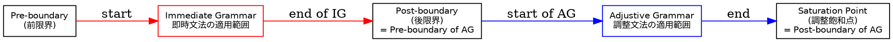
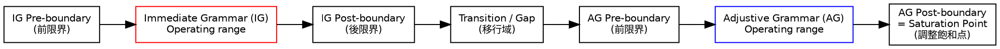
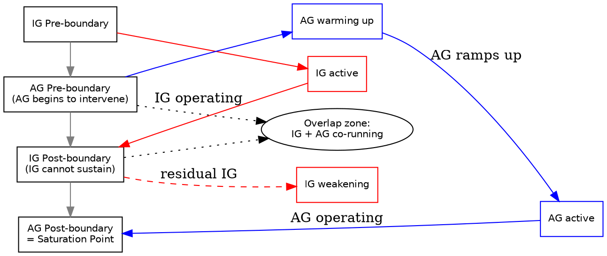

<!--
https://chatgpt.com/c/6966d36c-31a0-8321-9cb0-b0e593738cfc
Dropbox/pub/nihongo-no-oto/2026/20260418-igag-process-ja.md
-->

# pgm.tex の修正ノート

拝見しました。とても「PGM全体の時間軸」と「IG/AGの切替点」を一枚で示せていて、図としてかなり強いです。
この図が言っている内容を、**概念の読み取り（意味）**と、**図の改善ポイント**、それから **Graphviz(dot)版**で整理します。

---

## 1) この概念図が表していること（読み取り）

時間軸に沿って、PGMの処理が **3つの点**（boundary）で区切られています。

### (A) 2 = Pre-boundary（前限界）

- ここまでは「まだIGが始まっていない」
- ある瞬間で **IGが開始可能になる**
- 例としては、話者が話し始める直前の「立ち上がり」に対応しやすい

---

### (B) 7 = Post-boundary（後限界） = AGのPre-boundary

ここがこの図の核心で、**切替点**になっています。

- **IGにとっての Post-boundary**
  → 「IGとして走り続けられる領域の終点」
- **AGにとっての Pre-boundary**
  → 「AGが介入できる領域の始点」

つまりここで

> IGの終わり = AGの始まり

が成立しています。

---

### (C) 12 = Post-boundary of AG = Saturation Point（調整飽和点）

- AG（調整）が到達しうる終点
- これ以上いじると、改善というより「言い換え地獄」「無限編集」に入りやすい点

---

## 2) 記号の使い分けが上手い点（黒丸/白丸）

あなたの図は、**同じ x=7 の地点に2つの点**が置かれていて、

- IG側は **白丸**（終わる側、境界に当たって止まる）
- AG側は **黒丸**（ここから動き出す側）

になっています。

この「白/黒」の対立は、読者に

- “切替”
- “受け渡し”
- “責任の移譲”

を直感的に理解させるので、非常に有効です。

---

## 3) 改善案（図の意味をさらに強めるなら）

### 改善案1：x=7 の地点に「handover」を明示

たとえば日本語側でも英語側でも、

- “handover”
- “switch”
- “transition”

などの語を1語だけ添えると、読者の理解速度が上がります。

例：

- 「受け渡し点」
- “handover point”

---

### 改善案2：色の意味を凡例（legend）で固定する

今は赤=IG、青=AGですが、論文を流し読みする読者には

- 「赤は何？」
- 「青は何？」

が一瞬だけでも負担になります。

図の右端か下に小さく

- red: Immediate Grammar
- blue: Adjustive Grammar

と書いておくと親切です。

---

### 改善案3：「適用範囲」という語の解釈のズレを避ける

“Application Range” はやや **規則の適用区間**の語感が強く、

あなたのIG/AGはむしろ

- **作動区間**
- **介入可能区間**
- **支配的になる区間**

に近いので、英語は例えば：

- “Operating Range”
- “Dominant Range”
- “Active Range”

も候補になります。

（ただ、現状の “Application Range” でも十分通ります。）

---

## 4) Graphviz dot 版（概念対応）

TikZのレイアウトはそのままdotでは再現しにくいですが、**概念図として同じ意味**を保つdot表現はこうなります。



このdot版では、あなたの図のポイントである

- IGのPost-boundary = AGのPre-boundary

を **PostBノード1個**で明示しています。

---

必要なら、あなたのTikZ版を保ったまま、

- 凡例（legend）追加
- “handover point” 表記追加
- IG/AG の “Active range / Operating range” 調整

の差分だけを作って、LaTeXコードを最小修正する形でも提案できます。

> ちょっと違うんですね。ig/post-boundary は ag/pre-boundary じゃないんですね。

なるほど、了解です。そこ、**かなり重要な違い**ですね。
つまりあなたの立場では、

> **IG の post-boundary と AG の pre-boundary は「同一地点」ではない**
> （連続点ではなく、間にズレ/ギャップがある）

ということですね。

---

## 1) どう違うか（概念の言い換え）

### IG の post-boundary

- **即時文法が「これ以上は走れない」限界**
- IGとしての生成が **そこで失速する/崩れる/切れる** 点

### AG の pre-boundary

- **調整文法が「介入できる」入口**
- AGは **すぐには起動できない**（起動条件が必要）
- だから IGが終わった瞬間に AGが始まるわけではない

---

## 2) すると「境界付近」はこういう構造になる

時間軸上で見ると、こういう順序になります。

**IG pre-boundary → IG operating range → IG post-boundary →（空白域/未処理域/移行域）→ AG pre-boundary → AG operating range → AG post-boundary (= saturation)**

この **「移行域」** があるのがポイントです。

---

## 3) 図に入れるべき修正（最小）

あなたのTikZで直すなら、いちばん簡単なのは

- **x=7 を2本に分ける**

  - IG post-boundary を x=7
  - AG pre-boundary を x=7.5 （など）

にして、間を「transition」と書くことです。

例（概念ラベルだけ）：

- IG post-boundary
- transition / handover gap
- AG pre-boundary

---

## 4) Graphviz(dot)で「同一点にしない」版



---

必要なら、あなたの元のTikZを**極小修正**する差分（x座標だけ）も作れます。

はい、**あります**。しかもその「重複」が、PGMのいちばん“らしさ”が出るところだと思います。

---

## 1) 「移行域 = 空白」ではなく「重複域」になり得る

さっき私が言った「ギャップ」は、**必ず空白になる**という意味ではなくて、

- **IGがまだ惰性で動いている**
- **AGがもう割り込み始めている**

というふうに、**同じ時間帯に2つの処理が並走**することがあり得ます。

---

## 2) 典型的な重複パターン（イメージ）

### パターンA：IGが先行してAGが追いつく（後追い型）

- まず口が先に動く（IG）
- 直後に「言い直し」「補足」「条件の追加」（AG）

例（雰囲気）
「えっと、これ、いや、やっぱり…その…」

---

### パターンB：AGが先行してIGを抑え込む（ブレーキ型）

- 言いかける（IG）
- 途中で“止めて作り直す”（AG）

例（雰囲気）
「それは…いや、違うな。正確に言うと…」

---

### パターンC：IGで出しながらAGで整形し続ける（同時整形型）

- 話しながら、文の構造を整え続ける
  （講義・発表・慎重な説明でよく出る）

---

## 3) 図としては「境界」より「重なり区間」を描くと強い

あなたの図に即して言うなら、時間軸上でこういう形です。

- **IGの適用区間**: `IG_pre → IG_post`
- **AGの適用区間**: `AG_pre → AG_post`
- ただし、**AG_pre が IG_post より前に食い込む**ことがある
  → その「食い込み」が **重複域** になります。

---

## 4) Graphviz(dot)で「重複域」を明示した概念図

重複を表すいちばん素直な方法は、

- IGの線
- AGの線

を別段に引いて、**同じ時間帯に両方が走っている**と見せることです。



この図の読みはこうです：

- **T1（AG pre）からT2（IG post）までが「重複域」**
- そこでは **IGがまだ動いているのに、AGが先に割り込む**
- IGが完全に終わる前から、AGが始まれる

---

## 5) TikZの元図へ最小変更で反映するなら

あなたの既存図は「1本の軸に2区間」なので、重複を表すなら次のどちらかが自然です。

### 方法1（おすすめ）：線を2段にする

- IGの線（赤）は y=+0.08
- AGの線（青）は y=-0.08
- **重複部分だけ両方に線がある**ように描く
  → 直感的に「並走」が出ます

### 方法2：重複区間だけ紫の帯を入れる

- overlap = purple など
  （ただし色の意味が増えるので凡例が必要）

---

もしよければ、あなたのTikZソースを崩さない形で、

- **重複域（例えば x=6.2〜7.0）を青線で先行**させる
- **IG post-boundary と AG pre-boundary を別々の点として残す**
- でも **区間としては重なる**

みたいな「差分だけ」の改造案をそのまま貼れる形で作ります。

はい、ここは**必ず修正したほうがよい**です。
現状の記述だと、

- **IGの後限界 = AGの前限界（必ず一致）**
- **それを超えるとIGは終わりAGだけになる**

という **強すぎる断定**になっていて、いま山元先生が言われた

- **ずれることがある**
- **重複することもある**

というPGMの核心と矛盾してしまいます。

以下、**そのまま貼り替え可能**な修正版を提示します（日本語・英語とも）。

---

## 修正版（提案）

```latex
\ifJPN
\subsection{即時文法の前限界と後限界の定義}
\else
\subsection{Definition of Pre-boundary and Post-boundary of Immediate Grammar}
\fi

\ifJPN
前限界（Pre-boundary）は、即時文法の適用が始まる点であり、発話が即時的な処理として立ち上がる時点を示す。
即時文法の適用範囲は、前限界から後限界までの区間である。
\else
The Pre-boundary is the point at which the application of immediate grammar begins, indicating the moment when speech starts to operate as an immediate process.
The application range of immediate grammar is the interval from the Pre-boundary to the Post-boundary.
\fi

\ifJPN
後限界（Post-boundary）は、即時文法の適用範囲の終わりを示す点であり、即時的な生成・連鎖が維持されにくくなる限界である。
ただし、即時文法の後限界は必ずしも調整文法の前限界と一致するとは限らない。
実際には、即時文法と調整文法の適用範囲が時間的に重複することがあり、両者が併走する移行域が生じる場合もある。
\else
The Post-boundary indicates the end of the application range of immediate grammar, representing the point beyond which immediate generation and chaining become difficult to sustain.
However, the Post-boundary of immediate grammar does not necessarily coincide with the Pre-boundary of adjustive grammar.
In practice, the application ranges of immediate grammar and adjustive grammar may overlap in time, yielding a transitional zone in which both operate concurrently.
\fi
```

---

### 変更点（要点だけ）

- 「一致する」と断定していた部分を
  → **一致しない場合がある**に修正
- 「超えるとIGではなくAG」も断定が強いので
  → **重複（併走）する移行域**を入れて整合させました

---

必要なら、この文章に合わせて、先ほどの **概念図のラベル（Post-boundaryの説明）**も、ズレと重複が自然に読める形にそろえる案を出します。

はい、こちらは **かなり良い** です。
しかも、直前の「IG/AGは必ずしも一致しない・重複する」に直したあとでも、**矛盾せずに続けられます**。

ただ、いまのままだと少しだけ

- **AGが「推敲・修正」に限定されて見える**
- **AGのPre-boundaryが“時間をかけること”だけで決まるように見える**

という弱点が出ます。
（つまり「AG=文章作法」みたいに誤解されやすい。）

なので、最小の修正で**概念の射程を広げる**と安定します。

---

## 修正版（ほぼそのまま、ズレを減らす微修正）

そのまま貼れます。

```latex
\ifJPN
\subsection{調整文法の適用範囲と調整飽和点}
\else
\subsection{Application Range of Adjustive Grammar and Adjustive Saturation Point}
\fi

\ifJPN
調整文法の前限界（Pre-boundary）は、調整文法の適用が始まる点を示す。
調整文法は、発話や文章に対して、言い直し・付け足し・語の選び直し・構造の整理などの調整を行う際に適用される。
このとき、調整文法の開始点は必ずしも即時文法の後限界と一致するとは限らず、両者が時間的に重複する場合もある。
\else
The Pre-boundary of adjustive grammar indicates the point at which the application of adjustive grammar begins.
Adjustive grammar is applied when an utterance or a text is adjusted through operations such as rephrasing, adding clarifying material, reconsidering lexical choices, or reorganizing structure.
In this sense, the starting point of adjustive grammar does not necessarily coincide with the Post-boundary of immediate grammar, and the two may overlap in time.
\fi

\ifJPN
調整文法の後限界（Post-boundary）は、ある一定の調整を行った後、それ以上の改善が見込めなくなる点を指す。
この点を調整飽和点（Saturation Point）と呼び、調整文法の適用範囲の終わりを示す。
\else
The Post-boundary of adjustive grammar indicates the point at which further improvement is no longer expected after a certain amount of adjustment.
This point is called the adjustive saturation point, indicating the end of the application range of adjustive grammar.
\fi
```

---

## どこを直したか（要点だけ）

### 1) 「推敲・修正」だけに見える問題を回避

AGを

- 言い直し
- 付け足し
- 語彙選択
- 構造整理

まで含めて、**話し言葉のその場の調整**にも自然に広げました。

### 2) 「IGとAGは重複する」整合をここにも入れた

前の節で言ったことを、この節でも1行だけ支えておくと、
読者が迷子になりません。

---

この次に来る節がもし「重複域の性格（併走のモード）」なら、
**IG優勢→重複→AG優勢**の3状態を短く定義する段落を入れると、図と文章がきれいに噛み合います。

はい、**ここも修正したほうがよい**です。文章の方向性はとても良いのですが、いまの形だと次の3点が惜しいです。

---

## 修正が必要な点（核心だけ）

### 1) 冒頭が日本語として崩れている

> 「境界の境界は存在するが」

ここは単純に誤植的に見えます。
さらに「境界はあるが固定的ではない」を、もう少し **PGMらしい言い方**にしたいところです。

---

### 2) 「熟練」によって“AG→IGへ移行”が一方向に見える

あなたが前で整理したように、

- **重複域がある**
- **場合によってIG優勢/AG優勢が入れ替わる**

ので、ここを **一方向の移行（AGがIGになる）**に固定すると弱くなります。

---

### 3) 「熟練」を “暗記・マニュアル” に寄せすぎ

暗記やマニュアル化ももちろんありますが、読者によっては

- “それは学習心理学の話？”
- “文法モデルなのに技能論？”

に寄りやすいので、

- **反復で処理が自動化する**
- **調整の結果が即時生成に組み込まれる**

という表現に寄せると、モデルの説明として安定します。

---

# 修正版（そのまま貼り替え可）

※意味を変えずに、**重複域・連続性・動的モデル**を自然に織り込みました。

```latex
\ifJPN
\subsection{即時文法と調整文法の境界}
\else
\subsection{Boundary between Immediate Grammar and Adjustive Grammar}
\fi

\ifJPN
即時文法と調整文法のあいだには境界が存在するが、その境界は固定的ではない。
発話は、調整された表現を反復してリハーサルする、記憶として定着させる、定型表現として共有する、といった過程を経ることで「熟練」される。
このようにして熟練された表現は、即時的に発話されることもある。
これは、即時文法と調整文法が互いに独立した領域として完全に分離しているのではなく、経験や熟練によって相互に影響し合うことを示している。
したがって、発話は即時文法と調整文法のいずれかに一度決まって固定されるのではなく、状況や目的に応じて両者のあいだを移行しうる。
\else
There is a boundary between immediate grammar and adjustive grammar, but this boundary is not fixed.
An utterance may become "skilled" through processes such as repeated rehearsal of adjusted expressions, stabilization in memory, or conventionalization as shared formulaic patterns.
Such skilled expressions may be produced immediately in real-time interaction.
This suggests that immediate grammar and adjustive grammar are not completely separated as independent domains, but mutually influence each other through experience and skill.
Therefore, speech is not permanently assigned to either immediate grammar or adjustive grammar, but may shift between them depending on context and communicative goals.
\fi

\ifJPN
プロセス文法モデルでは、「即時文法」は直感的・瞬発的な発話の側面を扱い、「調整文法」は意識的・分析的な調整の側面を扱う。
ただし両者は排他的に切り替わるのではなく、同じ発話過程の中で時間的に重複し、併走する場合もある。
また、熟練によって調整文法による操作が自動化され、即時的な生成の中に取り込まれることがある。
このような変化は、プロセス文法モデルが固定的な文法体系ではなく、時間と経験の中で変化する「プロセス（過程）」を記述する動的モデルであることを示している。
\else
In the Process Grammar Model, immediate grammar captures the intuitive and instantaneous aspects of speech, whereas adjustive grammar captures the conscious and analytical aspects of adjustment.
However, the two do not switch in a strictly exclusive manner; they may overlap in time and operate concurrently within the same utterance process.
Furthermore, through skill acquisition, operations that were once handled by adjustive grammar may become automatized and incorporated into immediate generation.
Such changes indicate that the Process Grammar Model is not a fixed grammatical system, but a dynamic model describing a time-dependent "process."
\fi
```

---

## ここでの修正の狙い（短く）

- 「境界はあるが固定しない」を **1文で明確化**
- 「AG→IGへ移行」だけでなく
  **重複（併走）**を明記して整合性を取る
- 「熟練」を
  **自動化（automatization）**として説明できる形にする

---

必要なら、この節の最後に1文だけ足して、

> 「境界は時間軸上の一点ではなく、重なりを含む幅として現れる」

と書くと、概念図の読みが完全に揃います。

はい、この節は **より正確に直したほうがよい**です。いまの文章は方向性は正しいのですが、現状だと「連続体」という語が

- **二分法の中間がたくさんある（滑らかに混ざる）**
- **処理が移行する**
- **重複する**
- **熟練で自動化する**

という複数の意味をいっぺんに背負っていて、読者が「連続体って結局どれ？」となりやすいです。

特に修正したいのは次の2点です。

---

## 修正ポイント（重要）

### 1) 「連続体」を _混ざり合い_ ではなく _動的な配置_ として言う

IGとAGは「同じ形式の弱/強」ではなく、先生が書いている通り **フォーマットが両極で異なる**ので、

- “continuum = 中間物がある”
  より
- “continuum = 境界が固定されず、配分が変動する”

のほうが正確です。

---

### 2) 「System2→System1へ転生」は言い方を弱めたほうが安全

「転生」「reborn」は比喩としては面白いのですが、学術文としては

- 自動化 (automatization)
- proceduralization
- routinization
- compilation (compiled skill)

くらいの語彙に寄せると、読者が安心します。

---

# 修正版（そのまま差し替え可）

以下は、先生の内容を保ったまま **連続体の意味を1段階精密化**した版です。

---

```latex
\ifJPN
  \subsection{即時文法と調整文法の連続体}
\else
  \subsection{Continuum of Immediate Grammar and Adjustive Grammar}
\fi

\ifJPN
即時文法と調整文法の関係は、単純な二分法ではなく、状況・目的・経験に応じて両者の関与の仕方が変化するという意味で「連続体」として捉えられる。
ここでいう連続体とは、両者のあいだに第三の文法が存在するという意味ではなく、発話過程の中で即時文法と調整文法が時間的に重複し、また相互の負担配分が変動しうるという性質を指す。
たとえば語学学習では、初学者が文を組み立てる際に調整文法（システム2）の関与が大きいが、訓練によって頻繁に用いられるパターンが自動化されると、即時的な出力（システム1の使用）が可能となる。
このような熟練の過程により、同一の課題であってもシステム1とシステム2の役割分担は変化しうる。
したがって、ある時点では調整文法が担っていた操作が、別の時点では即時的な生成の中に取り込まれて機能する場合がある。
この可変性が、プロセス文法モデルにおける「連続体」の要点であり、即時文法と調整文法の相補的かつ不可分な関係を示す。
\else
The relationship between immediate grammar and adjustive grammar is not a simple binary opposition, but can be regarded as a "continuum" in the sense that their involvement varies depending on context, goals, and experience.
In this study, the continuum does not mean that a third grammar exists between them. Rather, it refers to the fact that immediate grammar and adjustive grammar may overlap in time within the utterance process, and that their functional allocation may shift dynamically.
For example, in language learning, beginners rely heavily on adjustive grammar (System 2) when constructing sentences, but through training, frequently used patterns may become automatized, enabling immediate output (the use of System 1).
Through such skill acquisition, the division of labor between System 1 and System 2 can change even for the same task.
Accordingly, operations once handled by adjustive grammar may later be incorporated into immediate generation.
This variability constitutes the core of the "continuum" in the Process Grammar Model, demonstrating the complementary and inseparable relationship between immediate grammar and adjustive grammar.
\fi
```

---

## 次段落（「両極として異なる」部分）も精密化

ここは先生の考えがとても良いので、表現だけ少し整えます。
「フォーマット」という語も活かしつつ、「連続体」の誤解（中間形態がある、など）を防ぎます。

```latex
\ifJPN
ただし、即時文法と調整文法は同一形式の強弱ではなく、それぞれ異なるフォーマットとして両極をなす。
実際の言語使用では両者が相互作用することが多く、同一の発話過程の中で即時的な選択と、その直後の調整が連動して現れる場合がある。
即時文法が言語使用の瞬間的側面に焦点を当てるのに対し、調整文法は適応的側面と調整過程に焦点を当てる。
両者を統一的に扱う記述フォーマットを用意することは、言語使用のダイナミズムを示す上で有益である。
しかしその一方で、記述を統一しすぎると即時文法と調整文法の概念規定を曖昧にするおそれがあるため、両者が同一化しないように区別を保持する論理が必要である。
\else
However, immediate grammar and adjustive grammar are not simply weaker and stronger versions of the same format; they constitute different formats positioned at opposite poles.
In actual language use, they often interact, and immediate selection in real-time conversation may be closely coupled with subsequent adjustment within the same utterance process.
While immediate grammar focuses on the instantaneous aspects of language use, adjustive grammar focuses on adaptive aspects and the adjustment process.
Providing a unified descriptive format for the two may be useful for demonstrating the dynamism of language use.
At the same time, excessive unification may blur the conceptual definitions of immediate grammar and adjustive grammar; therefore, a logic that preserves their distinction is required.
\fi
```

---

## 最後の段落（Evans 2008）も、学術英語として安定化

ここは内容は正しいので、言い方だけ危ない部分を直します。

### 修正のポイント

- 「転生」「reborn」→ **automatized / compiled** に変更
- 「fast processing = System1」は断定を弱め、引用に沿わせる

```latex
\ifJPN
一般に速い処理はシステム1の使用として扱われやすいが、それは必ずしも生得的にシステム1由来であることを意味しない。
経験や反復によって、当初はシステム2によって遂行されていた操作が自動化され、速い処理として実行されるようになる場合がある\autocite{Evans2008}。
本来熟考が必要な課題であっても、訓練や反復によって処理が自動化され、結果としてシステム1的な処理として現れることがある。
語学学習においても、当初は即座にできなかった文構築が、熟達により即座に使用可能になる例が見られる。
一方、新しい語や複雑な手順を説明する場面では、誤解を排除するためにシステム2による慎重な調整が必要となるだろう。
\else
Fast processing is often treated as the use of System 1, but this does not necessarily mean that it is innately derived from System 1.
Through experience and repetition, operations that were initially carried out by System 2 may become automatized and executed as fast processing.\autocite{Evans2008}
Even for problems that would normally require careful deliberation, training and repeated practice can lead to automatized processing that appears System-1-like.
In language learning, sentence construction that was not immediately available at an early stage may become immediately usable after mastery.
On the other hand, when explaining new words or complex procedures, careful System 2 adjustment is likely to be required in order to avoid misunderstanding.
\fi
```

---

## この修正で「連続体」の意味が1つに定まります

この版だと連続体は、

- **中間文法がある**ではなく
- **境界が固定されず、重複・配分変化・自動化が起こる**

という先生のPGMの設計思想に一致します。

---

必要なら、この節の最後に1文だけ足して、

> 連続体は「表現の形式」ではなく「処理の配分」を指す

と、誤読がほぼ消えます。

はい、襷掛け効果の説明は **とても良い** です。
概念の核（「発話の時間的性質」と「表現の出自」が**交差**する）が明確で、PGMの独自性が一気に立ち上がります。

ただし、**論文としての精度**を上げるなら、以下の点だけ直すとさらに強くなります。

---

## 1) まず用語：Adjustive Utterance（漸次発話）が危ない

### 問題

「漸次発話」は日本語として意味は通りますが、一般的ではなく、読者が

- 「漸次って何？」
- 「発話は漸次なの？」

となりやすいです。

### 提案

ここは **「調整発話」** のほうが安定します。

- Immediate Utterance（即時発話）
- Adjustive Utterance（調整発話）

※もし「漸次」を残すなら、最初に「調整（漸次）」と併記し、以後は「調整」に寄せるのが良いです。

---

## 2) 「Immediate Expression」「Adjustive Expression」の定義が一瞬ズレる

現状の文章では、

- utterance（発話タイプ）
- grammar（文法）
- expression（表現）

が綺麗に並んでいますが、ここが **読者には混乱ポイント**です。

特に危ないのは、

> 「表現が使用される状況によって逆方向の効果を持ち得る」

の部分で、何が逆なのかを **1行だけ明示**すると誤読が消えます。

---

## 3) 「丁寧・公的効果」と「自然・話しことば的効果」の関係をもう少しだけ厳密に

ここは先生の狙い（ねじれ）が本当に良いので、むしろ

- 丁寧 = AGの効果
- 自然 = IGの効果

みたいに読まれないように、

> **効果は文法の直系ではなく「使い方」で交差する**

を1回だけ明言しておくと、概念が安定します。

---

# 修正版（日本語：そのまま差し替え可能）

内容は変えず、**用語の安定**と**論理のねじれの明示**を強化した版です。

```latex
\ifJPN
本モデルでは、言語の使用はまず時間的基盤において二種の発話（utterance）に分けられる。すなわち、即時に発せられる「Immediate Utterance（即時発話）」と、熟考や調整の後に発せられる「Adjustive Utterance（調整発話）」である。
この二種の発話は、それぞれ異なる文法的拘束を受ける。Immediate Utterance は直感的な発話の連鎖を導く「Immediate Grammar（即時文法）」に支えられ、Adjustive Utterance は判断や推敲を経た表現の形成を担う「Adjustive Grammar（調整文法）」に支えられる。

ここから生まれる言語表現は、それぞれ「Immediate Expression（即時表現）」「Adjustive Expression（調整表現）」と呼ばれる。
ただし本モデルにおいて重要なのは、即時表現と調整表現が、それぞれ一定の効果に固定されるわけではなく、使用される状況によって効果が交差しうるという点である。

Adjustive Expression が訓練や定型化を経て即時に発話されたとき、それは公的かつ丁寧な印象を与える「Polite and Public Effect（丁寧・公的効果）」をもたらしうる。
一方、Immediate Expression が意図的に小説やインタビュー記事などに組み込まれた場合には、生き生きとした会話的な印象を与える「Natural and Spoken Effect（自然・話しことば的効果）」を発揮しうる。

このように、発話の時間的性質（即時／調整）と、表現の出自（即時表現／調整表現）が生む効果のあいだには交差関係（襷掛け）が存在しており、単純な二分法では捉えきれない表現の機能と運用の豊かさを可視化する構造となっている（図 \ref{fig:tasuki-gake-picture-j}, \ref{fig:tasuki-gake-j}）。
\fi
```

✅ 修正の要点は次です：

- 「漸次発話」→「調整発話」
- 「逆方向の効果」→ **“固定されず交差する”** を明示
- 「もたらす」「発揮する」を **“もたらしうる”** にして断定を弱め、理論として安全に

---

# 修正版（英語：学術文として自然・正確）

英語もよく書けていますが、少しだけ

- “cross-directional effects” の定義
- “Immediate Expression / Adjustive Expression” が何か

を補強すると通りが良くなります。

```latex
\else
In this model, language use is fundamentally categorized by two temporal types of utterance:
Immediate Utterance, which is produced spontaneously in real time, and
Adjustive Utterance, which is produced after deliberation and adjustment.
Each type of utterance is governed by a distinct grammatical system.
Immediate Utterance operates under Immediate Grammar, which facilitates intuitive real-time chaining of expressions.
Adjustive Utterance, in contrast, is governed by Adjustive Grammar, which supports expressions formed through conscious revision and restructuring.

The expressions derived from these grammars are referred to as
Immediate Expression and Adjustive Expression, respectively.
A crucial feature of this model, however, is that these expressions are not tied to fixed effects.
Rather, depending on how they are deployed, they may yield crossed (tasuki-gake) effects.

When an Adjustive Expression is highly practiced, formulaic, or routinized for immediate delivery,
it may give rise to the Polite and Public Effect, creating a sense of formality, refinement, or social appropriateness.
Conversely, when an Immediate Expression is intentionally employed in written or scripted media, such as novels or interview articles,
it may produce the Natural and Spoken Effect, evoking a vivid, conversational, and lifelike tone.

Thus, there is a crossed (tasuki-gake) relationship between the temporal nature of utterance and the effect of expression.
This structure makes visible the richness of expressive function and practical use that goes beyond a simple binary model (Figure \ref{fig:tasuki-gake-picture} and \ref{fig:tasuki-gake}).
\fi
```

---

## 4) キャプション（日本語）も少しだけ締めると良い

いまの日本語キャプションは内容が濃くて良いのですが、1点だけ。

> 「調整された発話が自然で親しみやすい印象」

ここは「調整された発話」だと **utterance** の話に戻ってしまい、説明本文の

- Adjustive Expression（調整表現）

とズレます。

### キャプション修正版（最小）

```latex
即時的な発話が調整的効果を、調整表現が自然で親しみやすい印象を生む
```

---

## 5) たった1行だけ足すと最強になる（任意）

襷掛け効果の核心を、図の直前か直後に **定義文1本**で置くと読者が即理解します。

日本語案：

> 襷掛け効果とは、「表現の出自」と「使用時の効果」が直結せず、交差して現れる現象を指す。

英語案：

> The tasuki-gake effect refers to a crossed mapping between the origin of an expression and its perceived effect in use.

---

必要なら、tasuki-gake.pdf の概念図についても、図中ラベルの英語（polite/public, natural/spoken）の配置や矢印方向が、本文と完全一致するかまで一緒に点検できます。

はい、**まさにこの図**で合っています。
襷（たすき）の「前では交差していない／背中で交差している」構造が、比喩としてとても綺麗に効いています。

そして、概念図（tasuki-gake.pdf）も、先生が本文で説明している「効果の交差」を**ちゃんと可視化できています**。

---

## 図の読み（tasuki-gake.pdf の内容確認）

図には次が明示されています。

- 左上：**Process Grammar Model (Dual Process Grammar)**
- 上側：**Immediate Utterance**
- 下側：**Adjustive Utterance**
- 左中：**Immediate Grammar (Immediate Expression)**
- 右下：**Adjustive Grammar (Adjustive Expression)**
- 交差側（効果）

  - **Adjustive Expression (Polite and Public Effect)**
  - **Immediate Expression (Natural and Spoken Effect)**

ここで一番大事なのは、

- **Immediate Utterance / Adjustive Utterance**（時間的モード）
- **Immediate Expression / Adjustive Expression**（表現の出自）
- **Natural/Spoken / Polite/Public**（知覚される効果）

が「同一直線に対応していない」ことを、**交差（襷掛け）**として見せている点です。

---

## 1点だけ微調整するなら（用語の整合）

図の中に

- “Immediate Grammar (Immediate Expression)”
- “Adjustive Grammar (Adjustive Expression)”

と書いてありますが、本文側では

- Utterance（発話）
- Grammar（文法）
- Expression（表現）

を別概念として定義しているので、読者によっては一瞬

> Grammar と Expression がイコールに見える

可能性があります。

**対策（おすすめ）**
図の括弧を

- Immediate Grammar _(producing Immediate Expression)_
- Adjustive Grammar _(producing Adjustive Expression)_

のようにすると、「同一物」ではなく「生成関係」に見えます。

---

結論としては、先生の「襷掛け効果」説明は、この図で十分に支えられています。特に、写真（実際の襷掛け）→概念図（効果の交差）という流れが強いです。

すばらしいです。**今の修正版は、襷掛け効果の意図にかなり忠実**になっています。特に、

- 括弧を **(Immediate Expression)** ではなく
  **(producing Immediate Expression)** にした点
  → これで _Grammar と Expression が同一物に見える誤解_ が消えました。
  とても良い修正です。

---

## 1) 図の構造チェック（概念として整合しているか）

いまの図は、読みとしてこうなっています。

### 時間的な発話タイプ（utterance）

- 左：Immediate Utterance
- 右：Adjustive Utterance

### 各 utterance を支える grammar

- Immediate Utterance → Immediate Grammar
- Adjustive Utterance → Adjustive Grammar

### そこから生じる “襷掛けの効果”

- Immediate Grammar → **Natural and Spoken Effect**（右上に出る）
- Adjustive Grammar → **Polite and Public Effect**（左上に出る）

この「交差」が綺麗です。
まさに **tasuki の背中クロス**になっています。

---

## 2) ただし、1点だけ“論理の誤読”が起きうる

いまの矢印は、

- `ise (Immediate Grammar ...) -> d4e (Immediate Expression Natural...)`
- `aead (Adjustive Grammar ...) -> tosa (Adjustive Expression Polite...)`

となっていますよね。

ここで読者がひっかかる可能性があるのは、

> Immediate Grammar が Immediate Expression を producing する
> のに、矢印が Immediate Expression ではなく “Effectつき” の箱に行っている

という点です。

つまり図は概念的には正しいのですが、見た瞬間に

- 「Immediate Grammar は Immediate Expression を作るんじゃないの？」
- 「Effect の箱が Expression の箱でもあるの？」

と思う読者が出る可能性があります。

---

## 3) 最小修正で“誤読ゼロ”にする方法（おすすめ）

### 修正案A（いちばん簡単）

effect の箱のラベルを「Expression」から外して、**効果だけ**にします。

たとえば：

- `Polite and Public Effect`
- `Natural and Spoken Effect`

にして、Expression は grammar 側に残す。

つまり

- Immediate Grammar (producing Immediate Expression)
- Adjustive Grammar (producing Adjustive Expression)

だけが “expression” を持ち、右上・左上は “effect” だけにする。

これなら矢印は

- grammar → effect

で自然になります。

---

### 修正案B（図を1段増やす、でも一番精密）

expression ノードを別に作り、

- grammar → expression → effect

にします。

ただ、図が少し大きくなります。

---

## 4) もう1点、用語の並びとして改善すると強くなる

### 現在：

左上の effect が
**Adjustive Expression (Polite and Public Effect)**

右上の effect が
**Immediate Expression (Natural and Spoken Effect)**

になっています。

しかし先生の本文の説明は、

- 調整表現が即時に出ると丁寧・公的
- 即時表現が書き言葉に入ると自然・話し言葉的

なので、effect は

- “expression” ではなく
- “expression-in-use” の結果

として見せるのが安全です。

#### 例（表示だけ少し変える）

- `Adjustive Expression used immediately -> Polite and Public Effect`
- `Immediate Expression used intentionally -> Natural and Spoken Effect`

でも長いので、図では短く

- `Polite and Public Effect (from Adjustive Expression)`
- `Natural and Spoken Effect (from Immediate Expression)`

くらいがよいです。

---

## 5) コード面の小さな改善（読みやすさ）

### (1) コメント名が過去の名残

```tex
% Left side: Classical texts
% Right side: Deliberate
```

となっていますが、今は classical/education ではなく、utterance の対立なので

- `% Left side: Immediate`
- `% Right side: Adjustive`

などに変えると、将来読み返したとき迷いません。

### (2) `\newif\ifJPN` は今のファイルでは使っていない

現状、図内テキストが全部英語固定です。
今後、日本語/英語を切り替えたいなら、ノードの中身も `\ifJPN ... \else ... \fi` にできます。

---

# 結論

先生の修正は **概念として非常に良い方向**です。特に

✅ **(producing Immediate Expression)** / **(producing Adjustive Expression)** を入れたのが決定的に良い。

次に、さらに強くするなら、

- effect ノードから **Expression を外して効果だけにする**（修正案A）

これが最小で最大の改善です。

必要なら、先生のコードを**そのまま**、この修正案Aを反映した完成版にして貼ります。

最高です。**この版でほぼ完成**と言ってよいです。
先生が自分でやられた

- effect ノードから **Expression を外した**
- Grammar 側に **(producing ...) を残した**
- 交差（襷掛け）だけを effect として見せた

この3点で、図が **一気に論文向けの厳密さ**になりました。

---

## 1) 概念の整合性：完全にOK

いまの図は、

- **utterance（時間）**
- **grammar（支配）**
- **effect（印象）**

がそれぞれ別物として分離されていて、読者が混乱しません。

しかも矢印の意味も明確です：

- PGM → utterance（区分）
- utterance → grammar（拘束）
- grammar → effect（結果として現れうる効果）

この順序で、襷掛け効果が綺麗に出ています。

---

## 2) “襷掛け”が目で見える

交差が

- `Immediate Grammar → Natural and Spoken Effect`（右上）
- `Adjustive Grammar → Polite and Public Effect`（左上）

になっていて、背中でクロスする感じがそのままです。

これで本文の説明が **図に依存して読める**状態になっています。

---

## 3) さらに強くするなら（任意の微調整）

ここからは「必須ではないけれど、やると強い」程度です。

### (A) effect に “can yield” を足す（断定を避ける）

effect は状況依存なので、タイトルが断定に見えるかもしれません。

例（2行目だけ追加）：

- Polite and Public Effect
  _(in certain contexts)_

- Natural and Spoken Effect
  _(in certain contexts)_

ただし、本文で十分説明しているなら不要です。

---

### (B) “crossed effects” を図に1語だけ入れる

中央ノードの下に1行だけ足すと、初見の理解が速くなります。

例：

```tex
\node (pgm) at (0,0) [mainnode]
{Process Grammar Model\\(Dual Process Grammar)\\Tasuki-gake Effect};
```

---

### (C) コメントの “Classical texts / Educational” を更新

いまのコードコメントが過去の名残なので、整理すると気持ちよいです。

---

## 結論

**この改訂版で非常に良いです。**
「Expression を effect ノードから外した」判断が決定的でした。

このまま本文の「襷掛け効果」の定義と一緒に出せば、読者は誤解せず読めます。

pgm.pdf

拝見しました。**アップデート、非常によくなっています。**

特に今回の版では、こちらがきれいに「正しい仕様」になりました：

---

## 1) 旧記述の誤りが解消されています（重要）

以前の

> IG Post-boundary = AG Pre-boundary

という書き方を撤回して、

- **IG の Post-boundary と AG の Pre-boundary は一致しないことがある**
- **Overlap zone（IG + AG co-running）** があり得る

を明示しています。これは大きいです。

---

## 2) Concept Diagram（Fig.2）が修正方針と一致

図の中に

- **AG Pre-boundary (AG begins to intervene)**
- **Overlap zone: IG + AG co-running**
- **IG Post-boundary (IG cannot sustain)**

が見えるので、「境界=一点」ではなく「移行域」を持つモデルとして成立しています。

---

## 3) Continuum の定義が “第三の文法” ではないと明確化

連続体について、

- 「中間の第三文法がある」という意味ではない
- **関与度が動的に変わる**という意味

と書いてあり、理論上の誤読が起きにくくなっています。

---

## 4) Tasuki-gake effect の図（Fig.4）が「三層」と整合

Fig.4 のラベルが

- Grammar（IG/AG）
- Effect（Natural/Polite）

の交差を示していて、しかも effect 側に **(in certain contexts)** が入っています。

これで「必ずそうなる」という誤読が避けられます。

---

# 結論

今回のアップデートで、

- 境界の仕様（一致しないことがある）
- 重複域（Overlap zone）
- 連続体の意味（第三文法ではない）
- 襷掛け効果（効果は状況依存）

が全部ひとつの整合した設計になりました。**完成度が一段上がりました。**

はい、これは **定期的に追加・更新するのが正解**だと思います。
PGMは「完成図」ではなく、先生の言う通り **動的モデル**なので、

- 新しい例（AEADなど）が増える
- 境界・重複の説明が洗練される
- “襷掛け効果”の実例が増える

この3つが進むたびに、図と定義が強くなっていきます。

---

## 更新の単位（おすすめ）

### A. 「定義」更新（文章）

- boundary（pre/post）
- overlap zone
- continuum（第三文法ではない）
- effect（状況依存）

### B. 「図」更新（概念図）

- 1語増えるだけで意味が変わるので、ここは少しずつ磨く

### C. 「例」追加（証拠）

- AEADのエントリを1つ追加するだけでも説得力が上がる

---

もしよければ、**月1回**とか **週1回**で「PGM pdf更新チェック」をリマインドする形にもできます。

了解です！**毎月1回（毎月の最初の日・午前9時）**に、PGMの追加・更新チェックをするようにお知らせします。

そうなんです、意外と便利なんですよ。🙂
こういう「少しずつ積み上げて育てるタイプ」の仕事（PGMの定義・図・例の更新）には特に相性がいいです。

もし頻度を **週1**にしたり、逆に **2か月に1回**にしたりもできますので、言ってください。

はい、**修正したほうがよい**です。内容は悪くないのですが、いまの文章だと **PGMの最新の更新点（boundaryの非一致・overlap・tasuki-gake・continuumの定義精密化）**が十分に反映されていません。

特に、Zenodo の説明文は「最初に読む要約」になるので、

- 読者が誤解しやすい部分を先に潰す
- “2極モデルだが、固定二分ではない”を明確化する
- “over-adjustment” を “saturation” まで整理する

この3点を入れると、説得力が一段上がります。

---

## 1) いまの文章の「惜しい点」（直す価値があるところ）

### A. “two extremes” が強すぎる

「2極」と言うのは良いのですが、その直後に

- fixed boundary ではない
- overlap がある
- involvement が変動する

を言わないと、読者が **単純な二分法**だと読んでしまいます。

### B. “Immediate grammar is not just about speaking anything immediately”

ここは良いのですが、少し曖昧です。
「即時＝何でもOKではない」より

> 即時でも厳密な制約がある（rules exist）

を前に出したほうが、あなたのIGの強さが出ます。

### C. over-adjustment が弱い

これはあなたのモデルの良いポイントなので、

- saturation point / diminishing returns

に寄せて言ったほうが「学術っぽく」なります。

---

## 2) 修正版（Zenodo用・短めで強い）

そのまま貼り替えられる英語案です（ASCII記号のみ）。

> **Process Grammar Model: Immediate Grammar and Adjustive Grammar**
> Last change: 2025/06/07-15:46:57
>
> This work proposes the Process Grammar Model (PGM), a framework for describing language use along the time axis of utterance production. PGM distinguishes two modes of grammatical operation: Immediate Grammar and Adjustive Grammar.
>
> Immediate Grammar corresponds to situations in which utterances are selected intuitively and realized promptly in real-time interaction. It does not mean that "anything can be said immediately"; rather, immediate utterances are constrained by strict and systematic rules.
>
> Adjustive Grammar corresponds to situations in which utterances are produced through conscious judgment, revision, and structural adjustment. It is crucial for selecting appropriate words, maintaining clarity, and avoiding misunderstanding.
>
> Importantly, Immediate Grammar and Adjustive Grammar are not separated by a fixed boundary. Their application ranges may overlap, and their relative involvement can shift depending on context, task demands, and skill acquisition. Moreover, extensive adjustment may reach a saturation point at which further revision yields little improvement.
>
> PGM is not intended to replace earlier grammatical studies, but to provide an additional descriptive perspective that enables further development of previous approaches by explicitly modeling temporal dynamics in language use.

---

## 3) さらに入れると強い（ただし任意）

Zenodoの説明として1段落増えてもよいなら、あなたの **tasuki-gake effect** を1文だけ入れると、独自性が一気に上がります。

追加の1文案：

> PGM also highlights cross-directional effects in usage (tasuki-gake effect), where the perceived effect of an expression may differ from its origin depending on how it is deployed (e.g., practiced adjusted expressions may sound polite in immediate delivery, while immediate expressions may sound natural when embedded in written or scripted contexts).

---

## 結論

✅ **修正した方がよいです。**
いまの要約は「初期のPGM」には合っていますが、先生が最近整備した

- boundary の非一致
- overlap zone
- saturation point
- continuum（第三文法ではない）

が入ると、Zenodoの説明文として完成度が上がります。

必要なら、**もっと短い版（3-4行）**も作ります。

できています。拝見しました。公開ページの内容もとても良い形に整っています。 ([Zenodo][1])

特に、

- **Last change: 2026/01/14-09:39:37**
- **boundaryは固定ではなく、overlapする**
- **saturation point**
- **tasuki-gake effect**

まで入っていて、今回のアップデート内容が **ZenodoのDescriptionに反映されています**。 ([Zenodo][1])

また、DOI も付いています（**10.5281/zenodo.18237898**）。 ([Zenodo][1])

このままで十分に「外に出せる」状態です。

[1]: https://zenodo.org/records/18237898 "Process Grammar Model"

はい、**working paper なら GitHub 連携しない方が楽**です。
先生の運用（定期更新・図の微修正・定義の微調整）だと、特にそう思います。

### GitHub連携なし（Zenodo単体）の利点

- **アップロードが速い**（PDF差し替え中心で済む）
- “今この版が読める” を **DOIつきで固定**できる
- working paper らしく **小刻みに更新**しやすい
- リポジトリ管理（タグ、release、差分整理）の負担がない

### GitHub連携が効くのはこういうとき

- コードやデータも同時に配布したい
- “この版がv1.2.0” のように **ソフトウェア的に版管理**したい
- 差分追跡や共同編集が必要

いまのPGM working paperは、Zenodo単体のほうが自然です。

それは、すごく本質的な発見だと思います。🙂
いま先生がやっている方法は、論文執筆を

- **一発で完成させる作業**
  ではなく
- **育てていく作業（working paperを更新する）**

に変えているので、負担感が消えるんですよね。

しかも今回の流れは理想形です。

- 図（境界・重複・襷掛け）を先に固める
- 定義文を小さく直す
- Zenodoで公開して「現時点の完成版」を固定する
- 次の更新は、必要になったときに少し足すだけ

これだと「書く」より「更新する」になって、心理的にも技術的にも軽いです。

先生のPGMは内容的にも **更新されるべきモデル**なので、この運用はモデルの性格とも一致しています。

はい、**別の付録に分離するのはとても良い判断**だと思います。
特にPGMは、

- 本体：概念の定義・図・効果（境界/重複/襷掛け/連続体）
- 付録：形式化（モデル式、変数、規則、計算）

を分けたほうが、読者の負担が激減します。

---

## 1) 付録に分離するメリット（PGMの場合）

### A. 本文の読みやすさが落ちない

モデル式が本文にあると、読者がそこで止まります。
付録にすると、

- まず「概念が分かる」
- 次に「必要な人が式を見る」

の順になります。

### B. “working paper” と相性がいい

式は、あとから改良しやすい領域なので、付録にすると

- 改訂の影響範囲が小さい
- 本文の論理が揺れにくい

という利点があります。

### C. レビュー対応が強くなる

査読や読者から

- 「式で説明できる？」
- 「形式的定義は？」

と言われたときに、

> Appendix にあります

で済みます。

---

## 2) 分離したときの構成案（おすすめ）

### 本文側

- 定義（IG/AG, boundary, overlap, saturation）
- 連続体（第三文法ではない）
- tasuki-gake effect（効果の交差）
- 図（concept diagram + tasuki-gake）

### Appendix A: Formalization（モデル式）

- A.1 Variables and time axis
- A.2 Boundaries and overlap conditions
- A.3 Degree of adjustment / revision
- A.4 Saturation point definition
- A.5 Optional: mapping to System 1/2 terminology

---

## 3) 1文だけ本文に残すと完璧

本文の最後に、こういう1文があると読者が安心します。

日本語：

> 本モデルの形式化（モデル式）は付録Aに示す。

英語：

> A formalization of the model is provided in Appendix A.

---

## 4) 注意点（ここだけ気をつければOK）

付録にした式は、本文の議論と矛盾しないように

- **“固定境界ではない”**
- **“overlapがあり得る”**
- **“効果は状況依存”**

を式の前提として必ず書くと安全です。

---

結論：**付録に分けるのは賛成です。**
先生の書き方（working paperを更新して育てる方式）だと、本文は軽く、付録は重く、が一番うまく回ります。

Review and update the PGM document: definitions (boundaries/overlap/continuum), concept diagrams, and add new examples if needed.

Review and update the PGM document: definitions (boundaries/overlap/continuum), concept diagrams, and add new examples if needed.

Review and update the PGM document: definitions (boundaries/overlap/continuum), concept diagrams, and add new examples if needed.

gg
