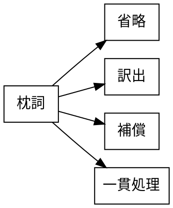

<!--
https://chatgpt.com/c/69e1ac01-766c-83a4-8ba2-06c8f7a1b708
Dropbox/pub/nihongo-no-oto/2026/20260418-pillow-words-ja.md
-->

# 枕詞の省略に対して、訳出・補償・一貫処理を論じる研究

Last change: 2026/04/18-15:02:35.

山元啓史, 東京科学大学

## 概要

伊勢物語第117段「住吉行幸」の和歌を読んでいると、枕詞の扱いをどうするかという問題は避けて通れない。本段の歌「むつましと／君はしら浪／みづがきの／久しき世より／いはひそめてき」において、「みづがきの」は「久しき」にかかる枕詞である。一般には、枕詞は自然訳において省略されることが多い。しかし、実際に翻訳作業を進めると、枕詞は単に「意味がないから落としてよい」とは言い切れないことがわかる。そこに書かれている以上、少なくとも何らかの働きを担っており、その働きは辞書的意味に尽きないからである。

本作業では、この歌の自然訳をまず「あなたのことを親しく思い、久しい昔からお守りしてきたのですよ。」とした。ここでは「みづがきの」を前面には出さず、「久しい昔から」という連鎖を中心に訳している。他方で、「この瑞垣のもとで、久しい昔からお守りしてきたのですよ。」のように、枕詞を軽く出す可能性も検討した。すなわち、「みづがきの」は自然訳において必ずしも全面的に訳出しなければならないわけではないが、まったくの無内容として扱ってよいわけでもない。本段階で重要なのは、枕詞を「訳すか訳さないか」という二分法で処理するのではなく、どの程度まで訳文の中で可視化するかを考えることである。

この点について、近年の和歌翻訳研究は示唆的である。T. E. McAuley は、和歌翻訳の困難の一つとして「poetic metalanguage」、すなわち歌枕や枕詞のような詩的慣用表現を挙げ、これらに対しては、場合によっては一貫した訳語を与えることで、原文における反復性や慣用性を読者に見せることができると論じている。少なくとも McAuley 自身の翻訳実践においては、枕詞は単純に無視されるべき要素ではなく、反復的に処理しうる詩的装置として考えられている。 ([早稲田大学][1])

また、Ingrid Helga Mayer は、百人一首の英語訳・ドイツ語訳を比較する博士論文の中で、枕詞を独立した検討対象として扱い、省略、訳出、補償といった処理を比較している。そこでは、たとえば「ひさかたの」や「あしびきの」のような枕詞が多くの翻訳で省略されていることが示される一方、省略されなかった場合や、別の箇所で効果を補償しようとする場合も整理されている。ここからわかるのは、枕詞の処理が翻訳において周辺的な問題ではなく、体系的に検討されるべき論点だということである。 ([北大学Eprints][2])

さらに Loren Waller は、掛詞と並べて枕詞を「notoriously untranslatable」と呼びながらも、そうした要素に意識的な訳者は、その多層的な含みを何とか読者に伝えようとする、と述べている。これは、枕詞が「訳せないから切り捨てる」べきものではなく、むしろ訳しにくさそのものが翻訳上の課題として引き受けられるべき対象であることを示している。 ([早稲田大学][3])

このように見ると、枕詞に対する翻訳上の基本的な態度として、少なくとも三つの方法を区別することができる。第一は、自然訳の流れを優先して枕詞を省略する方法である。第二は、原文に現れている要素として、枕詞を訳文中に何らかの形で出す方法である。第三は、その場では訳出しなくとも、訳文全体の格調や語感、あるいは注での説明によって、その働きを補償する方法である。本作業では、これらを対立的にではなく、歌ごとに使い分けるべき処理として考える。

「みづがきの」の場合、辞書的意味だけを見れば「瑞垣」と訳しても、それ自体が歌の核心になるわけではない。実際、この歌において中心にあるのは、「久しき世より」という時間の深さと、「いはひそめてき」という保護の開始と継続である。その意味で、自然訳では「久しい昔から」と受け、枕詞は前面に出さない処理が十分に可能である。しかし同時に、「みづがきの」は単に無意味な添え物ではなく、音の調子を整え、語を導き、神域的・儀礼的な格調を帯びさせる働きを持っていると考えられる。したがって、必要に応じて「この瑞垣のもとで」のように軽く訳出する余地もあるし、少なくとも注釈や作業方針の中では、その存在を明示しておく必要がある。

本プロジェクトでは、枕詞を一律に「訳さないもの」とみなす立場はとらない。むしろ、枕詞は、逐語訳では構造保持のために残す余地があり、自然訳では前面に出さないこともできるが、その場合でも、訳文全体の格調や注釈によって何らかの形で回収されるべき要素であると考える。つまり、枕詞に対しては、省略、訳出、補償、一貫処理のいずれを採るかを、歌ごとに慎重に判断する。その際の基準は、辞書的意味の有無だけではなく、音調、文体、連鎖、場面の気分といった、より広い働きに置かれるべきである。

[1]: https://www.waseda.jp/flas/rilas/assets/uploads/2020/10/427-446-T.-E.-McAuley.pdf?utm_source=chatgpt.com "issues in the translation of premodern Japanese waka⑴"
[2]: https://eprints.lib.hokudai.ac.jp/repo/huscap/all/61579/Mayer_Ingri.pdf?utm_source=chatgpt.com "『百人一首』の英独語版を通して見る和歌の翻訳 - huscap"
[3]: https://www.waseda.jp/flas/rilas/assets/uploads/2020/10/469-478-Loren-Waller.pdf?utm_source=chatgpt.com "Echoes of Sight and Sound: Reflections on translation from ..."

<!--
@article{McAuley2020PowerTranslation,
  author       = {McAuley, Thomas E.},
  title        = {The Power of Translation: issues in the translation of premodern Japanese waka},
  journal      = {Waseda RILAS Journal},
  number       = {8},
  year         = {2020},
  pages        = {427--446}
}

@phdthesis{Mayer2016HyakuninIsshue,
  author       = {Mayer, Ingrid Helga},
  title        = {Waka Translation as Seen through English and German Versions of the Hyakunin Isshu (Hyakunin Isshu no eidokugoban wo toushite miru waka no honyaku)},
  school       = {Hokkaido University},
  year         = {2016},
  type         = {Doctoral dissertation},
  doi          = {10.14943/doctoral.k12074},
  url          = {https://hdl.handle.net/2115/61579},
  note = {Title translated and supplied by the author}
}

@phdthesis{Mayer2016HyakuninIsshuj,
  author       = {Mayer, Ingrid Helga},
  title        = {『百人一首』の英独語版を通して見る和歌の翻訳},
  school       = {北海道大学},
  year         = {2016},
  type         = {博士論文},
  doi          = {10.14943/doctoral.k12074},
  url          = {https://hdl.handle.net/2115/61579}
}

@article{Waller2020EchoesSightSound,
  author       = {Waller, Loren},
  title        = {Echoes of Sight and Sound: Reflections on translation from a Hon'yaku awase},
  journal      = {Waseda RILAS Journal},
  number       = {8},
  year         = {2020},
  pages        = {469--478}
}
-->
