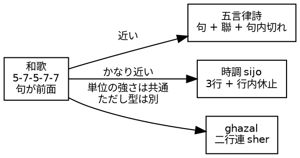
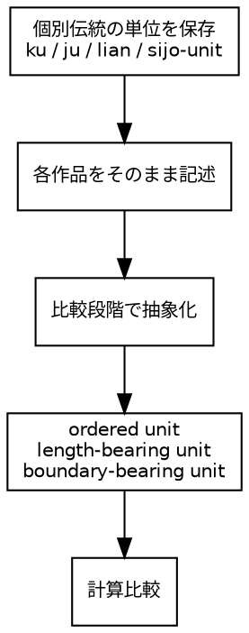
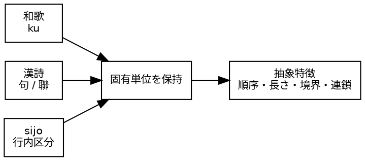

<!--
https://chatgpt.com/c/69e877f4-ae2c-83a9-852a-9e8cfb0b8f28
Dropbox/pub/nihongo-no-oto/2026/20260422-ku-segment-ja.md
-->

# 和歌の「句」に近い海外の詩形はありますか？

Last change: 2026/04/22-22:23:00.

山元啓史, 東京科学大学

## はじめに

和歌の「句」は、作品内部の構造単位であり、切れ目やまたがりの観点から重要な役割を果たしている。これに近い概念を持つ海外の詩形はあるかについて調査したところ、完全に同じ構造を持つものは見当たらないが、いくつか類似点のある詩形が存在することがわかった。

## 和歌との比較対象の詩形

五言律詩は、有力な比較対象である。律詩は八句から成り、各句が五字または七字でできていて、中間の聯に平行構造が強く求められる。さらに、古典中国詩では五言・七言の一句の内部にも、しばしば末尾三字の前に切れが意識され、五言なら 2+3、七言なら 4+3 のような内部区切りが語られる。「内部単位が強い」という意味では非常に近い。和歌の 5-7-5-7-7 の「第1句、第2句...」のような固定的な五分節とまったく同じではなく、中国詩では「句」と同時に「聯」がかなり大きな構造単位になる。つまり、五言律詩は「句の概念が強い」海外作品の代表例ではあるが、和歌と同型というより、「句 + 聯 + 句内切れ」が重なっている型だと言えよう ([Encyclopedia Britannica][1])。

「和歌の句」により近いものを挙げるなら、韓国の時調 `sijo` もかなり面白い。`sijo` は三行詩で、各行がさらにいくつかの音節群に分かれ、行内に小休止や大きな休止がある。単に「三行ある」だけではなく、行の内部にも構造的な切れ目がある。この点では、和歌の「句」や、句切れ・句またがりを考える感覚に比較的近い ([Encyclopedia Britannica][2])。

別の型としては、アラビア語・ペルシア語系のガザル `ghazal` もある。ただし、これは和歌の「句」に近いというより、「連や二行単位が強い」型である。ガザルでは各連句 `sher` が自立的で、二行一組の完結性が見られる。したがって、強い単位があるが、その単位は和歌の「句」ではなく「二行連」に近い ([Encyclopedia Britannica][3])。

五言律詩は、比較対象として可能性はあるが、和歌のように「五つの句」が前面に出るというより、「一句」「聯」「句内の 2+3 などの切れ」が複合している詩形である点に留意しなければならなり。和歌の「句」にもっと近い感覚を探すなら、韓国の `sijo` のような、行内の区切りが明確な形式も比較対象になろう。ガザルは強い単位を持つが、それは「句」というよりも「連句」である ([Encyclopedia Britannica][1])。

図1: 和歌の「句」に近い海外の詩形の比較

比較の第一候補は漢詩、とくに五言律詩や五言絶句である。その次に、`sijo` を置くと、「句という単位が詩作の構造にどう食い込むか」を国際比較しやすいと考える。

## `ku` というタグの位置付け

`ku`というタグを何か国際的なものに揃えない方がよい。単位も成り立ちも違う。比較するときには`ku`、`sijo`などというようにあらかじめ定義して計算比較すべきである。無理に国際的な一般名にそろえない方がよい。

`ku` をそのまま残す利点は、まず、その単位が和歌や俳句の内部で歴史的・実践的に成り立っていることを、そのままデータに保存できる。 `stanza` や `line` や `segment` に置き換えると、見かけは英語的に整っても、単位の由来がぼやける。比較とは、最初から同じものだと決めて並べることではなく、まず別物として記述し、そのうえでどの性質が似ていてどの性質が違うかを測ることである。

和歌は `ku`、時調は `sijo-unit` あるいはその作品固有の区分、漢詩は `ju` や `lian`、あるいは別の定義された単位とし、まず個別に持つ方がよい。比較計算の段階では、別に抽象的な層を作ればよい。たとえば、作品内部の順序つき単位、長さを持つ単位、切れ目候補になる単位、並行構造のかかる単位など、計算上の共通特徴を定義して比較する。よって、`ku` と `sijo` を無理に同じ名前にしなくても、同じ観点で比べられる。

図2: 伝統的な単位を保持しつつ、比較のための抽象的な特徴を定義する設計

データの一次記述はローカルで正確、比較は二次的に抽象化、という順序が大事である。一次データでは `ku` をそのまま使う。他の伝統も、それぞれ固有の単位名をそのまま使う。比較用には別の計算的定義を設ける。重要なのは、「同じ単位名にそろえる」のではなく、「比較可能な性質を定義する」ことである。たとえば和歌の `ku`、漢詩の「句」や「聯」、`sijo` の内部区切りは、それぞれ別物として保持したまま、次のような観点で揃えて比較する。

まず、順序構造として「線形に並ぶ単位列」を持たせる。次に、長さとしては、音節数・字数・モーラ数などで測れる。さらに、境界の強さとしては、句切れ・聯の区切り・行内休止などで観察可能となる。そして、連鎖の性質としては、どこで語が結びつきやすいか、またがりやすいかなどを測ることができる。つまり、比較の軸は「名前」ではなく「ふるまい」であるべきである。

図3: 固有単位を保持しつつ、抽象的な特徴で比較する設計

## 利用方法

この設計を通して次のような課題設定が可能になる。

和歌の「句またがり」は、漢詩のどの位置に対応する現象なのか。句境界をまたぐ共起の頻度は、詩形ごとにどう違うか。強い境界（句切れ・聯切れ）の直前直後で、語の選択はどう変わるか。音数制約（5-7-5-7-7 や五言・七言）が連鎖の長さにどう影響するか。これらの問いに対して、`ku` や `sijo-unit`、`ju` などの固有単位を保持しつつ、抽象的な特徴で比較することで、より深い理解が得られる。

`lemma` があるので語彙単位で比較でき、`gloss` があるので機能レベルでも比較でき、`ku` があるので境界をまたぐかどうかを機械的に判定が可能となる。つまり、すでに「比較可能な形式」でデータが格納されている。

## まとめ

和歌の「句」に近い海外の詩形は、完全に同じ構造を持つものはないが、五言律詩や時調 `sijo` など、類似点のある詩形が存在する。比較の際には、単位名を無理に揃えるのではなく、各作品の固有単位を保持しつつ、比較可能な特徴を定義して分析することが重要である。これにより、和歌の「句またがり」などの現象を国際的な文脈で理解することが可能になる。

## 参考文献

[1]: https://www.britannica.com/art/lushi?utm_source=chatgpt.com "Lüshi | Chinese Poetry, Tang Dynasty, Quatrains"
[2]: https://www.britannica.com/art/sijo?utm_source=chatgpt.com "Sijo | Korean verse form"
[3]: https://www.britannica.com/topic/ghazal?utm_source=chatgpt.com "Ghazal | Arabic Poetry, Love Poetry, Persian Poetry"
